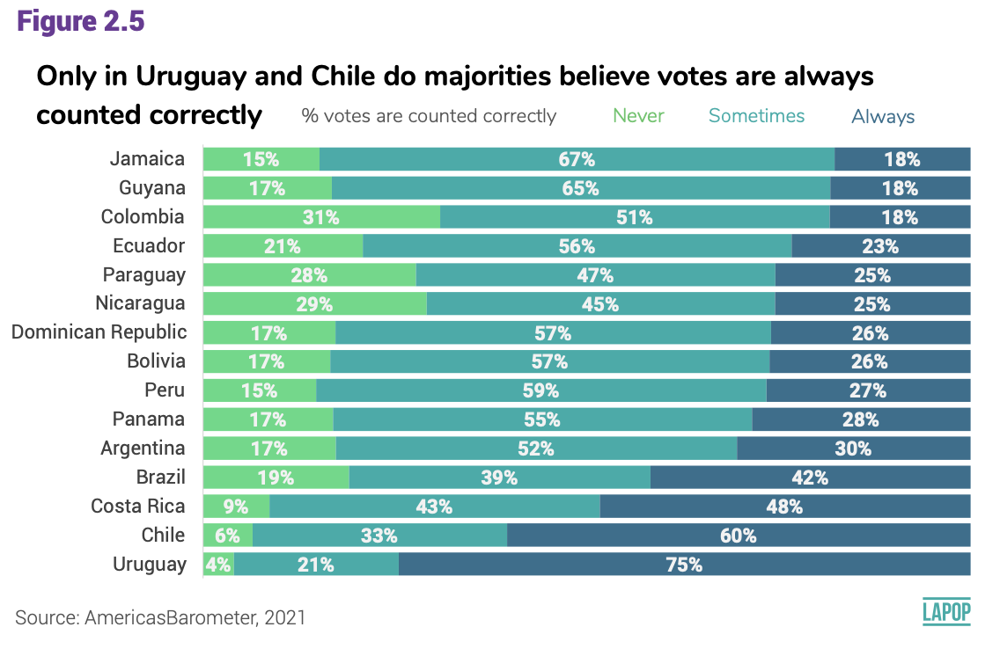
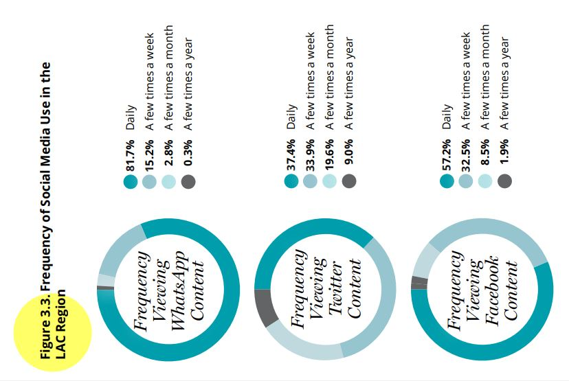

```{r setup, include=FALSE}
knitr::opts_chunk$set(message=FALSE,warning=FALSE, cache=TRUE)
```

```{css color, echo=FALSE}
.columns {display: flex;}
h1 {color: #3366CC;}
```

# Introduction

In this section we will continue to use the regional report "The Pulse of Democracy", available [here](https://www.vanderbilt.edu/lapop/ab2018/2018-19_AmericasBarometer_Regional_Report_Spanish_W_03.27.20.pdf), where the main findings of the 2018/19 round of the AmericasBarometer are presented.
One of the sections of this report reports data on social networks and political attitudes.
This section presents data on the use of the Internet and the use of social networks, in general and by country.
In this case we are going to work with the frequency of use of social networks.
In this section we are going to descriptively analyze these variables on the frequency of use of social networks, ordinal variables (or factor variables, in the language of R).

# About the dataset

The data we are going to use should be cited as follows: Source: AmericasBarometer by the Latin American Public Opinion Project (LAPOP), wwww.LapopSurveys.org.
This document reloads a trimmed database.
To reproduce the results shown in this section, you must clean the Environment.

This database is hosted in the "materials_edu" repository of the LAPOP account on GitHub.
Using the `rio` library and the `import` command, we can import this database from this repository.
In addition, the data from countries with codes less than or equal to 35 are selected, that is, the observations of the United States and Canada are eliminated.

```{r base18}
library(rio)
lapop18 = import("https://raw.github.com/lapop-central/materials_edu/main/LAPOP_AB_Merge_2018_v1.0.sav")
lapop18 = subset(lapop18, pais<=35)
```

We also load data from the 2021 round.

```{r base21}
lapop21 = import("https://raw.github.com/lapop-central/materials_edu/main/lapop21.RData")
lapop21 = subset(lapop21, pais<=35)
```

# Describing and plotting variables

In the section on descriptive statistics, which can be seen [here](https://arturomaldonado.github.io/BarometroEdu_Web_Eng/Descriptives.html), we worked with nominal variables, with dichotomous response options (Yes/No).
In this document we will work with politomic ordinal variables.

# Votes are correctly counted

In this section, we use the variable COUNTFAIR1.
Votes are counted correctly and fairly.
Would you say it happens always, sometimes or never?
Figure 2.5 of the report The Pulse of Democracy, available [here](https://www.vanderbilt.edu/lapop/ab2021/2021_LAPOP_AmericasBarometer_2021_Pulse_of_Democracy_SPA.pdf), shows results of this variable by country.

{width="544"}

In the same way as with nominal variables, these ordinal variables have to be declared as "factor" in new variables.

```{r}
library(haven)
lapop21$countfair1r = as.factor(lapop21$countfair1)
```

Then, these variables have to be labelled.
We can create a basic descriptive table with the command `table`.

```{r}
levels(lapop21$countfair1r) = c("Always", "Sometimes", "Never")
table(lapop21$countfair1r)
```

To calculate tables with percentages, rounded to one decimal place, we use `prop.table` and `round`.
Again, these percentages are not the same as those presented in the report because these calculations do not include factor weights.

```{r}
round(prop.table(table(lapop21$countfair1r)), 3)*100
```

As we mention in the previous section, we can plot this variable using the command `barplot`.

```{r}
barplot(prop.table(table(lapop21$countfair1r))*100)
```

Other option is create this plot using the library `ggplot`.
One option is working with the dataset from scratch.
The following code, however, shows a big bar with the percentage of missing values.
This is because this question was applied to a split sample.
The dataset records NA to the other half of those who do not answer this question.

```{r}
library(ggplot2)
ggplot(data=lapop21, aes(x=countfair1r))+
  geom_bar(aes(y=..prop..*100, group=1), width=0.5)+
  labs(x="Votes are counted correctly", y="Percentage", 
       caption="AmericasBarometer by LAPOP, 2021")+
  coord_cartesian(ylim=c(0, 100))
```

To prevent that the figure shows a bar for NAs, these observations should be filtered before producing the graph.
In the same manner as the previous section, we can filter the NAs for the variable "countfair1" with the command `subset` and the specification `!is.na`.

```{r}
ggplot(data=subset(lapop21, !is.na(countfair1r)), aes(x=countfair1r))+
  geom_bar(aes(y=..prop..*100, group=1), width=0.5)+
  labs(x="Votes are counted correctly", y="Percentage", 
       caption="AmericasBarometer by LAPOP, 2021")+
  coord_cartesian(ylim=c(0, 60))
```

Other option, that simplify the code, is to create a frequency table of this variable with the command `table` and `prop.table`.
This table is rounded to one decimal place with the command `round` and is saved as a dataframe with the command `as.data.frame` in an object "count".
This table records two columns, the first is called "Var1" with the labels of the variables and the second is called "Freq" and stores the percentages.

```{r}
count = as.data.frame(round(prop.table(table(lapop21$countfair1r)), 3)*100)
count
```

We can use this table "count" to produce a bar plot with the command `ggplot`.
The specification `aes` defines that the values of the column "Var1" are presented in the X axis and the values of the column "Freq" are shown in the Y axis.
We define a simple bar plot, using the command `geom_bar( )`, where internally we define the width of bars.
We define labels of axis and the "caption" with the specification `labs`.

```{r}
ggplot(data=count, aes(x=Var1, y=Freq))+
  geom_bar(stat="identity", width=0.5)+
  geom_text(aes(label=paste(Freq, "%", sep="")), color="white", 
            position=position_stack(vjust=0.5), size=3)+
  labs(x="Votes are counted correctly", y="Percentage", 
       caption="AmericasBarometer by LAPOP, 2021")
```

Figure 2.5 shows a stacked bar with information for each country.
First, we present a stacked bar plot using all observation of the 2021 round of the AmericasBarometer, that is including all countries.
To produce a stacked horizontal bar, we use the variable "Freq", now in the X axis.
We use the option `fill` to divive this bar by values of the variable "Var1".
Because Y axis does not show a variable, we define as `" "`.
In the same way as we change the variables in the axis, we can also change the labels in `labs`.
In this specification we change the label of the legend with `fill`.

```{r}
ggplot(data=count, aes(x=Freq, y="", fill=Var1))+
  geom_bar(stat="identity", width=0.3)+
  geom_text(aes(label=paste(Freq, "%", sep="")), color="white", 
            position=position_stack(vjust=0.5), size=3)+
  labs(x="Percentage", y="", fill="Votes are counted correctly",  
       caption="AmericasBarometer by LAPOP, 2021")
```

To replicate the comparative graph by country, we have to create a contingency table between variable "countfair1" and "pais".
This crosstable is saved in an object "count_country".
We should note that the dataframe creates a row for each value of "countfair" in each country.
In this way, we have 3 option x 20 countries = 60 rows.

```{r}
count_country = as.data.frame(round(prop.table(table(lapop21$pais, lapop21$countfair1r), 1), 3)*100)
count_country
```

We calculate data for each value of the variable "pais" in this table, even when there is no data in the variable "countfair" because this question was not fielded in a country.
For this reason, we have to drop rows of countries where we could not record information.
We can do this with the specification `[-c(rows), ]`.
After that, we can create a vector with the names of countries.
This list of countries is repeated three times (15 remaining countries x 3 options).
This vector is added to the dataframe in a column "country".

```{r}
count_country = count_country[-c(1:4,18,21:24,38,41:44,58),]
country = c("Nicaragua", "Costa Rica", "Panama", "Colombia", "Ecuador", "Bolivia", "Peru",
        "Paraguay", "Chile", "Uruguay", "Brazil", "Argentina", "Dom. Rep.", "Jamaica", "Guyana",
        "Nicaragua", "Costa Rica", "Panama", "Colombia", "Ecuador", "Bolivia", "Peru",
        "Paraguay", "Chile", "Uruguay", "Brazil", "Argentina", "Dom. Rep.", "Jamaica", "Guyana",
        "Nicaragua", "Costa Rica", "Panama", "Colombia", "Ecuador", "Bolivia", "Peru",
        "Paraguay", "Chile", "Uruguay", "Brazil", "Argentina", "Dom. Rep.","Jamaica", "Guyana")
count_country$country = country
count_country
```

With this dataframe "count_country", we have the elements to replicate the figure with stacked bars by country.
In the specification `aes`, we define that percentages are in X axis, countries in Y axis and that each bar is divided by column "Var2".

```{r}
ggplot(data=count_country, aes(x=Freq, y=country, fill=Var2))+
  geom_bar(stat="identity", width=0.3)+
  geom_text(aes(label=paste(Freq, "%", sep="")), color="white", 
            position=position_stack(vjust=0.5), size=2)+
  labs(x="Percentage", y="Country", fill="Votes are counted correctly",  
       caption="AmericasBarometer by LAPOP, 2021")
```

# Frequency of use of social networks

The 2018/19 round evaluates the use of social networks and includes variables to measure the use of Facebook, Twitter and Whatsapp: SMEDIA2 measures the use of Facebook.
How often do you view content on Facebook?
SMEDIA5.How often do you see content on Twitter?
and SMEDIA8.
How often do you use Whatsapp?
These variables have as response options:

1.  Daily
2.  A few times a week
3.  A few times a month
4.  A few times a year
5.  Never

In the same way as with nominal variables, these variables have to be declared as "factor" in new variables.

```{r factor}
lapop18$smedia2r = as.factor(lapop18$smedia2)
lapop18$smedia5r = as.factor(lapop18$smedia5)
lapop18$smedia8r = as.factor(lapop18$smedia8)
```

Footnote 15 of the report indicates that "interviewees who report never seeing content on Facebook and Twitter, and who indicate that they never use Whatsapp, are considered non-users of these social networks" (p. 64).
For this reason, Figure 3.3 of frequency of use of social networks (page 57) only includes the categories "Daily", "Some times a week", "Some times a month" and "Some times a year".
The category "Never" is excluded.

{width="463"}

In the new variables we are going to declare the value 5, corresponding to "never", as "NA", that is, as a missing value in R.

```{r eliminar nunca}
library(car)
lapop18$smedia2r = car::recode(lapop18$smedia2r, "5=NA")
lapop18$smedia5r = car::recode(lapop18$smedia5r, "5=NA")
lapop18$smedia8r = car::recode(lapop18$smedia8r, "5=NA")
```

Then, these variables have to be labeled and the basic descriptive tables generated, with the command `table`.

```{r label}
levels(lapop18$smedia2r) <- c("Daily", "A few times a week", 
                            "A few times a month", "A few times a year")
levels(lapop18$smedia5r) <- c("Daily", "A few times a week", 
                            "A few times a month", "A few times a year")
levels(lapop18$smedia8r) <- c("Daily", "A few times a week", 
                            "A few times a month", "A few times a year")
table(lapop18$smedia2r)
table(lapop18$smedia5r)
table(lapop18$smedia8r)
```

To calculate tables with percentages, rounded to a decimal place, we use `prop.table` and `round`.
Again, these percentages are not exactly the same as those presented in the report because these calculations do not include survey weights.

```{r percentages}
round(prop.table(table(lapop18$smedia2r)), 3)*100
round(prop.table(table(lapop18$smedia5r)), 3)*100
round(prop.table(table(lapop18$smedia8r)), 3)*100
```

To present all the data in a joint table, the table of each social network is saved in a new R object (named after each social network).
Then all of these partial tables, containing the same answer choices, are joined as rows with the `rbind` command.
This new joint table is saved as a new dataframe "table".

```{r basic table}
Facebook = round(prop.table(table(lapop18$smedia2r)), 3)*100
Twitter = round(prop.table(table(lapop18$smedia5r)), 3)*100
Whatsapp = round(prop.table(table(lapop18$smedia8r)), 3)*100
table = as.data.frame(rbind(Facebook, Twitter, Whatsapp))
table
```

To get a better presentation of the table, you can use the `kable` command from the `knitr` package or the `formattable` command from the `knitr` package.

```{r improved table}
library(knitr)
kable(head(table), format="markdown", digits=1)
library(formattable)
formattable(table)
```

To graph this variable we are not going to follow the same procedure as in the previous section.
In this section we are going to work directly from the table created with the percentages of the three social networks.
This table has each social network in the rows and the answer options in the columns.
In order to graph this data, it is required that the social networks are in the columns and the answer options in the rows, so first we are going to transpose this table.
We do this procedure using the `data.table` library and the `transpose` command.
We save these transposed data in a new table "table_tr".

This command transposes the data, but leaves the rows and columns unnamed.
Columns are first named with the command `colnames` using the row names of "table".
The rows are then named with the command `rownames` using the column names of "table".

Finally, we require a column inside "table_tr" that contains the response labels of the smedia questions.
These labels are like row names.
To include them as one more variable, add a variable "tabla_tr\$lab" to which the names of the rows are assigned with `row.names`.

```{r transposed table, message=FALSE, warning=FALSE}
library(data.table)
table_tr = transpose(table)
colnames(table_tr) = rownames(table)
rownames(table_tr) = colnames(table)
table_tr$lab <- rownames(table_tr)
table_tr
```

Second, the `ggplot2` library is activated to plot the data stored in "table_tr" with the command `ggplot`.
Within this command it is specified that this command is going to work with the dataframe "table_tr" (and not with lapop18), `data=table_tr`.
The "aesthetic" is specified: the X axis will not include a variable, the Y axis will show the "Facebook" information from the dataframe "table_tr", and `fill=lab` indicates that data will be divided by categories of the variable stored in "lab".

Then the `geom_bar` layer is added to indicate that it will be graphed in bars of width (`width = 1`) and that the bar will replicate what is specified in the aesthetic (`stat="identity"`).
With `geom_text` you add the labels of the data, with the percentage symbol, and you specify the position of the text with `position=position_stack(…)` and the size with `size=3`.
With `coord_polar` you transform the bars into a pie chart.
Finally, the "theme" is defined with `theme_void` indicating a white background and the legend tag is modified with `scale_fill_discrete`.

```{r pie chart}
library(ggplot2)
ggplot(data=table_tr, aes(x="", y=Facebook, fill=lab))+
  geom_bar(width=1, stat="identity")+
  geom_text(aes(label=paste(Facebook, "%", sep="")), color="white", 
            position=position_stack(vjust=0.5), size=3)+
  coord_polar("y", start=0)+
  theme_void()+
  scale_fill_discrete(name="Frequency of use of Facebook")
```

In figure 3.3 of the report "The Pulse of Democracy" a circular "donna" type graph is presented.
To exactly reproduce this type of graph, a few details of the above syntax have to be accommodated.
We set "x=2" in the "aesthetics" and set limits on the X axis, between 0.5 and 2.5, so that when the axis is rotated, the "hole" inside the circle is created.

```{r dona}
ggplot(data=table_tr, aes(x=2, y=Facebook, fill=lab))+
  geom_bar(stat="identity")+
  geom_text(aes(label=paste(Facebook, "%", sep="")), color="white", 
            position=position_stack(vjust=0.5), size=3)+
  coord_polar("y")+
  theme_void()+
  scale_fill_discrete(name="Frequency of use of Facebook")+
   labs(title="How often do you view content on Facebook?", 
        caption="AmericasBarometer by LAPOP, 2018/19")+
  xlim(0.5, 2.5)
```

To replicate the bar chart, some modifications are made to the code above.
For example, in "aesthetics", it is now indicated that the variable "smedia2r" goes on the X axis and the percentage "per" goes on the Y axis.
In addition, the specification of polar coordinates is eliminated.
We can add a title to the chart, axis labels, and a caption with the specification `labs`.
Finally, the Y axis is defined between 0 and 60 with the `coord_cartesian` specification.
An important point is that this graph can also be saved in an object in R, which we will call "plot1"

```{r bar graphic}
plot1 <- ggplot(table_tr, aes(x=lab, y=Facebook))+
  geom_bar(stat="identity",  width=0.5)+
  geom_text(aes(label=paste(Facebook, "%", sep="")), color="black", vjust=-0.5)+
  labs(title="Frequency of use of social networks", x="Frequency of use of Facebook", 
       y="Percentage", caption="AmericaBarometer by LAPOP, 2018/19")+
  coord_cartesian(ylim=c(0, 60))
plot1
```

Saving a chart to an object allows us to later add more layers or enhancements to the chart.
The plot above, for example, has the "Frequency of use" labels on a single line, so they could overlap.

To improve this visualization, these labels can be tilted, but if you want to maintain the horizontality to facilitate reading, what you can do is separate the long labels into two or more lines.
This can be done, for example, by creating a vector with the new labels.
Long tags can be broken into lines by including `\n` between the texts you want to break.
Then a new layer can be added to the object "plot1" to replace the labels with the new ones divided into lines.
This is done with the specification `scale_x_discrete` where we define to use the labels in the new vector.

```{r overlapping labels}
etiq <- c("Daily", "A few times\n a week", "A few times\n a month", 
          "A few times\n a year")
plot1 +  scale_x_discrete(labels=etiq)
```

This makes the graph more readable.
So far, we have replicated the tables and graphs that were used with the nominal variables, now using ordinal variables.
If you want to replicate the pie chart of the other social networks, you can run the same code, but change the social network column.
For Twitter, for example, you would have.

```{r Twitter graph}
plot2 <- ggplot(data=table_tr, aes(x=2, y=Twitter, fill=lab))+
  geom_bar(stat="identity")+
  geom_text(aes(label=paste(Twitter, "%", sep="")), color="white", 
            position=position_stack(vjust=0.5), size=3)+
  coord_polar("y")+
  theme_void()+
  scale_fill_discrete(name="Frequency of Twitter use")+
  labs(title="How often you view content on Twitter", caption="Americas Barometer by LAPOP, 2018/19")+
  xlim(0.5, 2.5)
plot2
```

# Cross tables

Table 3.1 (page 55) of the report "The Pulse of Democracy" shows the percentages of use of social networks by country.
Then, on page 56, there is a table with the percentage of social network users by sociodemographic characteristics, for example, urban/rural, male, average age, average wealth, and years of study.

{width="397"}

We will start by replicating the general data on the use of social networks that is reported in Table 3.1.
To replicate this table, you must first define the variable "country" and the variables for the use of social networks (smedia1, smedia4 and smedia7).

```{r país}
lapop18$smedia1r = as.factor(lapop18$smedia1)
lapop18$smedia4r = as.factor(lapop18$smedia4)
lapop18$smedia7r = as.factor(lapop18$smedia7)
levels(lapop18$smedia1r) = c("Yes", "No")
levels(lapop18$smedia4r) = c("Yes", "No")
levels(lapop18$smedia7r) = c("Yes", "No")
lapop18$pais = as.factor(lapop18$pais)
levels(lapop18$pais) = c("México", "Guatemala", "El Salvador", "Honduras",
                        "Nicaragua","Costa Rica", "Panamá", "Colombia", 
                        "Ecuador", "Bolivia", "Perú", "Paraguay", 
                        "Chile", "Uruguay", "Brasil", "Argentina", 
                        "Rep. Dom.", "Jamaica")
table(lapop18$pais) #Country
table(lapop18$smedia1r) #Facebook
```

However, the variable "user" of each social network is calculated as a condition of two variables, as seen in the document on data manipulation, with the following code.

```{r usuarios}
lapop18$fb_user = ifelse(lapop18$smedia1==1 & lapop18$smedia2<=4, 1, 0)
lapop18$tw_user = ifelse(lapop18$smedia4==1 & lapop18$smedia5<=4, 1, 0)
lapop18$wa_user = ifelse(lapop18$smedia7==1 & lapop18$smedia8<=4, 1, 0)
```

These variables are plotted in the report in Figure 3.1.
To reproduce this data, you can describe these variables.

```{r user}
prop.table(table(lapop18$fb_user))*100
prop.table(table(lapop18$tw_user))*100
prop.table(table(lapop18$wa_user))*100
```

As in previous graphs, with this data a dataframe can be created that would be used to make the circular graphs shown in the report.

To replicate the table of use of social networks by country, first, bivariate tables are created with the percentage of those who use and the percentage of those who do not use each social network in each country.
These tables are stored in R objects.
These objects are then merged using the commands `cbind` to bind the columns and `as.data.frame` to bind the tables as a dataframe.
This table also presents the percentages of those who do not use these social networks.
To present a table that includes only those who do use social networks, columns are eliminated, using the specification `[, c(-1,-3,-5)]`, which indicates that we want to eliminate columns 1 , 3 and 5.
Finally, the dataframe columns are renamed.

```{r table by country}
fbcountry = round(prop.table(table(lapop18$pais, lapop18$fb_user), 1), 3)*100
twcountry = round(prop.table(table(lapop18$pais, lapop18$tw_user), 1), 3)*100
whcountry = round(prop.table(table(lapop18$pais, lapop18$wa_user), 1), 3)*100
tablecountry = as.data.frame(cbind(fbcountry, twcountry, whcountry))
tablecountry = tablecountry[, c(-1,-3,-5)]
varnames = c("Use facebook", "Use Twitter", "Use Whatsapp")
colnames(tablecountry) = varnames
tablecountry
```

To have a better presentation of the table, there are two alternatives: the first with the `knitr` library and the other with the `formattable` library.

```{r improved table by country}
library(knitr)
kable(head(tablecountry), format="markdown", digits=1)
library(formattable)
formattable(tablecountry)
```

# Crosstables with sociodemographic variables

On page 56 of the report "The pulse of democracy" the results of the crosstable between the variables use of social networks and sociodemographic variables such as urban/rural, gender, age, wealth and years of education are presented.

{width="672"}

The variable "q1" records the gender of the interviewee.
This variable is encoded as follows:

1.  Man
2.  Woman

To calculate a "dummy" variable called "man", such that male is 1 and female is 0, one way to do it is algebraically (2-variable q1).
In this way, now the men maintain the value 1 (2-1) and the women become 0 (2-2).
In this case, the new variable "man" is created as a numeric variable.
We are going to keep the variable as "num" so that, further down, we can calculate the mean of this variable (something that cannot be done with a variable declared as a factor).

```{r man}
lapop18$men <- 2-lapop18$q1
table(lapop18$men)
```

The urban/rural variable is named "ur" in the database and is encoded as follows:

1.  Urban
2.  Rural

In the same way as with gender, the formula 2- variable ur is used, but this variable is converted into a factor and is labeled.

```{r urban}
lapop18$urban <- 2-lapop18$ur
lapop18$urban = as.factor(lapop18$urban)
levels(lapop18$urban) <- c("Rural", "Urban")
table(lapop18$urban)
```

The crosstables of the use of social networks by some of the sociodemographic variables will be presented, to better understand how the general table is constructed.
For example, the report shows in Table 3.2, after the general population column, the columns for WhatsApp users and non-users (variable "wa_user") and in the rows, the first corresponds to urban (variable "urban", where 0 is rural and 1 urban).
It is presented that among WhatsApp users, 76.7% are urban and among non-users, 62% are urban.
These data are generated with the `table` command that allows you to make a contingency table of 2 variables.
In this case it should be noted that each variable has a title.
So the command is `table(title1 = var1, title2 = var2)`.
Then, the `prop.table` command is used so that the observations are not displayed, but the percentages.
This command allows you to calculate the percentages of the total (the default option), of the rows and of the columns.
To calculate on columns you must specify `prop.table(table(...), 2)`.
If you wanted the percentage over the rows, the code would be `prop.table(table(...), 1)`.
This table can be saved as a dataframe with the `as.data.frame` command in a new object "t1".

```{r table WhxUr}
t1 = as.data.frame(round(prop.table(table(Urban = lapop18$urban, User = lapop18$wa_user), 2)*100, 1))
t1
```

The rows corresponding to "Urban" in this table reproduce the data in Table 3.2: 62.1% are urban among non-Whatsapp users and 76.7% are urban among users.

Now the table will be presented between Facebook users (variable "fb_user") and men (variable "men"), but presenting only the percentages used in the table and now using the code style of the Tidyverse, using the "pipe" operator.
The first thing is to define the variable "fb_user" as a factor and label it.
Then, the `subset` command is used to filter the missing cases on the "fb_user" variable.
Then the results are requested to be grouped by categories of the variable "fb_user".
With the `summarise` command, the average of the "man" variable is saved in the "man" column, with the `mean` command that includes the specification `na.rm=T` so as not to include missing values in the calculation.
In this case, it takes advantage of the fact that the variable "men" is a dummy variable, in such a way that the average corresponds to the proportion of men.

```{r tabl Fbxman, message=FALSE, warning=FALSE}
lapop18$fb_user = as.factor(lapop18$fb_user)
levels(lapop18$fb_user) = c("No user", "User")
library(tidyverse)
table1 = subset(lapop18, !is.na(fb_user)) %>% #To not include the NA group of Facebook users
  group_by(fb_user) %>%
  dplyr::summarise(Men=mean(men, na.rm=T)*100) #na.rm=T is included because man has NAs
table1
```

These are the percentages for Facebook users, in the row of the Male variable in Table 3.2.
That is, among non-users, 49.9% are men and among users this percentage is 49.7%.
So far we have replicated some results from Table 3.2.
The other data can continue to be reconstructed through combinations of the social network user variables and the sociodemographic variables.

# Two-Variable Bar Chart

The cross between WhatsApp users and the urban variable can also be seen in a grouped bar graph.
The first thing we will do is define the variable "wa_user" as a factor and label it.
Then, it is required to create a table with the grouped data.
The "t1" dataframe created earlier can be used, but here we will again use the "pipe" operator to recreate the data.

For this, it is grouped both by use of WhatsApp and by urban/rural, that is, in four combinations.
In each subgroup the n is calculated.
Since the % have to be calculated for each group of "wa_user", it is grouped again and the % of each subgroup is calculated, in such a way that the percentages add up to 100% in each subgroup of "wa_user".

```{r table wa}
lapop18$wa_user = as.factor(lapop18$wa_user)
levels(lapop18$wa_user) = c("No user", "User")
face <- subset(lapop18, !is.na(wa_user)) %>% #!is.na is used so that NAs are not reported in the table
  group_by(wa_user, urban) %>% #groups are configured
  dplyr::count() %>% #n is calculated
  group_by(wa_user) %>% #It is grouped by WhatsApp user
  dplyr::mutate(percentage = round(n/sum(n), 3)*100) #The percentage is calculated in each WhatsApp group
face
```

The data in this new table is exactly the same as in "t1".
With the table ready, use the `ggplot` command, defining "wa_user" to be the variable on the X axis, the Y axis to be the percentage, and the subgroups to be formed by the variable "urban" with the `fill` specification.
. The `dodge` specification is used in `geom_bar` to have the bars separated by each group.

```{r grouped graphics}
ggplot(data=face, aes(x=wa_user, y=percentage, fill=urban, ymax=100))+
  geom_bar(position="dodge", stat="identity")+
  geom_text(aes(label=paste(percentage, "%", sep="")), 
            position=position_dodge(width=0.9), vjust=-0.25)+
  ylab("Percentage")+
  xlab("Whatsapp user")
```

If we wanted to make the graph with stacked bars, we would have to change the `position="stack"` specification in `geom_bar` and the `position=position_stack()` specification in `geom_text`.

```{r stacked bars}
ggplot(data=face, aes(x=wa_user, y=percentage, fill=urban, ymax=100))+
  geom_bar(position="stack", stat="identity")+
  geom_text(aes(label=paste(percentage, "%", sep="")), 
            position=position_stack(), vjust=2.5)+
  ylab("Percentage")+
  xlab("Whatsapp user")
```

In both cases, the light blue bars indicate the percentages reported in table 3.2 of the report and correspond to the proportion of people living in urban areas between users and non-users.

# Summary

In this document we have worked with ordinal categorical variables, such as the frequency of use of social networks.
The use of contingency tables of two categorical variables and the creation of grouped bar graphs for 2 variables have also been introduced.

# Calculations including survey weights

## Example using the 2021 dataset

With the data of the 2021 wave of the AmericasBarometer, we have calculated the percentages of the variable that gauges whether the votes are counted correctly.
The figure we have produced is for the total sample; it means, for all the countries.
The Figure 2.5 of the report The Pulse of Democracy presents results for each country.

If we calculate percentages with the commands `table` and `prop.table`, we would get different results from those show in the Figure.
For example, Nicaragua, country 5, display that 26% of citizens in this country indicate that votes are always counted correctly, 49% indicate that votes are sometimes counted correctly, and 24.4% that voter are never counted correctly.
However, the figure shows that 29% indicate that votes are never counted correctly in Nicaragua, 45% that sometimes, and 25% that always.
These percentages do not match those produced with these commands.

```{r}
round(prop.table(table(lapop21$pais, lapop21$countfair1r), 1), 3)*100
```

This difference is due to the fact that commands `table` and `prop.table` do not include survey weights in calculations.
More information about these differences are found [here](https://arturomaldonado.github.io/BarometroEdu_Web_Eng/Expansion.html).

To replicate the results of Figure 2.5, there are some options.
The first option is using an specialized librery called `survey`.

To be allowed to use this library, we should first prepare the dataset, dropping missing values of variables that define the survey design.
An additional step is transforming the variables in the dataframe.
When we import the dataset, the system reads these variables as "haven_labelled" type, that is, they ma.intain labels of variables, with which we may produce a codebook.
This may be useful in other ocassions, but it generates problems with the library `survey`.
For this, we transform the variables to other type with the command `sapply`.

```{r message=FALSE, warning=FALSE, include=FALSE}
lapop21 = subset(lapop21, !is.na(weight1500))
sapply(lapop21, haven::zap_labels)
```

Once prepared the dataset, we activate the library and declare the survey design.
In the last section, we also use this library to calculate the results with the survey weights in the round 2018.
Contrary to this code, the 2021 round of the AmericasBarometer uses phone interviews, and not face to face.
For this reason, the primary unit of sampling is the individual, and so it is defined in the variable "upm".
The variable that defines strata is "strata" (and not "estratopri", as in the 2018 round).
The weighting variable is still "weight1500".

With this information, we save the design in an object "design21".

```{r}
library(survey)
design21 = svydesign(ids = ~upm, strata = ~strata, weights = ~weight1500, nest=TRUE, data=lapop21)
```

The library `survey` includes native commands to perform multiple operations including survey weights.
One is this commands is `svytable` that allows to make a crosstable between the variable "countfair1" and "pais", specifying the design.
This command returns the weighting absolute frequencies.
For this reason, we have to nest this code in the command `prop.table` to calculate the percentages from weighting absolute frequencies.
We also use the commands `round` to round percentage, and the command `as.data.table` to save this table in an object "votexcountry" as a dataframe that allows to use this data with `ggplot`.

```{r}
votexcountry = as.data.frame(round(prop.table(svytable(~pais+countfair1r, design=design21), 1)*100, 0))
votexcountry$country = country
votexcountry
```

```{r}
ggplot(data=votexcountry, aes(fill=countfair1r, x=Freq, y=country))+
  geom_bar(stat="identity", width=0.3)+
  geom_text(aes(label=paste(Freq, "%", sep="")), color="white", 
            position=position_stack(vjust=0.5), size=3)+
  labs(x="Percentage", y="Country", fill="Votes are counted correctly",
       caption="AmericasBarometer by LAPOP, 2021")
```

This figure reproduces exactly the results shown in the Figure 2.5 of the report, even in a different order.

## Example using the 2018/19 dataset

The small difference between the percentages shown in Figure 3.3 and those shown in the "Describing and plotting variables" section may be due to the fact that the survey weight is not included in all the previous tables and graphs.
If included, using the variable "weight1500", the percentages shown in the report would be replicated.
For example, to use WhatsApp, you can use the command `freq` from the library `descr`, which allows you to include a weighting variable.

This table can be saved to a dataframe, from which the rows and columns that are not required can be removed, and the remaining columns can be renamed.

```{r wa weighted}
table2 = as.data.frame(descr::freq(lapop18$smedia8r, lapop18$weight1500, plot=F))
table2 = table2[-c(5,6), -2]
colnames(table2) <- c("frec", "per")
table2$lab <- rownames(table2)
table2
```

With this new dataframe, we can replicate the figure for Whatsapp , with the data weighted, using the `ggplot` code.

```{r wa graf pond}
ggplot(data=table2, aes(x=2, y=per, fill=lab))+
  geom_bar(stat="identity")+
  geom_text(aes(label=paste(round(per, 1), "%", sep="")), color="white", 
            position=position_stack(vjust=0.5), size=3)+
  coord_polar("y")+
  theme_void()+
  scale_fill_discrete(name="Frequency of use of Facebook")+
   labs(title="Frequency with which you view content on Facebook", 
        caption="AmericasBarometer by LAPOP, 2018/19")+
  xlim(0.5, 2.5)
```

In addition to the `freq` command, you can also use the library `survey` and the native command `svytable`.

```{r survey}
library(survey)
design18 = svydesign(ids = ~upm, strata = ~estratopri, weights = ~weight1500, nest=TRUE, data=lapop18)
```

The results obtained are the same as with the previous method and those presented in the report.
These results can also be saved in a "dataframe" to make the graph.

```{r svytable}
prop.table(svytable(~smedia8r, design=design18))*100
```

The section "Cross with variables" presents the data of users of social networks by country.
To build the table considering the design effect, you can also use the native `svytable` command that allows you to compute a bivariate table.
In the same way as in the unweighted case, the partial tables of each social network are stored in list-type objects, which are put together as a "dataframe" and edited to present only the data of the users of each social network.
for country.

```{r bivariate svytable}
fbpais_2 = round(prop.table(svytable(~pais+fb_user, design=design18), 1), 3)*100
twpais_2 = round(prop.table(svytable(~pais+tw_user, design=design18), 1), 3)*100
wapais_2 = round(prop.table(svytable(~pais+wa_user, design=design18), 1), 3)*100
tablecountry_2 = as.data.frame(cbind(fbpais_2, twpais_2, wapais_2))
tablecountry_2 = tablecountry_2[, c(-1,-3,-5)]
varnames = c("Use Facebook", "Use Twitter", "Use Whatsapp")
colnames(tablecountry_2) = varnames
tablecountry_2
```

Finally, the section "Crosstables with sociodemographic variables" reproduces the results of Table 3.2 of the report.
In the same way as in the previous case, the native command `svytable` can be used to perform the cross between the social network usage variables and the urban variable.
The results of the Urban row in each social network would correspond to the first row of results in Table 3.2.

```{r}
round(prop.table(svytable(~urban+wa_user, design=design18), 2), 3)*100
round(prop.table(svytable(~urban+fb_user, design=design18), 2), 3)*100
round(prop.table(svytable(~urban+tw_user, design=design18), 2), 3)*100
```

In this way, frequency distribution tables and bivariate (or contingency) tables can be calculated including the design effect or the expansion factor.
