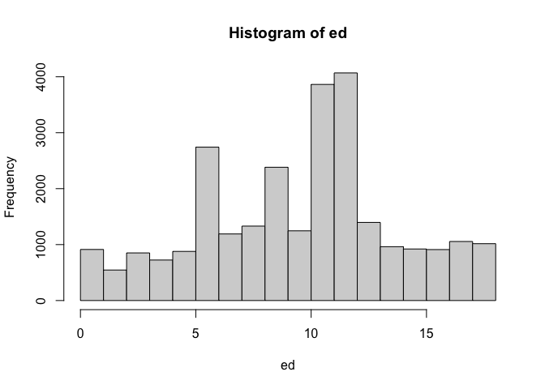

<style type="text/css">
.columns {display: flex;}
h1 {color: #3366CC;}
</style>

# Introduction

In this section we will see basic aspects of how to describe a numerical variable.
For that, we will continue to use the 2018/19 regional report "The Pulse of Democracy", available [here](https://www.vanderbilt.edu/lapop/ab2018/2018-19_AmericasBarometer_Regional_Report_10.13.19.pdf), where the main findings of the 2018/19 round of the AmericasBarometer are presented.
One of the sections of this document reports information on social networks and political attitudes.
This section presents information on Internet use and the use of social networks, in general, by country and by certain sociodemographic characteristics.

# About the dataset

The data we are going to use should be cited as follows: Source: AmericasBarometer by the Latin American Public Opinion Project (LAPOP), wwww.LapopSurveys.org.
This section loads a trimmed database.
This database is hosted in the "materials_edu" repository of the LAPOP account on GitHub.
It is recommended to clean the Environment before starting this module.

Using the library `rio` and the command `import`, you can import this database from this repository.
In addition, the data from countries with codes less than or equal to 35 are selected, that is, the observations of the United States and Canada are eliminated.


```r
library(rio)
lapop18 = import("https://raw.github.com/lapop-central/materials_edu/main/LAPOP_AB_Merge_2018_v1.0.sav")
lapop18 = subset(lapop18, pais<=35)
```

# Describing a numeric variable

Table 3.2 of the report "The Pulse of Democracy" shows the general averages of the variables age ("q2" in the database) and years of study ("ed" in the database) for the general population.

{width="604"}

The command `mean` is used to calculate the average and `na.rm=T` is used because these variables have missing values.


```r
mean(lapop18$q2, na.rm=T)
```

```
## [1] 39.99204
```

```r
mean(lapop18$ed, na.rm=T)
```

```
## [1] 9.934748
```

In the section where we worked with qualitative variables (or factor variables, in the language of R), we saw that the variables "men" and "urban" could be described by defining these variables as a factor, labeling them and making a frequency table of these variables.
Other way to find the percentage of people who are men or who live in urban areas is to work with these variables, but not define them as a factor.
When variables are created, they are both defined by default as numeric.
In this case, in addition to being numeric, they are variables of type dummy, that is, with values 0 and 1.
In the case of the "men" variable, we defined 0 = Woman and 1 = Man; and in the case of the "urban" variable we define 0 = Rural and 1 = Urban.
It is a good practice to name the dummy variable with a name that refers to category 1.
With dummy variables, when the average is calculated, the result is the same as the percentage of category 1.
So, if `mean(lapop$man, na.rm=T)` is calculated, this operation gives us the percentage of category 1, that is, men.
It is multiplied by 100 to put it in a format from 0 to 100.


```r
lapop18$men = 2-lapop18$q1
lapop18$urban = 2-lapop18$ur
mean(lapop18$men, na.rm=T)*100
```

```
## [1] 49.74846
```

```r
mean(lapop18$urban, na.rm=T)*100
```

```
## [1] 71.15398
```

These results are the same as those presented in the first column of results for the general population, except for the wealth variable ("quintall") which is not available in this trimmed version of the dataset.

# Plotting a numeric variable

After describing a numeric variable, you can also include some basic plots, for example, using the command `hist` you can produce the histogram of the variable "years of education" (ed).


```r
hist(lapop18$ed)
```

<!-- -->

This same plot can be reproduced using the command `ggplot`.
With this command we have more flexibility with the graphic options.
First, we define the dataframe to be used "lapop18" and the variable "ed" on the X axis.
Then we define the specification `geom_histogram()` to produce a histogram.
We define the width of the histogram bar with `banwidth=1`.
Finally, this code allows you to label the X and Y axis and include a black and white theme, with `theme_bw()`.


```r
library(ggplot2)
ggplot(lapop18, aes(x=ed))+
  geom_histogram(binwidth = 1)+
  xlab("Years of education")+
  ylab("Frecuency")+
  theme_bw()
```

<!-- -->

# Average by groups

Table 3.2 of the report shows the mean of these numerical variables by groups of variables related to social networks.
For example, it shows the average of years of study for Facebook users and for non-Facebook users.
If we want to calculate the average of years of study for Facebook users, we first calculate this variable, in the same way as in previous sections, with the command `ifelse`.


```r
lapop18$fb_user <- ifelse(lapop18$smedia1==1 & lapop18$smedia2<=4, 1, 0)
lapop18$tw_user <- ifelse(lapop18$smedia4==1 & lapop18$smedia5<=4, 1, 0)
lapop18$wa_user <- ifelse(lapop18$smedia7==1 & lapop18$smedia8<=4, 1, 0)
```

Calculating the average years for Facebook users and non-users can be done in many ways.
A first option is by using the square brackets `[...]`.
In this case, we will calculate the average years of study by user groups `[lapop18$fb_user==1]` and non-Facebook users `[lapop18$fb_user==0]`.


```r
mean(lapop18$ed[lapop18$fb_user==0], na.rm=T)
```

```
## [1] 8.064905
```

```r
mean(lapop18$ed[lapop18$fb_user==1], na.rm=T)
```

```
## [1] 11.44839
```

# Describing of a numerical variable by groups

Other way to describe a numeric variable is by using the command `summary`.
This command reports the most used descriptive statistics for a numerical variable: minimum, maximum, quartiles, mean and median.
All these statistics allow a better comparison between both groups, users and non-users of Facebook.
Within this command you can include the `digits=3` specification to round the results, which avoids having to use `round`, for example.


```r
summary(lapop18$ed[lapop18$fb_user==0], na.rm=T, digits=3)
```

```
##    Min. 1st Qu.  Median    Mean 3rd Qu.    Max.    NA's 
##    0.00    5.00    8.00    8.06   11.00   18.00    1374
```

```r
summary(lapop18$ed[lapop18$fb_user==1], na.rm=T, digits=3)
```

```
##    Min. 1st Qu.  Median    Mean 3rd Qu.    Max.    NA's 
##     0.0     9.0    12.0    11.4    14.0    18.0    1240
```

However, the command `summary` does not return an important statistic such as the standard deviation, a measure of dispersion or heterogeneity.
In order to have the above statistics and include the standard deviation, among other additional measurements, you can use the command `describeBy`, which is part of the library `psych`.
This command asks for the variable to describe ("ed") and the variable that forms the groups ("fb_user") and provides the mean, standard deviation, median, trimmed mean, absolute deviation from the median, minimum and maximum.


```r
library(psych)
describeBy(lapop18$ed, lapop18$fb_user)
```

```
## 
##  Descriptive statistics by group 
## group: 0
##    vars     n mean  sd median trimmed  mad min max range skew kurtosis   se
## X1    1 11540 8.06 4.3      8    7.99 4.45   0  18    18 0.13    -0.52 0.04
## ------------------------------------------------------------ 
## group: 1
##    vars     n  mean   sd median trimmed  mad min max range  skew kurtosis   se
## X1    1 14998 11.45 3.59     12   11.52 2.97   0  18    18 -0.24        0 0.03
```

This same information can be obtained using the tidyverse style of coding (with the operator pype `%>%`) and saved to a table.
This table can save the data of the average age for WhatsApp users and non-users and also the standard deviation of each group.
First, we define which dataframe to work with.
Then, it is indicated that the missing values of the Whatsapp users variable are not used internally with `filter(!is.na(wa_user))`.
Next, it is indicated that it will work in groups of the WhatsApp users variable with `group_by(wa_user)`.
Finally, it is indicated that in each group the mean and standard deviation will be calculated, with `summarise`.


```r
library(dplyr)
whatxedad <- lapop18 %>%
  filter(!is.na(wa_user)) %>%
  group_by(wa_user) %>%
  summarise(promedio = mean(q2, na.rm=T), sd = sd(q2, na.rm=T))
whatxedad
```

<div data-pagedtable="false">
  <script data-pagedtable-source type="application/json">
{"columns":[{"label":["wa_user"],"name":[1],"type":["dbl"],"align":["right"]},{"label":["promedio"],"name":[2],"type":["dbl"],"align":["right"]},{"label":["sd"],"name":[3],"type":["dbl"],"align":["right"]}],"data":[{"1":"0","2":"48.25723","3":"18.04314"},{"1":"1","2":"35.38153","3":"13.86258"}],"options":{"columns":{"min":{},"max":[10]},"rows":{"min":[10],"max":[10]},"pages":{}}}
  </script>
</div>

# Plotting a numeric variable by groups

The report does not show it, but graphs can be presented for each group to facilitate the comparison of a variable.
To make these comparative graphs by group, we're going to continue to use the tidyverse.
As in the previous table, the dataframe is defined and it is indicated that the missing values of the "wa_user" variable are not taken into account.
Then, it is instructed to make a plot, with `ggplot` having the variable "q2" on the X axis.
This graph is defined to be a histogram with `geom_histogram()`.
A novelty is that, with the `facet_wrap(~wa_user)` specification, it is possible to indicate that graphs are made for each group of that variable.
Finally, the axes are labeled.


```r
lapop18 %>%
  filter(!is.na(wa_user)) %>%
  ggplot(aes(x=q2))+
  geom_histogram()+
  facet_wrap(~wa_user)+
  xlab("Age")+
  ylab("Frecuency")
```

<!-- -->

This graph, however, shows the values 0 and 1 of the variable "wa_user" in the header of both graphs.
This is because this variable, when created, was defined by default as numeric.
For the variable labels to appear, you have to transform "wa_user" into a factor and label it.


```r
lapop18$wa_user = as.factor(lapop18$wa_user)
levels(lapop18$wa_user) <- c("No user", "User")
```

Other way to compare the age distribution by groups of WhatsApp users or non-users is by means of a boxplot.
With the command `boxplot` you can make these plots.
The command first asks for the variable on the Y axis, then the variable that defines the groups and the dataframe.
You can label the X and Y axis with the names of the variables.
Since the variable "wa_user" has been factored and labeled, the labels now appear.


```r
boxplot(q2 ~ wa_user, data=lapop18, xlab ="Whatsapp user", ylab="Age")
```

<!-- -->

# Summary

In this section we have worked with numerical variables, such as age or years of study.
Descriptive statistics have been calculated, such as the mean or standard deviation for the entire population or by groups.
Finally, several ways of graphing these variables have been presented, using histograms or boxplots.

# Calculations including survey weights

The above results do not include survey weights.
To include weights in the calculations you can use the command `weighted.mean`, which is part of the library `stats`, which comes preloaded with R, so you don't have to install it.


```r
weighted.mean(lapop18$q2, lapop18$weight1500, na.rm=T)
```

```
## [1] 39.98095
```

```r
weighted.mean(lapop18$ed, lapop18$weight1500, na.rm=T)
```

```
## [1] 9.931417
```

```r
weighted.mean(lapop18$men, lapop18$weight1500, na.rm=T)*100
```

```
## [1] 49.74826
```

```r
weighted.mean(lapop18$urban, lapop18$weight1500, na.rm=T)*100
```

```
## [1] 71.11895
```

Other way to calculate the mean including the expansion factor is by using the library `survey` and its native command `svymean`.
For this you have to define the sample design with the command `svydesign` and save this design in an object, here called "design18".


```r
library(survey)
design18 = svydesign(ids = ~upm, strata = ~estratopri, weights = ~weight1500, nest=TRUE, data=lapop18)
```

To calculate the average, the command `svymean` is used and the `na.rm=T` specification is used because these variables have missing values.


```r
svymean(~q2, design18, na.rm=T)
```

```
##      mean     SE
## q2 39.981 0.0535
```

```r
svymean(~ed, design18, na.rm=T)
```

```
##      mean   SE
## ed 9.9314 0.04
```

For dummy variables, the procedure is the same, except that they are multiplied by 100 to present it in percentage format.


```r
svymean(~men, design18, na.rm =T)*100
```

```
##       mean    SE
## men 49.748 8e-04
```

```r
svymean(~urban, design18, na.rm=T)*100
```

```
##         mean     SE
## urban 71.119 0.0076
```

The package `survey` also has commands to replicate charts.
For example, to calculate a simple histogram.


```r
svyhist(~ed, design18, freq = T)
```

<!-- -->

To calculate descriptive statistics by groups, you can use the command `svyby`, which allows you to define the numerical variable that you want to describe, the variable that defines the groups, and the weighted statistic that you want to calculate.


```r
svyby(~ed, ~fb_user, design18, svymean, na.rm=T)
```

<div data-pagedtable="false">
  <script data-pagedtable-source type="application/json">
{"columns":[{"label":[""],"name":["_rn_"],"type":[""],"align":["left"]},{"label":["fb_user"],"name":[1],"type":["dbl"],"align":["right"]},{"label":["ed"],"name":[2],"type":["dbl"],"align":["right"]},{"label":["se"],"name":[3],"type":["dbl"],"align":["right"]}],"data":[{"1":"0","2":"8.066855","3":"0.04903821","_rn_":"0"},{"1":"1","2":"11.439412","3":"0.04152185","_rn_":"1"}],"options":{"columns":{"min":{},"max":[10]},"rows":{"min":[10],"max":[10]},"pages":{}}}
  </script>
</div>

To reproduce a descriptive graph by groups, the command `svyboxplot` can be used to compare the distribution of the age variable between groups of a variable of type factor, such as WhatsApp users.


```r
svyboxplot(~q2~factor(wa_user), design18, all.outliers = T)
```

<!-- -->
