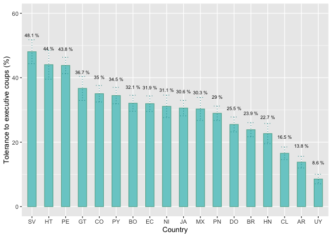
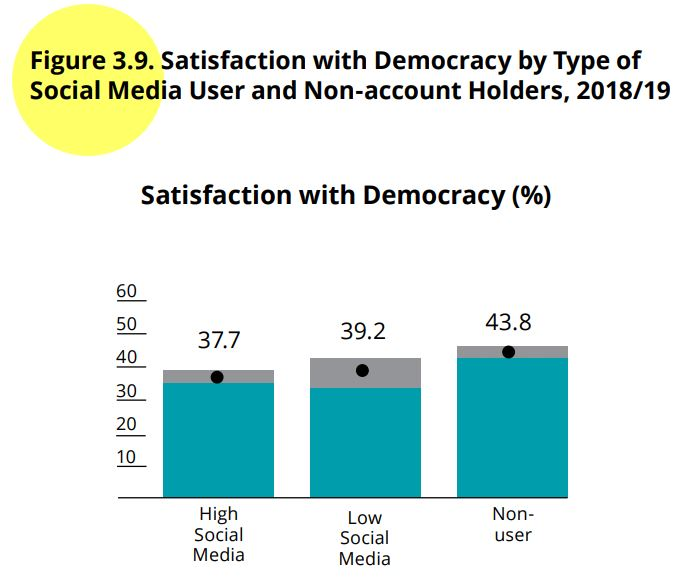
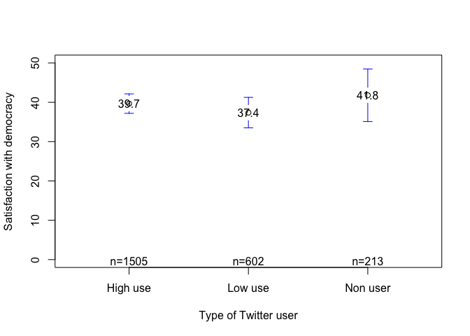
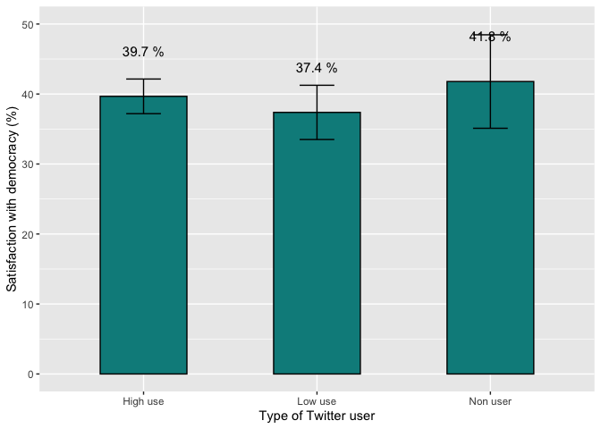
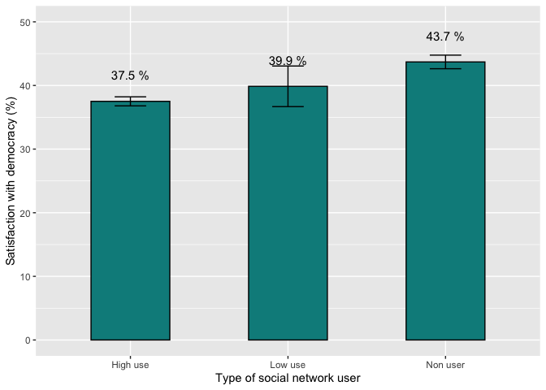
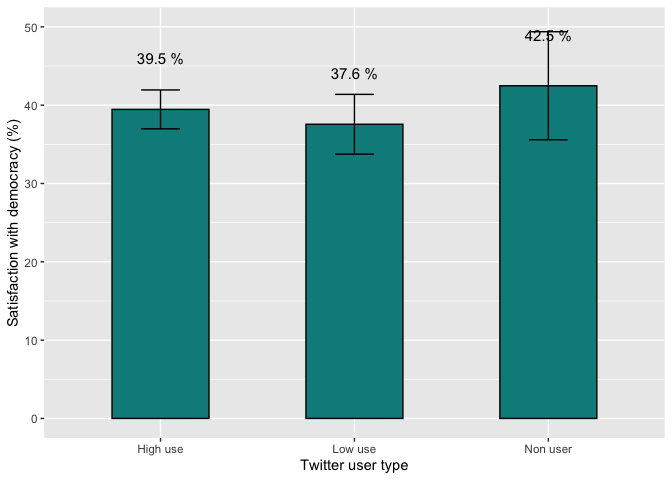

<style type="text/css">
.columns {display: flex;}
h1 {color: #3366CC;}
</style>

# Introduction

In this section we will see how to construct confidence intervals of the mean using the data from the AmericasBarometer.
For that, we will use the 2021 regional report "The Pulse of Democracy", available [here](https://www.vanderbilt.edu/lapop/ab2021/2021_LAPOP_AmericasBarometer_2021_Pulse_of_Democracy.pdf) and the 2018/19 report, available [here](https://www.vanderbilt.edu/lapop/ab2018/2018-19_AmericasBarometer_Regional_Report_Spanish_W_03.27.20.pdf).
The 2021 round reports data on executive coups.
Figure 1.7 shows the percentage of citizens that tolerates an executive coup by country.
In both cases, results include descriptive estimators and confidence intervals.
The 2018/19 round of the AmericasBarometer reports data on social networks and political attitudes.
In particular, Figure 3.9 reports the degree of satisfaction with democracy by type of user of social networks.

# About the dataset

The data we are going to use should be cited as follows: Source: AmericasBarometer by the Latin American Public Opinion Project (LAPOP), wwww.LapopSurveys.org.
This document loads a trimmed database.
This database is hosted in the "materials_edu" repository of the LAPOP account on GitHub.
It is recommended to clean the Environment before proceeding with this section.

Using the library `rio` and the command `import`, we can import this database from this repository.
In addition, the data from countries with codes less than or equal to 35 are selected, that is, the observations of the United States and Canada are eliminated.


```r
library(rio)
lapop18 = import("https://raw.github.com/lapop-central/materials_edu/main/LAPOP_AB_Merge_2018_v1.0.sav")
lapop18 = subset(lapop18, pais<=35)
```

We also upload the dataset for the 2021 round.


```r
lapop21 = import("https://raw.github.com/lapop-central/materials_edu/main/lapop21.RData")
lapop21 = subset(lapop21, pais<=35)
```

# Tolerance to executive coups

Figure 1.7 of the report The Pulse of Democracy for the 2021 round of the AmericasBarometer shows the results of the percentage of citizens that tolerates an executive coup by country.
This graph also displays the 95% confidence interval for each country.

{width="520"}

The variable used in this figure is "jc15a".
Its wording is: "Do you believe that when the country is facing very difficult times, it is justifiable for the president of the country to close the Congress and govern without Congress?" The options are:

1.  Yes, it is justified

2.  No, it is not justified

# Describing tolerance to executive coups

To calculate the percentage of citizens that justify or tolerate an executive coup, we have to recode this variable in a way that those who justify have a value of 100 and those who do not justify have a value of 0.
In this case, we use the command `recode` and we tabulate with `table` to verify the recodification.


```r
lapop21$jc15ar = car::recode(lapop21$jc15a, "1=100; 2=0")
table(lapop21$jc15ar)
```

```
## 
##     0   100 
## 14711  5908
```

To calculate the percentsage of citizens who tolerate an executive coup we can use the command `table` and `prop.table`.
The new variable "jc15ar" is a dummy variable.
With this type of variable, the mean is the proportion of responses with 100.
It means that if we calculate the mean of this variable, the results is the percentage for all respondents.
In this section we proceed as this variable is numeric.
In strict sense, this is a categorical nominal variable.
The calculation of standard deviations and confidence intervals are then referential.

The result indicates that the percentage of citizens that tolerates an executive coup is 28.7% for the whole sample.


```r
summary(lapop21$jc15ar)
```

```
##    Min. 1st Qu.  Median    Mean 3rd Qu.    Max.    NA's 
##    0.00    0.00    0.00   28.65  100.00  100.00   40042
```

# Confidence intervals for tolerance to executive coups

To calculate the 95% confidence interval of this percentage, we can use the command `t.test` or the library `lsr` that has the command `ciMean`.


```r
t.test(lapop21$jc15ar)
```

```
## 
## 	One Sample t-test
## 
## data:  lapop21$jc15ar
## t = 90.996, df = 20618, p-value < 2.2e-16
## alternative hypothesis: true mean is not equal to 0
## 95 percent confidence interval:
##  28.03599 29.27038
## sample estimates:
## mean of x 
##  28.65318
```

```r
library(lsr)
ciMean(as.numeric(lapop21$jc15ar), na.rm = T)
```

```
##          2.5%    97.5%
## [1,] 28.03599 29.27038
```

# Tolerance to executive coups by country

Figure 1.7 shows the percentage of citizens that tolerates an executive coup by country To replicate this results, we have to define the variable "pais" as factor.
We saved this change in a new variable "paises" that we label with the initials of each country.


```r
lapop21$paises = as.factor(lapop21$pais)
levels(lapop21$paises) <- c("MX", "GT", "SV", "HN", "NI", "CR",
                            "PN", "CO", "EC", "BO", "PE",
                            "PY", "CL", "UY", "BR", "AR", "DO",
                            "HT", "JA", "GU")
table(lapop21$paises)
```

```
## 
##   MX   GT   SV   HN   NI   CR   PN   CO   EC   BO   PE   PY   CL   UY   BR   AR 
## 2998 3000 3245 2999 2997 2977 3183 3003 3005 3002 3038 3004 2954 3009 3016 3011 
##   DO   HT   JA   GU 
## 3000 3088 3121 3011
```

To calculate these percentages by country, we can use several alternatives.
For example, the command `tapply` allows to calculate the mean of a variable by groups of other variable.


```r
tapply(lapop21$jc15ar, lapop21$paises, mean, na.rm=T)
```

```
##        MX        GT        SV        HN        NI        CR        PN        CO 
## 30.312500 36.687307 48.068670 22.660819 31.111111       NaN 28.962444 35.041447 
##        EC        BO        PE        PY        CL        UY        BR        AR 
## 31.944444 32.082414 43.805613 34.459459 16.544118  8.552632 23.862069 13.795620 
##        DO        HT        JA        GU 
## 25.495959 44.042553 30.583215       NaN
```

Other way is to ude the library `plyr` and `dplyr` that include the command `ddply`.
This command requires a definition of a dataframe "lapop21", the grouping variable "paises", and then the functions to calculate in each group, "mean" and "sd".


```r
library(plyr)
library(dplyr)
ddply(lapop21, "paises", summarise, mean=mean(jc15ar, na.rm=T), sd=sd(jc15ar, na.rm=T))
```

<div data-pagedtable="false">
  <script data-pagedtable-source type="application/json">
{"columns":[{"label":["paises"],"name":[1],"type":["fct"],"align":["left"]},{"label":["mean"],"name":[2],"type":["dbl"],"align":["right"]},{"label":["sd"],"name":[3],"type":["dbl"],"align":["right"]}],"data":[{"1":"MX","2":"30.312500","3":"45.99683"},{"1":"GT","2":"36.687307","3":"48.23249"},{"1":"SV","2":"48.068670","3":"49.99846"},{"1":"HN","2":"22.660819","3":"41.89433"},{"1":"NI","2":"31.111111","3":"46.32915"},{"1":"CR","2":"NaN","3":"NA"},{"1":"PN","2":"28.962444","3":"45.37325"},{"1":"CO","2":"35.041447","3":"47.72796"},{"1":"EC","2":"31.944444","3":"46.64234"},{"1":"BO","2":"32.082414","3":"46.69652"},{"1":"PE","2":"43.805613","3":"49.63180"},{"1":"PY","2":"34.459459","3":"47.54144"},{"1":"CL","2":"16.544118","3":"37.17149"},{"1":"UY","2":"8.552632","3":"27.97656"},{"1":"BR","2":"23.862069","3":"42.63874"},{"1":"AR","2":"13.795620","3":"34.49799"},{"1":"DO","2":"25.495959","3":"43.59987"},{"1":"HT","2":"44.042553","3":"49.69672"},{"1":"JA","2":"30.583215","3":"46.09229"},{"1":"GU","2":"NaN","3":"NA"}],"options":{"columns":{"min":{},"max":[10]},"rows":{"min":[10],"max":[10]},"pages":{}}}
  </script>
</div>

As we observe in the table, there is no data for Costa Rica, nor Guyana.
With the standard deviation, we can calculate the lower and upper limits of the confidence interval.

We can do this directly with the library `Rmisc`.
This library has the command `group.CI` that calculates the mean, the upper limit and the lower limit of a variable by groups of other variable.
This table is saved in an object "coup".
This command does not include rows of countries with no data, so there are no rows for Costa Rica and Guyana.


```r
library(Rmisc)
coup = group.CI(jc15ar~paises, lapop21)
coup
```

<div data-pagedtable="false">
  <script data-pagedtable-source type="application/json">
{"columns":[{"label":["paises"],"name":[1],"type":["fct"],"align":["left"]},{"label":["jc15ar.upper"],"name":[2],"type":["dbl"],"align":["right"]},{"label":["jc15ar.mean"],"name":[3],"type":["dbl"],"align":["right"]},{"label":["jc15ar.lower"],"name":[4],"type":["dbl"],"align":["right"]}],"data":[{"1":"MX","2":"33.88284","3":"30.312500","4":"26.742162"},{"1":"GT","2":"40.41369","3":"36.687307","4":"32.960926"},{"1":"SV","2":"51.78163","3":"48.068670","4":"44.355713"},{"1":"HN","2":"25.80600","3":"22.660819","4":"19.515638"},{"1":"NI","2":"34.61243","3":"31.111111","4":"27.609797"},{"1":"PN","2":"31.20785","3":"28.962444","4":"26.717039"},{"1":"CO","2":"37.61174","3":"35.041447","4":"32.471157"},{"1":"EC","2":"34.35553","3":"31.944444","4":"29.533359"},{"1":"BO","2":"34.56732","3":"32.082414","4":"29.597507"},{"1":"PE","2":"46.35270","3":"43.805613","4":"41.258529"},{"1":"PY","2":"37.01489","3":"34.459459","4":"31.904033"},{"1":"CL","2":"18.52143","3":"16.544118","4":"14.566804"},{"1":"UY","2":"10.03646","3":"8.552632","4":"7.068802"},{"1":"BR","2":"26.05857","3":"23.862069","4":"21.665568"},{"1":"AR","2":"15.62400","3":"13.795620","4":"11.967243"},{"1":"DO","2":"27.81437","3":"25.495959","4":"23.177545"},{"1":"HT","2":"48.54708","3":"44.042553","4":"39.538028"},{"1":"JA","2":"32.99455","3":"30.583215","4":"28.171877"}],"options":{"columns":{"min":{},"max":[10]},"rows":{"min":[10],"max":[10]},"pages":{}}}
  </script>
</div>

With this table, we can replicate Figure 1.7 with the library `ggplot`.
In a previous section, we produce a bar graph by country, specifying variables in axis with `aes` and using `geom_bar(…)`.
Now, we want to add confidence intervals.
For this, we add a new layer with the specification `geom_errorbar(…)`.
This specification requires a new `aes` where we have to specify a "ymin" and a "ymax" of the confidence interval.
The table "coup" has the information for "ymin" in the column "jc15ar.lower" and the information for "ymax" in the column "jc15ar.upper".

We also have options like `width` to specify the width of the whiskers of the error bars, `color` to specify the color of error bars, `cex` to specify the width of lines and `linetype` to specify the type of line, in this case dashed lines.


```r
library(ggplot2)
fig1.7 = ggplot(coup, aes(x=reorder(paises, -jc15ar.mean), y=jc15ar.mean))+
  geom_bar(width=0.5, fill="darkslategray3", colour="#69b3a2", stat="identity")+
  geom_errorbar(aes(ymin=jc15ar.lower, ymax=jc15ar.upper), width=0.4, 
                color="darkcyan", cex=0.4, linetype=3)+
  geom_text(aes(label=paste(round(jc15ar.mean, 1), "%")), vjust=-4.4, size=2.5)+
  xlab("Country") + ylab("Tolerance to executive coups (%)")+
  ylim(0, 60)
fig1.7
```

<!-- -->

These results, however, are not equal to those presented in Figure 1.7.
This is due to the fact that these calculations do not include survey weights.
Below, we will show how to include survey weights in calculations to replicate this figure.

# Describing of satisfaction with democracy

Figure 3.9 presents the percentage of respondents who are satisfied with democracy by type of social network user.

{width="436"}

The variable satisfaction with democracy is called "pn4" and is coded as follows:

1.  Very satisfied
2.  Satisfied
3.  Dissatisfied
4.  Very dissatisfied

Footnote 21 indicates that "Interviewees who select (1) or (2) are coded as satisfied with democracy." Therefore, this variable has to be recoded.
In this case, the command `recode` is used and tabulated, via `table`, to verify the recoding.


```r
library(car)
table(lapop18$pn4)
```

```
## 
##     1     2     3     4 
##  1727  8916 12455  3855
```

```r
lapop18$pn4rr = car::recode(lapop18$pn4, "1:2=100; 3:4=0")
table(lapop18$pn4rr)
```

```
## 
##     0   100 
## 16310 10643
```

The new variable "pn4rr" is a dummy variable.
In this type of variables, the mean corresponds to the proportion of responses of 100.
That is, if we calculate the mean of this variable, we are calculating the percentage for all the interviewees.
In this section we will treat this variable as if it were a numeric variable.
Strictly speaking, it is a nominal categorical variable.
The calculations of standard deviations and then of confidence intervals, therefore, are referential.


```r
summary(lapop18$pn4rr)
```

```
##    Min. 1st Qu.  Median    Mean 3rd Qu.    Max.    NA's 
##    0.00    0.00    0.00   39.49  100.00  100.00    1089
```

These results show an average of 39.5, that is, 39.5% of those interviewed are satisfied with democracy.
We can also calculate the confidence interval for this variable in several ways.
A first way is by performing a one-sample t-test, using the command `t.test`.
Other way is using the command `ciMean` from the library `lsr`.


```r
t.test(lapop18$pn4rr)
```

```
## 
## 	One Sample t-test
## 
## data:  lapop18$pn4rr
## t = 132.62, df = 26952, p-value < 2.2e-16
## alternative hypothesis: true mean is not equal to 0
## 95 percent confidence interval:
##  38.90364 40.07087
## sample estimates:
## mean of x 
##  39.48726
```

```r
library(lsr)
ciMean(lapop18$pn4rr, na.rm=T)
```

```
##          2.5%    97.5%
## [1,] 38.90364 40.07087
```

These results indicate that the 95% confidence interval of the mean for satisfaction with democracy varies between 38.9% and 40.1% .
We could change this default value to 99% confidence by adding the specification `conf = 0.99` to the command `ciMean`.

# Satisfaction with democracy by groups of consumption of information in social networks

The 2018/19 report uses a variable that measures "frequent exposure to political information." This variable is constructed in a complex way, based on the 3 social networks.
In this case we are going to start with a simpler recoding to recreate the confidence intervals of the variable "satisfaction with democracy" by groups of consumption of information in each social network.
Later the variable used in the report will be replicated.
The frequency of information consumption (variables "smedia2" for Facebook, "smedia5" for Twitter and "smedia8" for WhatsApp) of each social network is measured on the following scale:

1.  Daily
2.  A few times a week
3.  A few times a month
4.  A few times a year
5.  Never

We are going to recode these variables in such a way that those who respond daily or a few times a week will be classified as "high use", those who respond from 3 to 4 will be classified as "low use" and those who respond "never".
they will be classified as "non-users".
A similar classification scheme is used to define the users of the 3 social networks.
The new recoded variables are converted to a factor and labeled.


```r
table(lapop18$smedia2)
```

```
## 
##    1    2    3    4    5 
## 8633 4927 1286  282  231
```

```r
table(lapop18$smedia5)
```

```
## 
##   1   2   3   4   5 
## 795 728 422 193 220
```

```r
table(lapop18$smedia8)
```

```
## 
##     1     2     3     4     5 
## 14151  2646   495    50    87
```

```r
lapop18$smedia2r = car::recode(lapop18$smedia2, "1:2=1; 3:4=2; 5=3")
lapop18$smedia5r = car::recode(lapop18$smedia5, "1:2=1; 3:4=2; 5=3")
lapop18$smedia8r = car::recode(lapop18$smedia8, "1:2=1; 3:4=2; 5=3")
lapop18$smedia2r = as.factor(lapop18$smedia2r)
lapop18$smedia5r = as.factor(lapop18$smedia5r)
lapop18$smedia8r = as.factor(lapop18$smedia8r)
levels(lapop18$smedia2r) = c("High use", "Low use", "Non user")
levels(lapop18$smedia5r) = c("High use", "Low use", "Non user")
levels(lapop18$smedia8r) = c("High use", "Low use", "Non user")
table(lapop18$smedia2r)
```

```
## 
## High use  Low use Non user 
##    13560     1568      231
```

```r
table(lapop18$smedia5r)
```

```
## 
## High use  Low use Non user 
##     1523      615      220
```

```r
table(lapop18$smedia8r)
```

```
## 
## High use  Low use Non user 
##    16797      545       87
```

With these recoded variables, it is possible to calculate the mean (which are the percentages) of satisfaction with democracy for each group of information consumption in social networks.
This can be done in multiple ways.
If you want to compare the means, you can use the command `tapply`.


```r
tapply(lapop18$pn4rr, lapop18$smedia2r, mean, na.rm=T) #Facebook
```

```
## High use  Low use Non user 
## 37.55182 37.94466 40.74074
```

```r
tapply(lapop18$pn4rr, lapop18$smedia5r, mean, na.rm=T) #Twitter
```

```
## High use  Low use Non user 
## 39.66777 37.37542 41.78404
```

```r
tapply(lapop18$pn4rr, lapop18$smedia8r, mean, na.rm=T) #Whatsapp
```

```
## High use  Low use Non user 
## 37.39093 38.92100 43.37349
```

Other option that can display both the mean and the standard deviation is through the library `plyr` and the command `ddply`.
The code for Facebook would be:


```r
library(plyr)
ddply(lapop18, "smedia2r", summarise, mean=mean(pn4rr, na.rm=T), sd=sd(pn4rr, na.rm=T))
```

<div data-pagedtable="false">
  <script data-pagedtable-source type="application/json">
{"columns":[{"label":["smedia2r"],"name":[1],"type":["fct"],"align":["left"]},{"label":["mean"],"name":[2],"type":["dbl"],"align":["right"]},{"label":["sd"],"name":[3],"type":["dbl"],"align":["right"]}],"data":[{"1":"High use","2":"37.55182","3":"48.42747"},{"1":"Low use","2":"37.94466","3":"48.54092"},{"1":"Non user","2":"40.74074","3":"49.24932"},{"1":"NA","2":"41.80890","3":"49.32656"}],"options":{"columns":{"min":{},"max":[10]},"rows":{"min":[10],"max":[10]},"pages":{}}}
  </script>
</div>

It is important to note that in this case we have not indicated that internally we do not work with missing values (using the specification `filter(!is.na(wa_user))`), so the table above presents a row of NA, observations with no information of using of the social network, where the average and the standard deviation of the variable satisfaction with democracy are calculated.
Finally, an option that allows you to display many statistics for each group is `describeBy` from the library `psych`.
The code for Twitter is:


```r
library(psych)
describeBy(lapop18$pn4rr, group=lapop18$smedia5r)
```

```
## 
##  Descriptive statistics by group 
## group: High use
##    vars    n  mean    sd median trimmed mad min max range skew kurtosis   se
## X1    1 1505 39.67 48.94      0    37.1   0   0 100   100 0.42    -1.82 1.26
## ------------------------------------------------------------ 
## group: Low use
##    vars   n  mean    sd median trimmed mad min max range skew kurtosis   se
## X1    1 602 37.38 48.42      0   34.23   0   0 100   100 0.52    -1.73 1.97
## ------------------------------------------------------------ 
## group: Non user
##    vars   n  mean    sd median trimmed mad min max range skew kurtosis   se
## X1    1 213 41.78 49.44      0   39.77   0   0 100   100 0.33     -1.9 3.39
```

However, what interests us is to calculate the confidence intervals for each group.
Figure 3.9 of the report presents the mean of satisfaction with democracy, shown as a point, and the confidence intervals for each group, shown as a gray area with lower and upper limits.
The library `Rmisc` and the command `group.CI` can be used to calculate the confidence intervals of the variable satisfaction with democracy by groups of information consumption on Facebook.


```r
library(Rmisc)
group.CI(pn4rr~smedia2r, lapop18)
```

<div data-pagedtable="false">
  <script data-pagedtable-source type="application/json">
{"columns":[{"label":["smedia2r"],"name":[1],"type":["fct"],"align":["left"]},{"label":["pn4rr.upper"],"name":[2],"type":["dbl"],"align":["right"]},{"label":["pn4rr.mean"],"name":[3],"type":["dbl"],"align":["right"]},{"label":["pn4rr.lower"],"name":[4],"type":["dbl"],"align":["right"]}],"data":[{"1":"High use","2":"38.37595","3":"37.55182","4":"36.72770"},{"1":"Low use","2":"40.38847","3":"37.94466","4":"35.50086"},{"1":"Non user","2":"47.34574","3":"40.74074","4":"34.13574"}],"options":{"columns":{"min":{},"max":[10]},"rows":{"min":[10],"max":[10]},"pages":{}}}
  </script>
</div>

With these data, for example, the average satisfaction with democracy among the group with high use of information on Facebook is 37.6%.
The lower limit of the confidence interval is 36.7% and the upper limit is 38.4%.
With these data, a bar chart similar to 3.9 could be replicated.

# Confidence Intervals for satisfaction with democracy by groups of Twitter users

The easiest way to plot confidence intervals by groups is to use the command `plotmeans`.


```r
library(gplots)
plotmeans(lapop18$pn4rr~lapop18$smedia5r,
          xlab="Type of Twitter user",
          ylab="Satisfaction with democracy",
          ylim=c(0, 50),
          mean.labels=T, digits=1,
          connect=F
         )
```

<!-- -->

This option displays the confidence intervals but is difficult if you want to plot the bars.
The library `ggplot` gives us more options and allows us to plot in a similar way to Figure 3.9 of the report.
For this, a "tw.use" dataframe is first saved with the data of the mean and the upper and lower limits of each group, using the command `group.CI`.
It is the data from this dataframe that is used with `ggplot` and a graph is created which is saved in a "graf1" object.
With this library, the layer `geom_bar()` is added to define that you want a bar graph of the variables specified in `aes`.
Then the layer `geom_errorbar()` is added to add the error bars and then the mean values with `geom_text()`.
Finally, the X and Y axis are labeled with `xlab` and `ylab` and the limits of the Y axis are defined with `ylim`.


```r
tw.use <- group.CI(pn4rr~smedia5r, lapop18)
library(ggplot2)
graf1 <- ggplot(tw.use, aes(x=smedia5r, y=pn4rr.mean))+
  geom_bar(width=0.5, fill="darkcyan", colour="black", stat="identity")+
  geom_errorbar(aes(ymin=pn4rr.lower, ymax=pn4rr.upper), width=0.2)+
  geom_text(aes(label=paste(round(pn4rr.mean, 1), "%")), vjust=-4.2, size=4)+
  xlab("Type of Twitter user") + ylab("Satisfaction with democracy (%)")+
  ylim(0, 50)
graf1
```

<!-- -->

According to these results, satisfaction with democracy is higher in non-Twitter users, compared to users, although the differences are not statistically significant from a visual comparison between confidence intervals.

# Satisfaction with democracy by groups of type of user of social networks

So far, confidence intervals of satisfaction with democracy have been created by type of Twitter user.
The report aggregates the users of the three social networks to identify three types of users: high-users, low-users, and non-users of any social network.
The way of recoding this type of user of three social networks is based on several conditions.
As the report says: "We use the same coding as in the previous section, to distinguish between those who frequentle use social media (those with accounts that they access a few times a week or daily) and those who do not use social networks frequently (those with accounts that they access a few times a month or a few times a year). We also include non-users: those who do not have any social network accounts (those who indicate that they do not have an account on Facebook, Twitter or Whatsapp) and those who have an account, but never use it" (p.81).
We first identify those who use each social network a few times a week or daily as 1 and if they use each social network a few times a month or a few times a year, as 0.
For this we use the command `ifelse`.
Then, we add the values of each social network in a single variable, with values between 0 and 3.
The command `rowSums` is used, which allows the horizontal sum of defined variables, in this case those at position `[, 89:91]`.
In this command, we use the specification `na.rm=T` so that the sum does not take missing values into account.


```r
lapop18$sm2 = ifelse(lapop18$smedia2==1 | lapop18$smedia2==2, 1, 0)
lapop18$sm5 = ifelse(lapop18$smedia5==1 | lapop18$smedia5==2, 1, 0)
lapop18$sm8 = ifelse(lapop18$smedia8==1 | lapop18$smedia8==2, 1, 0)
lapop18$anyhi = rowSums(lapop18[,89:91], na.rm=T)
table(lapop18$anyhi)
```

```
## 
##     0     1     2     3 
##  9831  5811 11131  1269
```

Starting from this variable, a variable is created that aggregates the three social networks, called "hi_lo_non".
First, this variable is created as a vector of NAs.
Values of 1, 2, 3 or NA are then imputed to it, depending on the values of "anyhi" or the values of the social network variables.
A new variable of type factor is then created, with identical values as "hi_lo_non" and is labeled.
The definition of the conditionality is worked through the square brackets `[...]`.
In this way, the conditions are defined as follows:

-   The variable "hi_lo_non is equal to 1 if the variable anyhi is greater than or equal to 1 (use daily or a few times a week) = `lapop18$hi_lo_non[lapop18$anyhi>=1] = 1`

-   The variable "hi_lo_non is equal to 2 if the variable anyhi is equal to 0 (use a few times a year or never) = `lapop18$hi_lo_non[lapop18$anyhi==0] = 2`

-   The variable "hi_lo_non is equal to 3 if the variables of account holding are equal to 2 (No) = `lapop18$hi_lo_non[lapop18$smedia1==2 & lapop18$smedia4==2 & lapop18$smedia7==2] = 3`

The following coding rules follow the same logic of combining other variables to impute the value 3 or NA.


```r
lapop18$hi_lo_non = NA #create a vector with NAs#
lapop18$hi_lo_non[lapop18$anyhi>=1] = 1 #1 is coded for those who use a social network daily or a few times a week.#
lapop18$hi_lo_non[lapop18$anyhi==0] = 2 #Those who use a social network a few times a month and a year are coded as 2#
lapop18$hi_lo_non[lapop18$smedia1==2 & lapop18$smedia4==2 & lapop18$smedia7==2] = 3 #Those who do not have social networks are coded as 3#
lapop18$hi_lo_non[lapop18$smedia2==5 & lapop18$smedia5==5 & lapop18$smedia8==5] = 3 #Those who never use any social network are coded as 3#
lapop18$hi_lo_non[lapop18$pais==3 & (lapop18$smedia2==5 | lapop18$smedia5==5 | lapop18$smedia8==5)] = 3 #A particular code is applied to country 3#
lapop18$hi_lo_non[lapop18$pais==3 & (lapop18$smedia1==2 | lapop18$smedia4==2 | lapop18$smedia7==2)] = 3 #A particular code is applied to country 3#

lapop18$hilon = as.factor(lapop18$hi_lo_non)
levels(lapop18$hilon) = c("High use", "Low use", "Non user")
prop.table(table(lapop18$hilon))*100
```

```
## 
##  High use   Low use  Non user 
## 64.941873  3.480494 31.577634
```

According to these data, 64.9% of those interviewed report a high use of social networks, while, at the other extreme, there are 31.6% who do not use any social network.
These data differ slightly from those reported in the Appendix to the report, available [here](https://www.vanderbilt.edu/lapop/ab2018/Appendix_Material_for_2018-19_AmericasBarometer_Report-Comparative_Chapters_10.13.19.pdf), where 65.34% of high use and 31.60% of non-users are reported.
These differences may be due to differences in the interpretation of the coding rules from Stata to R.

In the same way that the graph of average satisfaction with democracy by type of Twitter user was produced using `ggplot`, now the same will be done but for the users of the three social networks, variable "hilon".


```r
library(Rmisc)
satis.use = group.CI(pn4rr~hilon, lapop18)
library(ggplot2)
fig3.9 = ggplot(satis.use, aes(x=hilon, y=pn4rr.mean))+
  geom_bar(width=0.5, fill="darkcyan", colour="black", stat="identity")+
  geom_errorbar(aes(ymin=pn4rr.lower, ymax=pn4rr.upper), width=0.2)+
  geom_text(aes(label=paste(round(pn4rr.mean, 1), "%")), vjust=-2.5, size=4)+
  xlab("Type of social network user") + ylab("Satisfaction with democracy (%)")+
  ylim(0, 50)
fig3.9
```

<!-- -->

This graph would be a replication of the one presented in the report (Figure 3.9 on page 62), with minor differences due to the encoding of the resulting data.

# Summary

In this section we have worked with a recoded dummy variable (satisfaction with democracy), which can be used as a numerical variable for calculating confidence intervals of proportions.
With this variable, the confidence interval of the mean has been calculated, which would be that of the proportion of respondents who are satisfied with democracy.
Then, these variables have been described by groups of a factor variable (consumption of political information).
It has been presented how to calculate the confidence intervals of the numerical variable by groups of the factor variable.
Finally, it has been presented how to plot the confidence intervals by groups.

# Calculations including survey weights

Other way to calculate the confidence interval, including the survey weight, is by using the library `survey` and the command `confint` along with the native command `svymean`.


```r
library(survey)
design18 = svydesign(ids = ~upm, strata = ~estratopri, weights = ~weight1500, nest=TRUE, data=lapop18)
```

In the same way as in the previous section, the satisfaction with democracy variable can be described by incorporating survey weights using the command `svymean`.


```r
svymean(~pn4rr, design18, na.rm=T)
```

```
##         mean     SE
## pn4rr 39.459 0.3317
```

To calculate the confidence interval, the above code has to be nested inside the command `confint`.
This command calculates the 95% confidence interval by default.
You could change this default value to 99% confidence by adding the `conf = 0.99` specification to the command.


```r
confint(svymean(~pn4rr, design18, na.rm=T))
```

```
##          2.5 %   97.5 %
## pn4rr 38.80884 40.10901
```

The mean and confidence interval of satisfaction with democracy can also be calculated incorporating the survey weight using the command `svyby`.
Within this command, the numerical variable to be described (`~pn4rr`), the variable that forms the groups (`~smedia5r`), the sample design (`design18`), the function to be calculated ( `svymean`), that does not take into account missing values (`na.rm=T`) and the confidence interval of each group (`vartype="ci"`) are defined.


```r
tw.uso.weighted <- svyby(~pn4rr, ~smedia5r, design18, svymean, na.rm=T, vartype = "ci")
tw.uso.weighted
```

<div data-pagedtable="false">
  <script data-pagedtable-source type="application/json">
{"columns":[{"label":[""],"name":["_rn_"],"type":[""],"align":["left"]},{"label":["smedia5r"],"name":[1],"type":["fct"],"align":["left"]},{"label":["pn4rr"],"name":[2],"type":["dbl"],"align":["right"]},{"label":["ci_l"],"name":[3],"type":["dbl"],"align":["right"]},{"label":["ci_u"],"name":[4],"type":["dbl"],"align":["right"]}],"data":[{"1":"High use","2":"39.46510","3":"36.98285","4":"41.94735","_rn_":"High use"},{"1":"Low use","2":"37.56570","3":"33.74961","4":"41.38179","_rn_":"Low use"},{"1":"Non user","2":"42.48075","3":"35.57877","4":"49.38274","_rn_":"Non user"}],"options":{"columns":{"min":{},"max":[10]},"rows":{"min":[10],"max":[10]},"pages":{}}}
  </script>
</div>

To be able to plot, these calculations are saved in a "tw.uso.weighted" dataframe, which includes the mean data for each group and the lower and upper limit of the confidence interval.
In the same way as with data that does not include the survey effect, the library `ggplot` is used and a plot is created which is saved in a "graf2" object.
Very similar specifications to the previous examples are used.


```r
graf2 <- ggplot(tw.uso.weighted, aes(x=smedia5r, y=pn4rr))+
  geom_bar(width=0.5, fill="darkcyan", colour="black", stat="identity")+
  geom_errorbar(aes(ymin=ci_l, ymax=ci_u), width=0.2)+
  geom_text(aes(label=paste(round(pn4rr, 1), "%")), vjust=-4.2, size=4)+
  xlab("Twitter user type") + ylab("Satisfaction with democracy (%)")+
  ylim(0, 50)
graf2
```

<!-- -->
