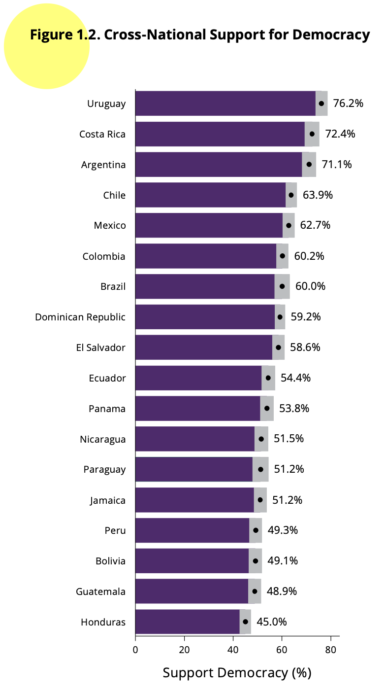
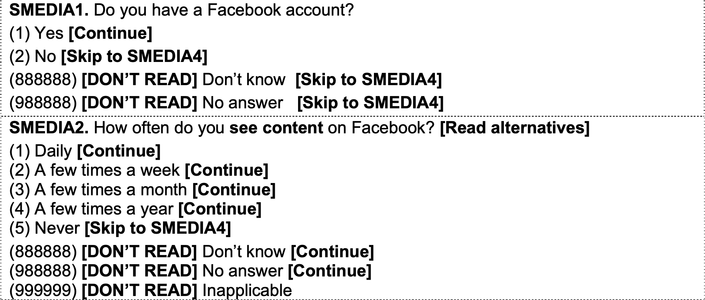
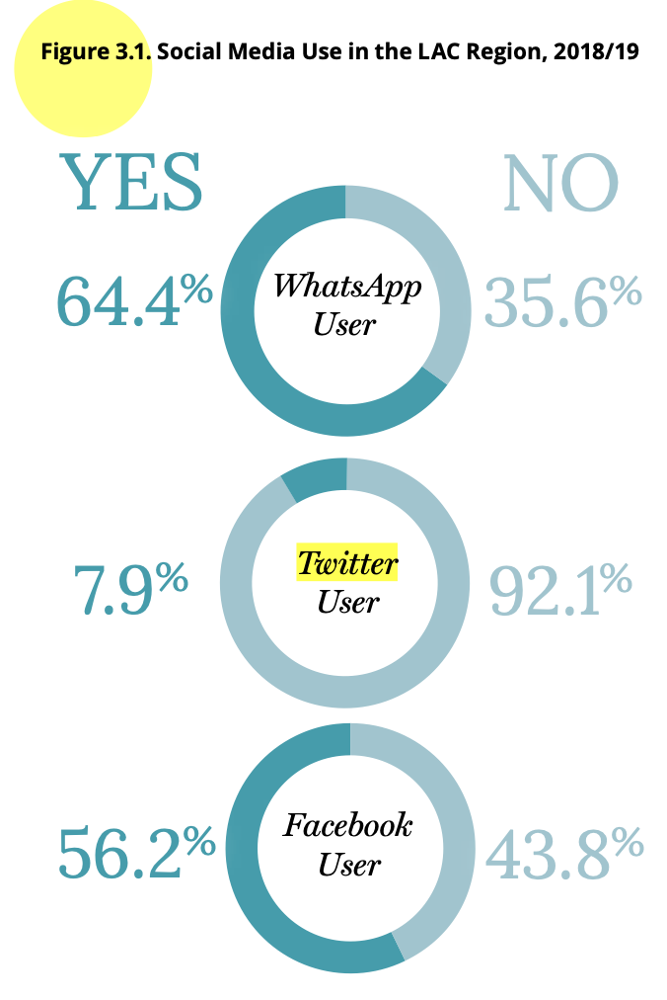

```{r setup, include=FALSE}
knitr::opts_chunk$set(message=FALSE,warning=FALSE, cache=TRUE)
```

```{css color, echo=FALSE}
.columns {display: flex;}
h1 {color: #3366CC;}
```

# Introduction

This section will cover basic aspects of data manipulation, such as recoding a variable, selecting data, and calculating a new variable.
At the end, there is a note about the statistical calculations considering the design effect.

# About the AmericasBarometer datasets

The data that we are going to use should be cited as follows: Source: Barometer of the Americas by the Latin American Public Opinion Project (LAPOP), wwww.LapopSurveys.org.

In this section a dataset is loaded.
This dataset is hosted in the "materials_edu" repository of LAPOP's GitHub account.
Through the library `rio` and the command `import`, this database can be imported from this repository, using the following code.
The dataset is imported into the object "lapop21".
This dataset has an extension .RData and when it is imported, variables are defined as type double ("dbl"), which is a type of variable that allows decimals, different from type integer, "int", that only accept integers.

```{r base}
library(rio)
lapop21 = import("https://raw.github.com/lapop-central/materials_edu/main/lapop21.RData")
```

The dataset for the previous round of the AmericasBarometer is also in this repository.
We can load and call it "lapop18".
It is necessary to clarify that this dataset, imported from a SPSS file, loads variables as type numeric ("num").

```{r base18}
lapop18 = import("https://raw.github.com/lapop-central/materials_edu/main/LAPOP_AB_Merge_2018_v1.0.sav")
```

# Recoding a variable

In this section we will use the report "The Pulse of Democracy" that presents the results for the 2021 round of the AmericasBarometer, available [here](https://www.vanderbilt.edu/lapop/ab2021/2021_LAPOP_AmericasBarometer_2021_Pulse_of_Democracy.pdf).
This report presents the results on support for democracy in the Americas.
These results are based on the variable called ING4 in the dataset.
This variable is worded as follows:

ING4.
*Changing the subject again, democracy may have problems, but it is better than any other form of government. To what extent do you agree or disagree with this statement?*

This variable is measured in a 1-7 scale, where 1 means "strongly disagree" and 7 means "strongly agree".
Then, values from 5 to 7 are recoded as support for democracy.
To see the distribution of responses to this variable, you can use the `table` command.

```{r describing ing4}
table(lapop21$ing4)
```

In this way, the observations (absolute frequencies) are calculated for each value of the variable.
To calculate the percentage of people who support democracy, we have to recode this variable and create a new one.
It means that the original ING4, in a 1-7 scale, has to be recoded in a new variable following this rule:

1.  Values between 1-4 of ING4 become 0 in a new variable ing4r
2.  Values between 5-7 of ING4 become 1 in a new variable ing4r

An example of how this recoded data is presented in the report can be seen in Graph 1.1.
This shows the percentage of citizens who support democracy by country.
That is, the percentage of respondents who answered between 5 and 7 to the ING4 question in each country is shown.
According to the recoding, this graph would represent the percentage of respondents who register a 1 in the recoded variable.

{width="563"}

In the report The Pulse of Democracy for the 2018/19 round, available [here](https://www.vanderbilt.edu/lapop/ab2018/2018-19_AmericasBarometer_Regional_Report_10.13.19.pdf), it is presented a similar figure, using the same variable and the same rule for recoding.

{width="435"}

To recode a variable in R there are several ways.
One of the most efficient ways to do this is by using the command `recode` from the `car` package.
The `dplyr` package has also a `recode` command that can confuse R.
To avoid confusion we will specify in the syntax `car::recode` recoding.
The recoded variable is recorded as "lapop21\$ing4rec".
Then, the command `table` is used to describe this new variable.

```{r recoding}
library(car)
lapop21$ing4rec <- car::recode(lapop21$ing4, "1:4=0; 5:7=1")
table(lapop21$ing4rec)
```

If the observations between 1 and 4 of the original variable are added (1699 + 1470 + 3003 + 6089), we see that it is the result equals the observations in value 0 of the new variable (12261), as it was written in the recoding.
It should also be noted that the dataset in the Environment now has one more variable, totaling 1826 variables.

# Selection of observations

The Figure 1.1 shows that support for democracy goes from a high of 80% in Uruguay to a low of 46% in Haiti.
To replicate result corresponding to Uruguay, we can select observations from this country.
According to codification of variable "pais", Uruguay is coded as 14.

{width="515"}

Selection of observations in R can be done in several ways.
One way is to use brackets.
Other way is to use the command `subset`.
With this command, we select observations from this country and we save this selection in a new dataframe "lapop1".
We have 3009 observations in Uruguay and 1826 variables.

```{r Uru}
lapop1 = subset(lapop21, pais==14)
table(lapop1$pais)
```

With this selection of data, you can calculate the percentages (relative frequencies) using the command `prop.table`.
This command gives us the relative frequencies (in values between 0 and 1) of a frecuency table calculated with `table`.
These relative frequencies are multiplied by 100 to reproduce the percentage in each country.
In this case, the brackets `[…]` are used to make the selection of cases from each country.

```{r percent}
prop.table(table(lapop1$ing4rec[lapop1$pais==14]))*100
```

These results are percentages (between 0 and 100), but include many decimal places.
To round to one decimal, as shown in Graph 1.2, you can use the command `round`, where all the previous syntax is nested.
In this command, you have to specify the number of decimal places you want, which in this case is 1.

```{r round}
round(prop.table(table(lapop1$ing4rec[lapop1$pais==14]))*100, 1)
```

According to this result, 84.5% of Uruguayans support democracy.
This result is different from what it is reported in Figure 1.1, where reported value is 80%.
This difference is due to the fact that our procedures do not include the effect of complex design features, such as weights, stratification, and cluster sampling.
Below, we present procedures to reproduce precise reported results.

The report for the 2018/19 wave indicates "Figure 1.2 displays the percent of individuals in each country that expresses support for democracy in 2018/19. Support for democracy ranges from a low of 45% in Honduras to a high of 76.2% in Uruguay." (p. 11).

For replicating these results about Honduras and Uruguay for the 2018/19 round, we can select observations for these two countries.
According to the questionnaire, available HERE, Honduras is coded as 4 and Uruguay as 14 in variable "pais", that is imported as a numeric variable.

We include the operator "or", that is written as \"\|\" in R.
In this way, we can select observations from Honduras or Uruguay using `pais==4 | pais==14`.
The description of variable "pais" shows that it includes only observations for Honduras (2) and Uruguay (14).

```{r select}
lapop2 = subset(lapop18, pais==4 | pais==14)
table(lapop2$pais)
```

The new dataframe "lapop2" has 3141 observations and 84 variables.
It does not include a recoded variable for support for democracy.
We proceed to include it.

```{r ing4}
lapop2$ing4rec <- car::recode(lapop2$ing4, "1:4=0; 5:7=1")
```

With this variable, we can follow the same procedures as before: produce a relative frequency table.

```{r relative}
prop.table(table(lapop2$ing4rec[lapop2$pais==4]))*100
prop.table(table(lapop2$ing4rec[lapop2$pais==14]))*100
```

And then, we include rounding.

```{r round2}
round(prop.table(table(lapop2$ing4rec[lapop2$pais==4]))*100, 1)
round(prop.table(table(lapop2$ing4rec[lapop2$pais==14]))*100, 1)
```

With this code, we have reproduced results for countries in the extremes of Figure 1.2.
In this case, results are similar to the ones reported in the figure in the report.

Both reports also indicate that the United States and Canada are excluded from the calculations.
The dataset loaded as "lapop18" includes all the countries in the round.
To exclude these two countries, we have to select the countries that are NOT USA and Canada.
This new selection can be saved in a new dataframe or it can be overwritten in the original dataframe, as it is done in this case because the exclusion of these countries is for all the calculations that follow.
According to the questionnaire, USA has the code 40 and Canada, the code 41 in the variable "pais".
To exclude them, countries with a code of less than 40 (or 35 or less) must be included.
For this we can again use the `subset` command.

```{r drop USA Canada}
lapop18 <- subset(lapop18, pais<=35)
```

It can be observed in the Environment that the observations of the "lapop18" dataframe are reduced after running this code, since the observations of repondents in these two countries have been eliminated.
The number of observations goes from 31,050 to 28,042, a number that coincides with that of the dataset in .RData format that we used in the previous module and that we indicated that it did not include these countries.

In the same way, we can proceed in the 2021 wave dataset.
After this, observations decrease to 60,661.

```{r drop 2021}
lapop21 = subset(lapop21, pais<=35)
```

# Calculating a variable

A frequent LAPOP practice with the AmericasBarometer data is the rescaling of variables.
The report's chapter on democratic legitimacy provides examples of this rescaling with variables related to support for the system.
To calculate this index for system support, we work with a set of five variables:

B1.
To what extent do you think the courts of (country) guarantee a fair trial?
. To what extent do you respect the political institutions of (country)?

B2.
To what extend do you respect the political institutions of (country)?

B3.
To what extent do you think the basic rights of the citizen are well protected by the political system of (country)?

B4.
To what extent are you proud to live under the political system of (country)?

B6.
To what extent do you think the political system of (country) should be supported?

As the report indicates "For each question, the original scale from 1 (" Not at all ") to 7 ("A lot") is recoded on a 0-100 scale, in such a way that 0 indicates the lowest level of support for the political system and 100 is the highest level of support for the political system. This new scale follows the typical LAPOP recoding and can be interpreted as a measure of support in units, or degrees, on a continuous scale ranging from 0 to 100" (p. 34).
To check the original scale of these variables, we can describe these variables using the `table` command.

```{r describing2}
table(lapop18$b1)
table(lapop18$b2)
table(lapop18$b3)
table(lapop18$b4)
table(lapop18$b6)
```

It is observed that all the variables run on a scale from 1 to 7.
To rescale a variable from an original scale from 1 to 7 to another from 0 to 100, the first thing to do is subtract 1 unit, so the variable would have a scale of 0 to 6, then divide it by 6, with which would vary between 0 and 1 and, finally, multiply it by 100.
this is:

Rescaled variable = ((original variable -1)/6)\*100

```{r calculate}
lapop18$b1rec <- ((lapop18$b1-1)/6)*100
lapop18$b2rec <- ((lapop18$b2-1)/6)*100
lapop18$b3rec <- ((lapop18$b3-1)/6)*100
lapop18$b4rec <- ((lapop18$b4-1)/6)*100
lapop18$b6rec <- ((lapop18$b6-1)/6)*100
table(lapop18$b1rec)
```

With this transformation, it is observed that the 4,089 interviewees who scored 1 in question B1 now have a score of 0.
The 4,067 who scored 2 now have a score of 16.67, that is 2-1=1/6=0.1667\*100=16.67.
This same operation could be done with the `car :: recode` command, following this recoding rule:

-   Value of 1 in original variable is recoded as 0 in new variable
-   Value of 2 in original variable is recoded as 16.67 in new variable
-   Value of 3 in original variable is recoded as 33.33 in new variable
-   Value of 4 in original variable is recoded as 50 in new variable
-   Value of 5 in original variable is recoded as 66.67 in new variable
-   Value of 6 in original variable is recoded as 83.33 in new variable
-   Value of 7 in original variable is recoded as 100 in new variable

This way of recoding, however, is not very efficient.
It is simpler to use the formula to calculate the recoding.
To calculate the system support index, the report indicates that "The system support index is the average of five questions: B1, B2, B3, B4 and B6" (p.46).
In other words, with the rescaled variables, the average of these five variables has to be calculated for each individual (that is, in each row of the dataset).
This could be done by calculating the average manually.

System support = (b1rec + b2rec + b3rec + b4rec + b6rec)/5

In R we have the command `rowMeans` that is used to calculate averages of certain columns for each row.
The syntax `[, 86:90]` indicates that the average calculation will be performed by rows for all rows and using columns 86 to 90 of the "lapop18" dataframe (the calculation could be done for some particular rows by defining `[ row_n: row_m, 86:90]`).
This average is saved in a new variable "support", which is described.

```{r system support}
lapop18$apoyo = rowMeans(lapop18[,85:89])
table(lapop18$apoyo)
```

With this index, it is possible to calculate the average support for the system for the last round of the AmericasBarometer, as well as the averages for each of the variables that are included in the index.
The `mean` command is used for the average and the `na.rm = T` specification is used to tell the command not to take into account the missing values of these variables.
These statistics will be seen in more detail in other documents.

```{r system support 2018/19}
mean(lapop18$apoyo, na.rm=T) #system support
mean(lapop18$b1rec, na.rm=T) #courts guarantee fair trial
mean(lapop18$b2rec, na.rm=T) #Respect for institutions
mean(lapop18$b3rec, na.rm=T) #Basic rights are protected
mean(lapop18$b4rec, na.rm=T) #Pride in the political system
mean(lapop18$b6rec, na.rm=T) #The political system should be supported
```

These results are those shown in Figure 2.1 for the 2018/19 round.

{width="622"}

# Condicionally calculating a variable

Sometimes the calculation of a variable does not only require the numerical transformation of the original variable, but the values of the new variable depend on the values of other variables.
For example, the chapter "Social networks and political attitudes" of the report "The Pulse of Democracy" presents the results for the variables "WhatsApp user", "Twitter user" and "Facebook user".
To calculate these variables, footnote 7 of this chapter indicates: "For each platform, we identify users with a combination of two sets of survey questions. First, we identify users as those who respond positively to the questions, SMEDIA1/SMEDIA4/SMEDIA7. Do you have a Facebook/Twitter/WhatsApp account? Then, we recode as non-users those who respond "never" to the follow-up questions, SMEDIA2/SMEDIA5/SMEDIA8. How often do you see content on Facebook/Twitter/WhatsApp?" (p. 64).

{width="531"}

That is, the user is not only the one who has an account (SMEDIA1 = 1), but the one who uses it with a certain frequency (SMEDIA2 = 1, 2, 3, 4).
In this way, the non-user can have an account, but never use it.
Therefore, the variable "user" depends on the values of 2 variables.
The rule for coding is:

-   Facebook user = 1 (he/she is a user) if SMEDIA1 = 1 (he/she has an account) and SMEDIA2 \<= 4 (he/she uses it with some frequency)

-   Facebook user = 0 (he/she is not a user) if SMEDIA2 = 2 (he/she doesn´t have an account) or SMEDIA2 = 5 ( he/she has an account but never uses it)

This rule transforms into the following R syntax, which uses the command `ìfelse`.
This syntax includes the condition to assign values of 1 to a new variable and assigns all other observations the value of 0.
These new variables are described using the `table` command to generate the absolute frequencies,the `prop.table` command for the relative frequencies and the `round` command to round the decimals.
These commands will be seen in more detail in the following documents.

```{r users, echo=TRUE, message=FALSE, warning=FALSE}
lapop18$fb_user <- ifelse(lapop18$smedia1==1 & lapop18$smedia2<=4, 1, 0)
lapop18$tw_user <- ifelse(lapop18$smedia4==1 & lapop18$smedia5<=4, 1, 0)
lapop18$wa_user <- ifelse(lapop18$smedia7==1 & lapop18$smedia8<=4, 1, 0)
round(prop.table(table(lapop18$fb_user))*100, 1)
round(prop.table(table(lapop18$tw_user))*100, 1)
round(prop.table(table(lapop18$wa_user))*100, 1)
```

These results are those presented in Graph 3.1 of the report in the form of pie charts.
These types of graphs will be seen in the next section.

{width="309"}

# Design effect observation

Both the results for system support and those of social network users differ from those that appear in the report for two reasons.
First, about support the system, because "Cross-time values are calculated including only those countries the AmericasBarometer has surveyed consistently since 2006: Argentina, Brazil, Bolivia, Chile, Colombia, Costa Rica , the Dominican Republic, Ecuador, El Salvador, Guatemala, Honduras, Jamaica, Mexico, Nicaragua, Panama, Paraguay, Peru, Uruguay" (p.46).
The code only filters the last round, which includes countries that are not on that list, such as the United States or Canada.
On the other hand, the calculations reported in the publication include the use of survey weights, which have not been included in these calculations, but which will be incorporated in other documents (see [here](https://rpubs.com/arturo_maldonado/728626)).

# Summary

In this document we have seen the basic elements of data manipulation and transformation using the AmericasBarometer datasets.
A variable has been recoded using the `recode` command, cases have been selected using `subset` and a new variable has been calculated algebraically and with the `ifelse` command.
