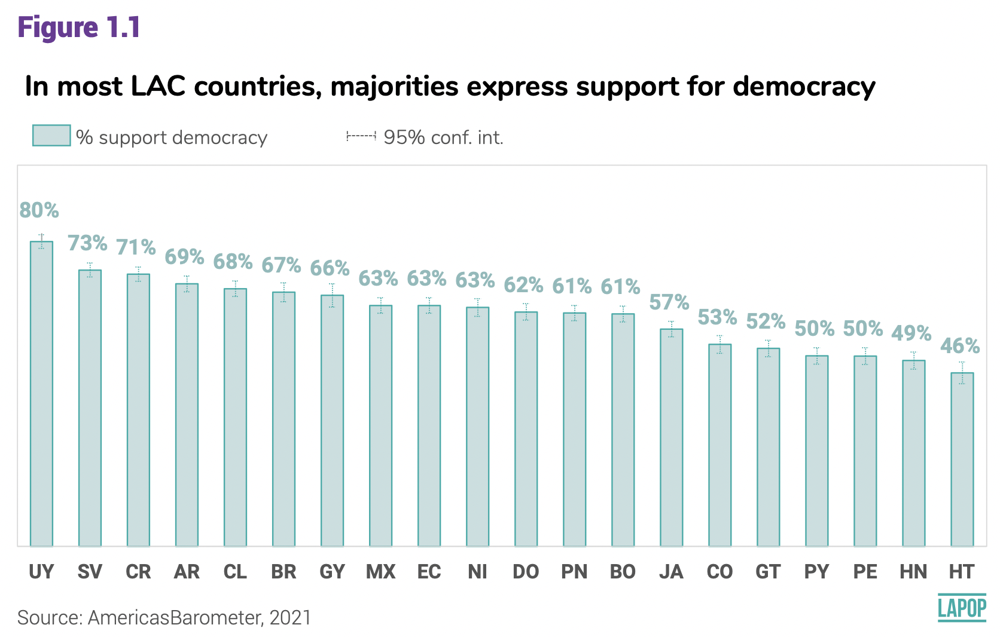

```{r setup, include=FALSE}
knitr::opts_chunk$set(message=FALSE,warning=FALSE, cache=TRUE)
```

```{css color, echo=FALSE}
.columns {display: flex;}
h1 {color: #3366CC;}
```

# Introduction

In this section we will see how to construct confidence intervals of the mean using the data from the AmericasBarometer for more than two groups.
For that, we will continue to use the last regional report "The Pulse of Democracy" for 2021 round, available [here](https://www.vanderbilt.edu/lapop/ab2021/2021_LAPOP_AmericasBarometer_2021_Pulse_of_Democracy.pdf), and for the 2018/19 round, available [here](https://www.vanderbilt.edu/lapop/ab2018/2018-19_AmericasBarometer_Regional_Report_10.13.19.pdf), where the main findings of the AmericasBarometer are presented.
In both reports, one of the sections reports the results on support for electoral democracy by country.
This type of plot is one of the most used with the AmericasBarometer data because it uses data for one wave to its limits, presenting a panoramic view of the region for a critical variable like support for democracy in all the countries in Latin America

# About the dataset

The data we are going to use should be cited as follows: Source: AmericasBarometer by the Latin American Public Opinion Project (LAPOP), wwww.LapopSurveys.org.
We can download the data freely [here](http://datasets.americasbarometer.org/database/login.php).

This section loads a trimmed database, originally in SPSS (.sav) format.
This database is hosted in the "materials_edu" repository of the LAPOP account on GitHub.
Using the library `rio` and the command `import`, you can import this database from this repository.
In addition, the data from countries with codes less than or equal to 35 are selected, that is, the observations of the United States and Canada are eliminated.

```{r base}
library(rio)
lapop18 = import("https://raw.github.com/lapop-central/materials_edu/main/LAPOP_AB_Merge_2018_v1.0.sav")
lapop18 = subset(lapop18, pais<=35)
```

We also load the dataset for the 2021 round.

```{r}
lapop21 = import("https://raw.github.com/lapop-central/materials_edu/main/lapop21.RData")
lapop21 = subset(lapop21, pais<=35)
```

# Support for democracy by country 2021

Figure 1.1 shows the percentage of citizens that supports democracy in each country.
Each country bar includes the 95% confidence interval.
The question in which is based this figure is: **ING4.** Changing the subject again, democracy may have problems, but it is better than any other form of government.
To what extent do you agree or disagree with this statement?
Respondents can answer in a 1-7 scale, where 1 means "Strongly disagree" and 7 "Strongly agree".

To calculate these percentages, we hace to recode all answers between 5 and 7 as those who support democracy.

{width="540"}

First, we have to define a new variable with this recodification that identifies supporters.

```{r}
library(car)
lapop21$ing4r = car::recode(lapop21$ing4, "1:4=0; 5:7=100")
table(lapop21$ing4r)
```

To replicate Figure 1.1, we have to define a variable that identifies countries as a variable of type factor.
For this, we calculate a new variable "paises" as factor with the command `as.factor` and we label it the the initials of each country, with the command `levels`, in the same way as it is shown in Figure 1.1.

```{r}
lapop21$paises = as.factor(lapop21$pais)
levels(lapop21$paises) = c("ME", "GT", "SV", "HN", "NI",
                            "CR", "PN", "CO", "EC", "BO", "PE",
                            "PY", "CL", "UY", "BR", "AR", "DO",
                            "HT", "JA", "GY")
table(lapop21$paises)
```

Once done, we can use the library `Rmisc`\` and the command `summarySE`\`to calculate the means (that is, the percentages) of support for democracy in each country.
This command also includes the standard deviation, the standard error and the confidence interval.
We save this table in an object "df".

```{r}
library(Rmisc)
df = summarySE(data=lapop21, measurevar="ing4r", groupvar="paises", na.rm=T)
df
```

With this table "df" we can replicate Figure 1.1 using the library `ggplot` in the same way as previous sections show.

```{r}
library(ggplot2)
fig1.1 <- ggplot(df, aes(x=reorder(paises, ing4r), y=ing4r))+
  geom_bar(width=0.5, fill="purple", colour="black", stat="identity")+
  geom_errorbar(aes(ymin=ing4r-ci, ymax=ing4r+ci), width=0.2)+
  geom_text(aes(label=paste(round(ing4r, 1), "%")), vjust=-1.5, size=2)+
  xlab("Country")+
  ylab("Support for democracy")
fig1.1
```

These results are not the same as those presented in Figure 1.1 because they do not include survey weights.

# Support for democracy by country 2018/19

Figure 1.2 of the 2018/19 report shows the average support for electoral democracy for each of the 18 countries analyzed.
It also presents the confidence intervals for each country, in the form of a gray bar, which indicates the lower and upper range of this interval, with a dot indicating the mean value.

{width="465"}

To reproduce the data in this graph, you first have to recode the variable, in the same way as was done in the section about [confidence intervals](https://arturomaldonado.github.io/BarometroEdu_Web_Eng/IC.html).

```{r recode, message=FALSE, warning=FALSE}
library(car)
lapop18$ing4r = car::recode(lapop18$ing4, "1:4=0; 5:7=100")
table(lapop18$ing4r)
```

When the database is imported, the variables are defined as numerical, and many of them are factors, such as the variable "pais".
In order to evaluate support for democracy by country, a new variable "paises" is defined as a factor and labeled.

```{r pais}
lapop18$paises = as.factor(lapop18$pais)
levels(lapop18$paises) = c("Mexico", "Guatemala", "El Salvador", "Honduras", "Nicaragua",
                            "Costa Rica", "Panama", "Colombia", "Ecuador", "Bolivia", "Peru",
                            "Paraguay", "Chile", "Uruguay", "Brazil", "Argentina", 
                           "Dominican Republic", "Jamaica")
table(lapop18$paises)
```

With these variables, we create a new dataframe with the data on the average support for democracy for each country (which is the percentage of citizens that support democracy), with the data to build the confidence intervals.
For this we use the command `summarySE` which is part of the library `Rmisc`.
These data are saved in the dataframe "df2".

```{r datos, message=FALSE, warning=FALSE}
library(Rmisc)
df2 = summarySE(data=lapop18, measurevar="ing4r", groupvar="paises", na.rm=T)
df2
```

With this new dataframe, a graph similar to Figure 1.2 of the report is constructed.
It must be taken into account that some percentages are not similar to those shown in the report because this code does not include survey weights.

For the plot construction we use the library `ggplot2`.
The command `ggplot` first requires you to specify the dataframe you are working with, which in this case is "df".
Next, the "aesthetics" of the graph are defined with the `aes` specification, indicating what information to include on each axis.
By default the bars are vertical, so the "paises" variable is defined on the X axis, but the `reorder` specification is used to indicate that the bars do not follow the alphabetical order of the "countries" variable but rather are ordered by the values of the variable "ing4r".
In the Y axis, the variable "ing4r" is defined, which will mark the height of the bar.

Once the axes are defined, the command `geom_bar` is used to indicate that we want to create a bar chart.
Within this command we specify the width, the internal color, the border color and, above all, that the data from the dataframe "df2" is used as it appears, with the specification `stat="identity"`.

In addition to the bar, we add `goem_errorbar` to include the error bars that mark the limits of the confidence intervals.
This layer also requires an `aes` aesthetic where the lower (`ymin=ing4r-ci`) and upper bounds are defined (`ymax=ing4r+ci`).

The specification `geom_text` is used to add the data labels to each bar.
This specification requires an `aes` aesthetic where it is defined that the "ing4r" data will be used, but rounded to 1 decimal place and with the "%" symbol.
We adjust the position of the label with `hjust` and the size of the label with `size`.

Finally, it is indicated that the X axis does not have a label and that the Y axis is named "Support for democracy according to countries. The `coord_flip()` specification is used to rotate the graph 90 degrees and present the horizontal bars.

```{r graf}
library(ggplot2)
fig1.2 <- ggplot(df2, aes(x=reorder(paises, ing4r), y=ing4r))+
  geom_bar(width=0.5, fill="purple", colour="black", stat="identity")+
  geom_errorbar(aes(ymin=ing4r-ci, ymax=ing4r+ci), width=0.2)+
  geom_text(aes(label=paste(round(ing4r, 1), "%")), hjust=-0.8, size=2)+
  xlab("")+
  ylab("Support for democracy by country")+
  coord_flip()
fig1.2
```

This type of graph is widely used in the AmericasBarometer reports and others produced by LAPOP.
This graph shows the average value of support for democracy in each country and a bar with 95% confidence intervals.
In this way, a visual comparison can be made between countries to see where there might be statistically significant differences.
When the confidence intervals of two countries overlap, we may say that there is a difference in the population average of support for democracy.
On the other hand, if the confidence intervals do not overlap, we may say that there is a population difference in the average support for democracy among the countries.

If, for example, the average support for democracy is compared between Uruguay (76.2%) and Costa Rica (72.4%), the countries at the top of the ranking, we may say that the population averages of both countries are not different, since the confidence intervals overlap.
On the contrary, if Argentina (71.1%) and Chile (63.9) are compared, we may say that the population average of support for democracy in Argentina is greater than the equivalent in Chile, since both confidence intervals do not overlap.

However, this visual comparison is for reference, because to find out if there are statistically significant differences among countries (or between a couple of countries), a statistical test must be carried out.
In the section on [comparison of 2 means](https://arturomaldonado.github.io/BarometroEdu_Web_Eng/ttest.html), a t-test was used to compare two groups.
This same test could be used to compare whether the differences in the sample means between two countries can be extrapolated, but it does not help if one wanted to have a general comparison between this entire group of countries, or it would be very cumbersome to have to make multiple comparisons for each country pair.

In order to have that general picture and, in turn, be able to evaluate the pairings, another statistical test can be used.

# ANOVA test

The ANOVA test is used to compare the mean of a numerical variable between groups of a variable type factor.
In this case, we use the ANOVA test with a dummy variable, coded as 0-1, so that the mean equals the proportion.

This test is based on the F distribution and proposes the following null hypothesis for the comparison of a numerical variable X between n groups of the factor variable.

$$
H0: \mu_{x1} = \mu_{x2} = \mu_{x1} =...= \mu_{xn}
$$

The alternative hypothesis it proposes is that at least one population mean of a group is different.

# Evaluating means using ANOVA

The command `aov` performs analysis of variance with a numeric variable and a variable of type factor with more than 2 groups.
This test is saved in an object called "anova" and the results are then described with the command `summary`.

For example, for the comparisons among countries in the 2021 report.

```{r}
anova1 = aov(lapop21$ing4r~ lapop21$paises)
summary(anova1)
```

The value of the F test statistic is 119.6, with a corresponding very small p-value.
Since this value of the p-value is less than 0.05, the null hypothesis can be rejected and we can affirm that at least one population mean is different.
The ANOVA test does not tell us which means are different.

To find out which means are different, we have to evaluate the different pairings to find out the differences in each pair.
This detail can be calculated with a post-hoc test called Tukey's Test.
In R this test can be run with the command `TukeyHSD`.

In this case there are many pairings because there are many countries.
In each pairing there is the value of the difference of the variable "ing4r" between the 2 countries, as well as the lower and upper limit of this difference.
The adjusted p-value ("p adj") must be evaluated to know if the difference in support for democracy between these two countries is statistically significant and can be extrapolated to the population.

For example, Figure 1,1 shows that confidence intervals of support for democracy for Uruguay and El Salvador do not overlap, so we may say there is a statistically significant differenfce.
Tukey\`s test indicates that the p-value for this pairing is lower than 0.05, so we can confidently affirm that there is a difference in the population.

Figure 1.1 also shows that the confidence intervals for El Salvador and Costa Rica overlap, so we cannot say if there is a difference.
Tukey\`s test shows that this pairing reports a p-value closer to 1, higher than 0.05, so we cannot conclude that there is a statistically significant difference between these two countries.

```{r}
TukeyHSD(anova1)
```

In the same way, we can compare countries in the 2018/19 round.

```{r anova}
anova2 = aov(lapop18$ing4r~ lapop18$paises)
summary(anova2)
```

The value of the F test statistic is 50.19, with a corresponding very small p-value.
Since this value of the p-value is less than 0.05, the null hypothesis can be rejected and we can affirm that at least one population mean is different.
The ANOVA test does not tell us which means are different.

In this case, we had visually found that the confidence intervals for support for democracy between Uruguay and Costa Rica overlap, so there were probably no significant differences.
Tukey's test indicates that the p-value of this pairing (0.785) is greater than 0.05, so we cannot say that there are population differences in support for democracy between these two countries.

We had also seen that the confidence intervals of support for democracy between Argentina and Chile did not overlap, so we may say that there was a significant difference.
Tukey's test shows a p-value of 0.0053, less than 0.05, so we can affirm that there is a statistically significant difference in support for democracy between these two countries at 95% confidence.

```{r posthoc}
TukeyHSD(anova2)
```

# Summary

In this section we have expanded the comparison of means from 2 groups to more than 2 groups.
First, a visual examination was performed using a bar graph with confidence intervals.
Then, these comparisons were tested with the ANOVA test and with Tukey's post hoc test that allows evaluating each pairing between groups and knowing if there are statistically significant differences.

# Calculations including survey weights

## For the 2021 round

To reproduce Figure 1.1, we have to create a table with the average of support for democracy, including a weighted variable.
For this we can use the command `compmeans` that allows to calculate the mean of variable "ing4r" by groups of variable "paises", including a weighted variable "weight1500".
We save this table in a dataframe.

```{r}
library(descr)
df2 = as.data.frame(compmeans(lapop21$ing4r, lapop21$paises, lapop21$weight1500, plot=F))
df2
```

First, we create a vector with the names of the columns of the datafreme, which we assign with the command `colnames`.
The command `compmeans` does not create a column with country names, so you have to add a country name column with the command `row.names`.
Finally, we create a new column çwith the data for the standard error (standard deviation divided by the root of n) and the confidence interval (1.96, at 95% confidence, multiplied by the standard error).

```{r}
varnames <- c("media", "n", "sd")
colnames(df2) <- varnames
df2$pais <- row.names(df2)
df2$err.st <- df2$sd/sqrt(df2$n)
df2$ci <- df2$err.st*1.96
df2 = df2[c(-21),]
df2
```

With this new dataframe "df2" we can reproduce Figure 1.1 in a very similar way to previous graph, but with the data considering survey weights.

```{r}
graf2 = ggplot(df2, aes(x=reorder(pais, media), y=media))+
  geom_bar(width=0.5, fill="purple", colour="black", stat="identity")+
  geom_errorbar(aes(ymin=media-ci, ymax=media+ci), width=0.2)+
  geom_text(aes(label=paste(round(media, 0), "%")), vjust=-2.5, size=2)+
  xlab("")+
  ylab("Support for democraxcy by country")
graf2
```

In the same way as above, inferences from this graph should be formalized by a inference test.
To calculate if there are differences among these means, we can use the library `survey`.
Before we have to fit the data.

```{r message=FALSE, warning=FALSE, include=FALSE}
lapop21 = subset(lapop21, !is.na(weight1500))
sapply(lapop21, haven::zap_labels)
```

Them we save the design in an object "design21".

```{r}
library(survey)
design21 = svydesign(ids = ~upm, strata = ~strata, weights = ~weight1500, nest=TRUE, data=lapop21)
```

For the calculation of the anova test we have to define a linear model, using support for democracy as dependent variable and "paises" as independent variable.
We save this model in an object "model.anova".

We can describe this model.
These results show that the model has calculated different indicators for each country, assuming Mexico as the reference.
So, we can see the mean of support for democracy for Mexico in the intercept of the model (63.2).
Then, the value of each country corresponds to the difference of means with Mexico.
For example, the value for Guatemala is -11.2, which us the difference in support for democracy between these two countries.
This difference is equal to that obtained in the pairings above.

```{r}
model.anova1=svyglm(ing4r ~ paises, design21)
summary(model.anova1)
```

To calculate the anova test for this model, we can use the command `aov` that uses as argument the object with the linear model.
These results, in turn, are saved in an object "anova.w1".
We can present a `summary` of these results.
Because the p-value (Pr\>F) is lower than 0.05, we conclude than at least a pairing of means is different.

```{r}
anova.w1=aov(model.anova1)
summary(anova.w1)
```

To evaluate all pairings, we can use the command `TukeyHSD`, using the results of object "anova.w1".
This command shows all pairings, taking into account a survey weight.

```{r}
TukeyHSD(anova.w1)
```

## For the 2018/19 round

To reproduce Figure 1.2 taking into account survey weights, we have to include a code that allows to make calculation including the variable "weight1500".
Some command in R allow to include a variable as weighted variable.
For example, the library `descr` includes the command `compmeans` that we can use to calculate means (or proportions for a dummy variable) by groups of other variable, using a weighted variable.
This command calculates the mean, the N and the standard deviation of each group.
We can save this data in a new dataframe "df3".

```{r weighted data}
library(descr)
df3 = as.data.frame(compmeans(lapop18$ing4r, lapop18$paises, lapop18$weight1500, plot=F))
df3
```

In the same way as with the dataset for the 2021 round, we have to add vectors to this table.

```{r weighted data 2}
varnames = c("media", "n", "sd")
colnames(df3) = varnames
df3$pais = row.names(df3)
df3$err.st = df3$sd/sqrt(df3$n)
df3$ci = df3$err.st*1.96
df3
```

With this new dataframe "df3", which already includes the value of the confidence interval, we can replicate Figure 1.2, in a very similar way to the previous graph, but with the data considering survey weights.

```{r graf2}
fig1.2w <- ggplot(df3, aes(x=reorder(pais, media), y=media))+
  geom_bar(width=0.5, fill="purple", colour="black", stat="identity")+
  geom_errorbar(aes(ymin=media-ci, ymax=media+ci), width=0.2)+
  geom_text(aes(label=paste(round(media, 1), "%")), hjust=-0.8, size=2)+
  xlab("")+
  ylab("Support for democracy by country")+
  coord_flip()
fig1.2w
```

Other way to include the expansion factor is by using the library `survey`.
The sample design is defined first.

```{r design}
library(survey)
design18 = svydesign(ids = ~upm, strata = ~estratopri, weights = ~weight1500, nest=TRUE, data=lapop18)
```

In the same way as with the 2021 round, we use a generalized linear model to calculate the ANOVA test.

```{r modeloglm}
model.anova2=svyglm(ing4r ~ paises, design18)
```

We describe this model to find that the p-value is lower than 0.05, so we affirm that at least one pairing is statistically different.

```{r anovaw}
anova.w2=aov(model.anova2)
summary(anova.w2)
```

We can also describe this model to calculate the weighted mean for Mexico in the intercept and the differences with respect to this reference country.

```{r resumenmodelow}
summary(model.anova2)
```

To evaluate all pairings we can use the command `TukeyHSD` of the object "anova.w2".

```{r tukeyw}
TukeyHSD(anova.w2)
```

The difference with respect to Mexico are equal to those reported in the generalized linear model.
These differences include survey weights.
