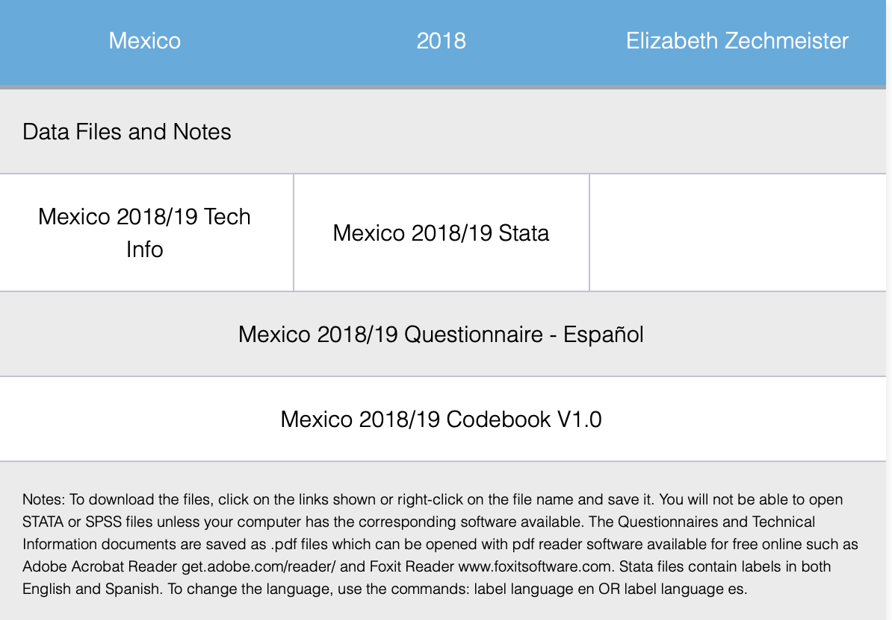

```{r setup, include=FALSE}
knitr::opts_chunk$set(message=FALSE,warning=FALSE, cache=TRUE)
```

```{css color, echo=FALSE}
.columns {display: flex;}
h1 {color: #3366CC;}
```

# Introduction

Data that we are going to use through this sections are the AmericasBarometer datasets from the [LAPOP Lab](https://www.vanderbilt.edu/lapop/). A center for excellence in international survey research, LAPOP team uses gold-standard scientific approaches and innovative methods in cross-national and targeted surveys, evaluations, and reports about individuals´ attitudes, evaluations and experiences. The AmericasBarometer is the only scientifically rigorous comparative survey of democratic values and behaviors that covers all independent countries in North, Central, and South America, as well as a significant number of countries in the Caribbean. Every year, it publishes dozens of high-quality academic research and relevant articles for public policy implementation. Reports from this project can be seen and downloaded in this [link](https://www.vanderbilt.edu/lapop/publications.php).

The 2021 wave of the AmericasBarometer is the nineth wave of this project. The questionnaiere includes a common module that allows to evaluate to what extent citizens support democratic values, perceive if there are basic liberties, how they experience the rule of law, who they participate in political life, whether they support their political system, if they use social networks, among other topics. The common questionnaires and the country-specific questionnaires are available in this [link](https://www.vanderbilt.edu/lapop/core-surveys.php).

Datasets and reports are public and are available in the project´s webpage.

This data should be cited as follows: Source: AmericasBarometer by the Latin American Public Opinion Project (LAPOP), wwww.LapopSurveys.org.

# Downloading AmericasBarometer datasets

Datasets are for free download [here](http://datasets.americasbarometer.org/database/login.php). In this link, you can register or get into as a "Free user". In the Search space, you can text "2018". here you have access to a complete dataset "2004-2018 LAPOP AmericasBarometer Merge (v1.0FREE).dta" (434.6MB) in STATA format.

{width="372"}

We can also access datasets for each country. For example, if we look for "Mexico" in the Search space, we can access datasets for each round of the AmericasBarometer for Mexico. Data for the last round can be downloaded as a file called "MEX_2021_LAPOP_AmericasBarometer_v1.2_w.dta" in STATA format. Also, we can download the questionnaire and a technical document.

{width="376"}

# Importing AmericasBarometer datasets

Once downloaded a dataset, it is a good practice to create a new project in RStudio. In the "File" menu, there an option "New project", where we can select the option "New directory" and "New project" and then we can name the project and give a path in your computer.

{width="380"}

This path is the working directory where produced files will be saved. If you are not clear what is the path, you can always see the working directory in the RStudio´s console or you can recall it using the commando `getwd()`. If you want to change the working directory, you can use the command `setwd()`. For example, you can define:

`setwd("path_of_working_directory/working_directory")`

The downloaded AmericasBarometer dataset has to be saved in the working directory. In this way, we can read a STATA dataset as a dataframe object in R. There are many ways to read a dataset in R. A first way is via the menu "File" and the sub menu "Import Dataset". In this option, we can import files in text, Excel, SPSS, SAS or STATA format. If we choose STATA, R opens a window where we should look for path of the file. This window shows a previsualization of the dataset. The dataset shows the original name by defect, but we can change the name to a simpler one. On this example, we have changed the name "LAPOP_Merge_2004_2018.dta" to just "lapop". The Environment will show this name.

{width="700"}

This way to import a dataset can be done also by code, what is advisable when we have a R Script or a RMarkdown file. Actually, the menu "Import Dataset" shows the code that we can run to reproduce this process.

Here it is necessary to point out that R and RStudio work with "packages", that contain commands and algorithms for doing procedures. Some of these packages come loaded since installation. We have to install others from the R repository (CRAN). In the following sections, we are going to work with some packages that are not loaded and that we have to install. We are going to use the code `install.packages("package")`.

Once installed, we have to call a package to be "active". Active packages have a check in the modulo "Packages". To call a package we use the command `library(package)`.

In this case, to import a dataset in STATA we call the library `haven` and use the command `read_stata`. The details of this library can be found [here](https://cran.r-project.org/web/packages/haven/index.html). In this library, we also have the command `read_dta` to read STATA files or the command `read_sav` to read SPSS files. In this example, if the file for Mexico in STATA format is in the working directory, the code to load this file as a dataframe in R is

`library(haven)`

We call this dataframe "mex18".

`mex18 = read_stata("Mexico LAPOP AmericasBarometer 2019 v1.0_W.dta")`.

We have to take into account that we have to activate the library with the command `library`, before usign the command included in this library. If we do not activate the library, the code gets an error.

In the menu "Import Dataset" we can also load files from Excel using the library `readxl` and the command `read_excel`. Finally, we can also load files .txt using the library `readr`.

In the section about [correlation](https://arturomaldonado.github.io/BarometroEdu_Web_Eng/correlation.html), we work with data from the project Variaties of Democracy (or V-Dem). This data can be downloaded in the project´s web in .csv of .xls formats. If we download this data and save in the working directory with the name "v.dem.xlsx", this data can de read as a new dataframe. Firstm we have to activate the library.

`library(readxl)`

Then, we read the file

`vdem = read_excel("vdem.xlsx")`.

A general option to load datasets in RStudio is installing and using a library called `rio`. This library allows to import, export, convert different types of data files, such as STATA, SPSS, Excel, csv, SAS, RData, Minitab, dbf, among many more. For this website, this library is useful because it allows to import dataset saved in virtual repositories like GitHub.

# Reading AmericasBarometer data in RStudio

Along these sections, we will use limited datasets of the 2018/19 wave for space issues. We will also use datasets in RData format, a native type of dataset in R, which is efficient in saving space. This allows to load the 2018/10 dataset with all variables.

These datasets are stored in a repository called "materials_ede" in the LAPOP account in [GitHub](https://github.com/lapop-central/materials_edu). From this point, we are going to use code that anyone can replicate.

For example, to load a limited version of the dataset of the 2018/19 wave, stored in GitHub in SPSS format, we can activate library `rio` and import this remote dataset with the command `import`.

```{r importing GitHub}
#install.packages("rio") You should use this code if rio is not installed yet
library(rio) 
lapop18 = import("https://raw.github.com/lapop-central/materials_edu/main/LAPOP_AB_Merge_2018_v1.0.sav")
```

Once this code run, we see a dataset appears in the Environment. This dataset includes 31,050 observations and 84 variables.

In the same manner, we can use the library `rio` to call a complete dataset, in RData format, with the same commando. This new dataset is saved in a dataframe called "lapop18v2".

```{r importing RData}
lapop18v2 = import("https://raw.github.com/lapop-central/materials_edu/main/lapop18.RData")
```

This new dataset has 28,042 observations (because it does not include USA and Canada) and 1,369 variables.

# Summary

In this section, we have briefly explained how to download AmericasBarometer datasets, either a complete wave dataset or a dataset of a particular country. Then, we have explained how to define a project in RStudio and how to define a working directory. It is in the working directory where downloaded datasets shoul be saved to be able to import then in RStudio. We can import datasets using the library `haven` or the library `rio`. With these libraries, we can import multiple formats, including STATA, SPSS, csv, formats in which we can download AmericasBarometer datasets.
