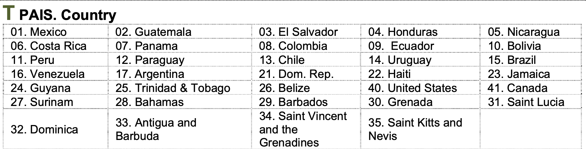

```{r setup, include=FALSE}
knitr::opts_chunk$set(message=FALSE,warning=FALSE, cache=TRUE)
```

```{css color, echo=FALSE}
.columns {display: flex;}
h1 {color: #3366CC;}
```

# Introduction

This section presents basic aspect of the use of R and RStudio.

# Objects

In the previous section we mentioned that the Environment shows produced and loaded objects.
In R, we can create objects and then manipulate them.
For example, the Figure 1.1 shows the percentage of people who support democracy by country.
If we want to save result for Uruguay (UY), we can create an object.

{width="539"}

The following line of code creates an object called "UY", which saves the number 80.
This object is shown in the Environment, both the name, as the value it saves.

```{r object}
UY = 80
```

If we want to calculate the difference in percentage point between Uruguay, the country with the highest support for democracy, and Haiti, the one that shows the lowest percentage, we can rest the object minus the value of Haiti´s percentage.
When we run this code, RStudio shows the result (34 percentage points).

```{r rest}
UY - 46
```

Objects in R not only can save numbers, but also can save characters (or string of characters).
The AmericasBarometer collects information from almost all countries in the Americas.
The following table shows countries in which LAPOP has collected information in some wave of the AmericasBarometer.



If we want to save a country´s name in an object, we can name the object "country1" and write the name of the country (a string of characters) in between quotation marks.

```{r country}
country1 = "Mexico"
```

This new object appears in the Envorinment.

# Vectors

A vector is an object that contain a set of elements, such as numbers or string of characters, among other types.
For example, we can create a vector called "support" that saves all the percentages of the Figure 1.1.

```{r vector percentages}
support = c(80, 73, 71, 69, 68, 67, 66, 63, 63, 63, 62, 61, 61, 57, 53, 52, 50, 50, 49, 46)
```

In a similar way, we can create a vector with the names (or acronyms) of all countries.

```{r vector pais}
country = c("UY", "SV", "CR", "AR", "CL", "BR", "GY", "MX", "EC", "NI", "DO", "PN", "BO", "JA", "CO", "GT", "PY", "PE", "HN", "HT")
```

It is not necessary to follow the same order of Figure 1.1; however, it is suggested for reasons explained below.

We can select particular elements of a vector using `[…]`.
For example, if we want to recall Argentina, both its name and percentage, we can write the position of that country in brackets.

```{r select vector}
country[4]
support[4]
```

# Functions

A function is a procedure that receives an input and produces an output.
For example, the function Y = X\^2 gets a value for X, for example 2, and returns a value for Y, in this case 4.
R has algebraic functions, such as square root or logarithm.
For example, the function `log(…)` receives a value for X and returns a value for Y equals to the logarithm of X.

```{r root}
sqrt(36)
log(20)
```

Also, we can apply a function to a set of data, such as those saved in a vector.
For example, if we want to calculate the rate of people who support democracy per 1000 people in all countries, we hace to multiply the vector "country" by 10.
In this case, the function of multiplication is applied to each element of the vector.

```{r support2}
support2 = support*10
support2
```

There are more useful function for our goals because they work over a set of values, such as those saved in a vector, calculating a single value.
For example, if we want to calculate the average support for democracy in all countries shown in Figure 1.1, we can use the function `mean(…)`.

```{r mean}
mean(support)
```

This function gets all the values in a vector, sum all of them and divide by the number of observations, resulting in the average.

Other functions useful for statistics are the median, the standard deviation, minimum, maximum and sum.

```{r other functions}
median(support)
sd(support)
min(support)
max(support)
sum(support)
```

Figure 1.1 shows results for countries where the AmericasBarometer has information.
However, in some cases, a vector can include a missing value.
For example, this figure does not show information for Venezuela, country where LAPOP did not do fieldwork for security reasons.
If we want to create a vector that includes a missing value, we can run this code:

El Gráfico 1.1 muestra los resultados para los países donde se tiene información.
Sin embargo, en algunos casos un vector puede incluir un valor perdido.
Por ejemplo, el gráfico no muestra información para Venezuela, país donde no se realizó trabajo de campo por motivos de seguridad.
Si quisiéramos crear un vector que incluya este valor faltante, se podría hacer así:

```{r apoyo con NA}
support2 = c(support, NA)
support2
```

We have used the same name "support2", so we have overwrited this vector with the new values.
This vector, that includes only numbers, now contain a last value NA.

Some functions cannot calculate their procedures if vectors contain values NA.
For example, the function `mean`.

```{r mean support2}
mean(support2)
```

The direct calculation of the mean of vector "support2" give a results NA.
To be able to calculate, we have to indicate that the function does not have to take into account this value NA.
We have to use the specification `na.rm=True`.

```{r mean support na.rm}
mean(support2, na.rm=T)
```

# Packages

R is a collaborative project.
Many developers produce new packages that are administered by the same R project.
This packages can include many functions that help to manipulate data.

For example, R have native functions to import dataset from a variety of formats, such as Excel, SPPS or STATA.
Each format has an specific function, such as `read_csv` or `read_dta`.
However, developers have produced a package called "rio", that includes a function `import`, which allows to import every type of dataset.
This package does not come with the standard installation of R, so, we have to install this package to be able to use it.

For installing a package, we use the command `install.packages` with the name of the needed package between quotation marks.

R es un proyecto colaborativo.
Muchos desarrolladores producen nuevos paquetes que son administrados por el mismo proyecto de R.
Estos paquetes pueden incluir muchas funciones que ayudan a manejar datos.
In this case, we have used a \# before the code because we have installed this package previously.
The \# serves to show comments of lines of code that we want to show, but not run.

```{r instalar paquetes}
# install.packages("rio")
```

Once installed, We have to activate this package to be able to use its functions.
This is done with the command `library`.
We do not need quotation marks in this case.
Once activated, we can use every function of this library, such as the function `import`.
We can check this procedure in the bottom right panel, in the "Packages" tab.
The package "rio" appears with a check.

```{r activar}
library(rio)
```

# Dataframes

Dataframes are rectangular data structures.
As convention, dataframes have vectors in columns and observations in rows.
To create a dataframe, we can use the command `data.frame(...)`.

For example, we can create a dataframe that joins data from vector "country" and vector "support".
Both vectors have the same dimensions.
We see in the Environmet that both vectors have dimension [1:20].
We can save this dataframe in an object "supportLA".

```{r dataframe}
supportLA = data.frame(country, support)
supportLA
```

We see that the object "supportLA" is saved in a separated section in the Environment called "Data".
This objects has 20 observations (that is, 20 rows or countries) and two variables (that is, two vectors or two columns).
We can click in this object and see the data in a separate tab.

If we would want to create a dataframe with vectors "country" and "support2", R gives an error message because these vectors have different dimensions.

Now, the vector "support" is part of the dataframe "supportLA".
To be able to use the functions in a dataframe, we should specify the column, from which we want to apply the function.
For example, if we want to calculate the average support of democracy from the dataframe "supportLA", we have to specify the columns with "\$".

```{r support data}
mean(supportLA$support)
```

In general, every dataset is a rectangular structure where we have observations in rows and variables in columns; what changes is the number of rows and columns.

For example, an AmericasBarometer dataset in a country may have 1,500 observations (1,500 rows) and more than 100 variables (more than 100 columns).
In that case, every observation is a person that responded the survey and a columns (or vector) recorded responses of all respondents in a question from the questionnaire.

Further, a join dataset (a merged data) is a dataset of all countries.
This dataset may have more than 30 thousand observations (that is, all respondents in every countri in a particular wave of the AmericasBarometer) and more that 100 columns.

Going beyond the size of the dataset, columns are vector to which we can apply functions.

In the following section about importing the AmericasBarometer data in RStudio, we will see ways to download a dataset from this project and upload it in RStudio.

# Summary

In this section, we have reviewed basic aspect of R, such as objects and vectors, basic functions that we can apply to these objects.
Also, we have reviewed a way to install libraries, to activate them and be able to use their functions.
Finally, the idea of a dataframe was explained.
