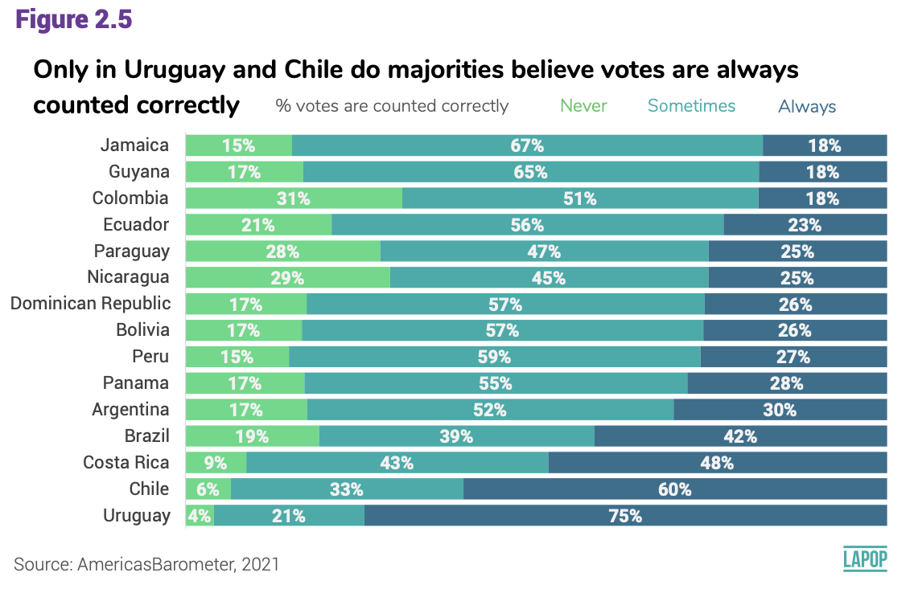
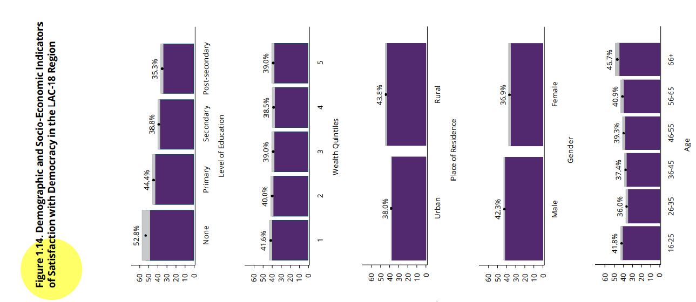

```{r setup, include=FALSE}
knitr::opts_chunk$set(message=FALSE,warning=FALSE, cache=TRUE)
```

```{css color, echo=FALSE}
.columns {display: flex;}
h1 {color: #3366CC;}
```

# Introduction

The previous sections corresponding to the [t-test](https://arturomaldonado.github.io/BarometroEdu_Web_Eng/ttest.html) and the [ANOVA test](https://arturomaldonado.github.io/BarometroEdu_Web_Eng/anova.html) are about the relationship of a numerical variable with a categorical variable, in such a way that the goal is to compare and extrapolate the means of a numerical variable by groups of a categorical variable.

In this section we will look at bivariate relationships between two categorical (or factor in R terminology) variables.
This evaluation is done using cross-tables (or contingency tables) and is evaluated using the chi-square test.

# About the dataset

The data we are going to use should be cited as follows: Source: AmericasBarometer by the Latin American Public Opinion Project (LAPOP), wwww.LapopSurveys.org.
We can download the data freely [here](http://datasets.americasbarometer.org/database/login.php).

This section loads a trimmed database, originally in SPSS (.sav) format.
It is recommended to clean the Environment before starting this section.

This dataset is hosted in the "materials_edu" repository of the LAPOP account on GitHub.
Using the library `rio` and the command `import`, we can import this database from this repository.
In addition, the data from countries with codes less than or equal to 35 are selected, that is, the observations of the United States and Canada are eliminated.

```{r base}
library(rio) 
lapop18 = import("https://raw.github.com/lapop-central/materials_edu/main/LAPOP_AB_Merge_2018_v1.0.sav")
lapop18 = subset(lapop18, pais<=35)
```

We also load the dataset for the 2021 round.

```{r}
lapop21 = import("https://raw.github.com/lapop-central/materials_edu/main/lapop21.RData")
lapop21 = subset(lapop21, pais<=35)
```

# Votes are counted fairly

The report The Pulse of Democracy for the 2021 round of the AmericasBarometer reports the results of variable **COUNTFAIR1.** Votes are counted correctly and fairly.
Would you say it happens always, sometimes or never?
Percentages are presented by countries.

This figure is reporting the cross of a categorical variable (or factor in R language), called "countfair1" that has three categories (never, sometimes and always), with other categorical variables called "pais" that has 15 categories (each country presented).

{width="596"}

This variable is imported in R as numeric.
For be able to work with this variable, we have to declare it as a factor variable, using the command `as.factor`.
We then label this variable with the command `levels`.

```{r}
library(haven)
lapop21$countfair1r = as.factor(lapop21$countfair1)
levels(lapop21$countfair1r) = c("Always", "Sometimes", "Never")
table(lapop21$countfair1r)
```

# Cross-table of votes are counted fairly by country

Before replicating this figure, it is useful to see results in a cross-table.
We can create this table with the command `table`.
However, this table presents absolute frequencies.
Also, this table shows that this question was not fielded in some countries.

```{r}
table(lapop21$pais, lapop21$countfair1r)
```

To reproduce the relative frequencies, we have to use the command `prop.table`.
This command returns the percentages for the total by defect.
We want to calculate percentages by rows (that is, by country) in this case.

```{r}
prop.table(table(lapop21$pais, lapop21$countfair1r))
```

To calculate the percentages by rows, we have to add the specification `, 1` in `prop.table`.
We can also nest this code in the command `addmargins` to calculate the sum of horizontal percentages.
These are the same percentages that are presented in a bar plot below.
These percentages are not equal to those presented in Figure 2.5 because this calculation does not include survey weights.

```{r}
addmargins(prop.table(table(lapop21$pais, lapop21$countfair1r), 1)*100, 2)
```

# Bar graph of votes are counted fairly by country

In the same way as we did in the section about ordinal variables, available [here](https://arturomaldonado.github.io/BarometroEdu_Web_Eng/Descriptives2.html), we can replicate the comparative graph by country we have to create a contingency table between variables "countfair1" and "pais".
This cross-table is saved in an abject "count_pais".
We should note that the dataframe include a row for each value of "countfair1" in each country.
In this way, we have 3 options x 20 countries = 60 rows.

```{r}
count_pais = as.data.frame(round(prop.table(table(lapop21$pais, lapop21$countfair1r), 1), 3)*100)
count_pais
```

This table presents NAs for countries where the question "countfair1" was not asked.
For this reason, we have to drop rows where there is no data.
We can do this with the specification `[-c(rows)]`.
After that we create a vector with the names of countries.
We repeat names three times (15 countries x 3 options).
We dd this vector to the dataframe in column "country".

```{r}
count_pais = count_pais[-c(1:4,18,21:24,38,41:44,58),]
country = c("Nicaragua","Costa Rica", "Panama", "Colombia", "Ecuador", "Bolivia", "Peru",
        "Paraguay", "Chile", "Uruguay", "Brazil", "Argentina", "Dom. Rep.","Jamaica", "Guyana", "Nicaragua","Costa Rica", "Panama", "Colombia", "Ecuador", "Bolivia", "Peru",
        "Paraguay", "Chile", "Uruguay", "Brazil", "Argentina", "Dom. Rep.","Jamaica", "Guyana","Nicaragua","Costa Rica", "Panama", "Colombia", "Ecuador", "Bolivia", "Peru",
        "Paraguay", "Chile", "Uruguay", "Brazil", "Argentina", "Dom. Rep.","Jamaica", "Guyana")
count_pais$country = country
count_pais
```

We have the elements in this dataframe "count_pais" to replicate the stacked bar plot.
We specify in `aes` that percentages are in X axis, countries in Y axis and each bar is divided by column Var2.

```{r}
library(ggplot2)
ggplot(data=count_pais, aes(x=Freq, y=country, fill=Var2))+
  geom_bar(stat="identity", width=0.3)+
  geom_text(aes(label=paste(Freq, "%", sep="")), color="white", 
            position=position_stack(vjust=0.5), size=2)+
  labs(x="Percentage", y="Country", fill="Votes are counted fairly",
       caption="AmericasBarometer by LAPOP, 2021")
```

# Evaluating Democracy in Practice

From page 20, the report *The Pulse of Democracy* evaluates democracy in practice.
In particular, this section of the report uses the variable "pn4".
This variable is worded as follows: "In general, would you say that you are very satisfied, satisfied, dissatisfied, or very dissatisfied with the way democracy works in (country)?"

The report indicates that this variable is recoded as a dichotomous variable to be able to work with percentages.
In this section we are going to work with the original variable, which is an ordinal categorical variable (or factor).

Figure 1.14 of the report presents an evaluation of satisfaction with democracy by demographic and socioeconomic variables, such as educational level, quintiles of wealth, place of residence, gender or age groups.
That is, satisfaction with democracy is used as the dependent variable and each demographic or socioeconomic variable as the independent variable.

{width="419"}

For example, the report indicates that among men, 42.3% are satisfied with democracy (using the variable recoded as a dummy), while among women, this percentage drops to 36.9%.
Here we are going to analyze these same variables, but using the variable "pn4" in its original form (as an ordinal categorical).
Before proceeding, we need to recode the variables as factor and label them.

```{r gender}
lapop18$gender = as.factor(lapop18$q1)
levels(lapop18$gender) = c("Male", "Female")
table(lapop18$gender)
```

The same is done for the variable "pn4" which becomes a new variable "satis".

```{r satis}
lapop18$satis = as.factor(lapop18$pn4)
levels(lapop18$satis) = c("Very satisfied", "Satisfied", "Dissatisfied", "Very dissatisfied")
table(lapop18$satis)
```

# Cross-table of satisfaction with democracy by gender

With the new factor variables, we first calculate a cross-table or contingency table.
The command `table` is used to present the frequencies of one or two variables.
By convention, the dependent variable "satisfaction with democracy" is placed in the rows and the independent variable "gender" in the columns.

```{r table}
table(lapop18$satis, lapop18$gender)
```

To calculate the relative frequencies, you have to nest the command `table` inside the command `prop.table`.
If nested only, this command calculates the proportions over the total observations.

```{r table2}
prop.table(table(lapop18$satis, lapop18$gender))
```

These proportions are not very useful for the comparison we want to make.
What we require are the conditional distributions of "satisfaction with democracy" for each gender group.
That is, calculate the percentages for each column.
In order for `prop.table` to calculate these percentages, we have to add the specification `(…, 2)`.
Multiply by 100 to go from ratios to percentages.
You can also nest all code inside the command `addmargins` to check the sum of percentages over the columns, with the specification `(..., 1)`.

```{r tables3}
addmargins(prop.table(table(lapop18$satis, lapop18$gender), 2)*100, 1)
```

The table shows that 6.8% of men are very satisfied with democracy, a percentage very similar to that of women.
44% of men are dissatisfied with democracy.
In this category, women have a higher percentage (48.4%).

In this way, it is possible to compare the percentages of the dependent variable "satisfaction with democracy" for each category of the independent variable "gender".

# Graphs of satisfaction with democracy by gender

In the section about [descriptives of ordinal variables](https://arturomaldonado.github.io/BarometroEdu_Web_Eng/Descriptives2.html), we presented a preview of what we are seeing in this section.
Here we will revisit those themes, using the tidyverse.

To make the graph, we first create a new dataframe with the data from the cross-table.
The command `as.data.frame` is used to transform the bivariate table into a new dataframe called "table".
Using this command, the results are sorted by new columns (Var1, Var2 and Freq) so that they can be used to create a graph.

```{r table4}
table = as.data.frame(prop.table(table(lapop18$satis, lapop18$gender), 2)*100)
table
```

We will use the library `ggplot2` and the command `ggplot` to create a bar chart, using the dataframe "table" containing the percentages of satisfaction with democracy for men and women.
This command requires an aesthetic where it is specified that "Var1" will be included on the X axis, which corresponds to the categories of satisfaction with democracy.
The "Freq" is included on the Y axis, which corresponds to percentages.
Also included is the specification `fill` to indicate that it will be split into Male/Female groups for each category of "Var1" and `ymax` to specify the upper limit of the Y axis.

After defining the variables in the axes, it is indicated that a bar graph is wanted with the command `geom_bar` and with the specification `position="dodge"` it is indicated that a graph with bars separated by each combination of categories is wanted.
The specification `stat="identity"` is added to indicate that the command works with the data in the table.

The command `geom_text` includes the percentages of each bar, which is found in the "Freq" column.
These percentages are rounded with `round` to 1 decimal place and the "%" symbol is added with `paste`.
Also included is the specification `position=position_dodge(...)` which places these percentages at the top of each column.
The default option within this specification is `width=NULL`, but this way the percentages would be misplaced, so `width=0.9` is defined to center the percentages.

By default, the legend includes the name of the column with the gender data, which is "Var2".
To change this name, use the command `labs(fill="Gender")` to properly name the legend.
Finally, the Y and X axis are labeled with `ylab` and `xlab.`

```{r grafbar}
library(ggplot2)
ggplot(data=table, aes(x=Var1, y=Freq, fill=Var2, ymax=60))+
  geom_bar(position="dodge", stat="identity")+
  geom_text(aes(label=paste(round(Freq, 1), "%", sep="")),
            position=position_dodge(width=0.9), vjust=-0.25)+
  labs(fill="Gender")+
  ylab("Percentage")+
  xlab("Satisfaction with democracy")
```

Other way to display this data is through stacked bars.
That is, for each gender category, the distribution of satisfaction with democracy is shown.
For this, we use the same command `ggplot` but now the order of the variables in the aesthetic is changed.
Now the variable "Var2" (with the gender categories) is located on the X axis and each bar is divided according to the values of Var1.

The bar type changes in the command `geom_bar` to `position="stack"`.
In the same way, the data labels have to consider the position of each slice, with `position=position_stack()`.

```{r grafbarapila}
ggplot(data=table, aes(x=Var2, y=Freq, fill=Var1, ymax=100))+
  geom_bar(position="stack", stat="identity")+
  geom_text(aes(label=paste(round(Freq, 1), "%", sep="")),
            position=position_stack(), vjust=2)+
  labs(fill="Satisfaction with democracy")+
  ylab("Percentage")+
  xlab("Gender")
```

# Cross-table of satisfaction with democracy by educational level

Figure 1.14 of the report shows the results on satisfaction with democracy (according to the recoded dummy variable) by educational level.
As a second example, here we are going to replicate that relationship using the original variable of type factor.

We first recode the education variable.
The original variable "ed" is a numerical variable (years of study).
This variable has values ranging from 0 to 18.
It is recoded in such a way that those with zero years of education are assigned a value of 0 "None", those between 1 and 6 years of education are assigned a value of 1 "Primary", those between 7 and 11 years of education are assigns them the value of 2 "Secondary" and between 12 and 18 years of education the value of 3 "Post-secondary".

```{r recoed}
library(car)
lapop18$educ <- car::recode(lapop18$ed, "0=0; 1:6=1; 7:11=2; 12:18=3")
lapop18$educ <- as.factor(lapop18$educ)
levels(lapop18$educ) <- c("None", "Primary", "Secondary", "Post-secondary")
table(lapop18$educ)
```

With the recoded variable it is possible to calculate the cross-table of satisfaction with democracy by educational levels.

```{r tableed}
addmargins(prop.table(table(lapop18$satis, lapop18$educ), 2)*100, 1)
```

To create the graph, we have to save the table as a dataframe.
The command `as.data.frame` is used to save the percentages so that they can be used with the command `ggplot`.

```{r table5}
table2 <- as.data.frame(prop.table(table(lapop18$satis, lapop18$educ), 2)*100)
table2
```

In this case, since we have 4 categories for satisfaction with democracy and another 4 categories for educational levels, a bar graph would create 16 bars, which would complicate the comparison.
So, in this case, the stacked bar type is preferred.

```{r barrapiladased}
library(ggplot2)
ggplot(data=table2, aes(x=Var2, y=Freq, fill=Var1, ymax=100))+
  geom_bar(position="stack", stat="identity")+
  geom_text(aes(label=paste(round(Freq, 1), "%", sep="")),
            position=position_stack(), vjust=2)+
  labs(fill="Satisfaction with democracy")+
  ylab("Percentage")+
  xlab("Education level")
```

Figure 1.14 shows that there is a higher percentage of satisfaction with democracy among the least educated.
This relationship can also be seen in this graph.
The sectors "very satisfied" (in pink) and "satisfied" (in green) decrease as we go from none to primary, secondary and higher.

In all examples, we can observe percent differences in a variable by categories of other variable.
These percentages can be compared directly in the graph, but we should run a significance test to evaluate if there is a statistically significant relationship.

# Chi-square test of independence

Two categorical variables are said to be statistically independent if the conditional (population) distributions are identical for each category of the independent variable.
In the above bivariate relationship, this means that being male or female does not change opinions regarding satisfaction with democracy.
As these conditional distributions differ more from each other, both variables are said to be more related or more dependent.

This evaluation is done using the chi-square or $\chi^2$ test of independence.
This test is based on the comparison of the observed frequencies (the observations collected in the field) versus the expected frequencies (the observations that should be in each cell if the variables were independent).
The test statistic summarizes how close the expected frequencies are to the observed frequencies.

$$
\chi^2 = \sum\frac{(f_o-f_e)^2}{f_e}
$$

The smaller the distance in each cell, the less likely it is to reject the null hypothesis.
The larger the distance in each cell, the more likely it is to reject the null hypothesis.

$$
H0: f_o = f_e
$$

With the value of $\chi^2$ and with the degrees of freedom (rows-1\*columns-1), a p-value is calculated on the chi-square distribution.
If this p-value is less than 0.05, H0 is rejected.
This test requires that there be at least 5 observations in each cell.

# Test of votes are counted fairly by country

In R, the command `chisq.test` is used to calculate the statistic and the associated p-value.
The results of this test can be saved to a new object "chitest1".

```{r}
chitest1 <- chisq.test(lapop21$countfair1r, lapop21$pais)
chitest1
```

The p-value obtained is less than 0.05, so the H0 is rejected, so we say that the observed frequencies seem to be different from the expected frequencies that would exist in each cell if there were no relationship, so we say that there is a relationship between the variables or that there is a dependency between the two.

It is important to note that "chitest1" is an object of type *list*.
This type of object can store other information of a different type.
For example, "chitest1" saves the tables of observed frequencies (same result as with the command `table`) and the table of expected frequencies.
In this object the value of the residuals, the standardized residuals and the value of the p-value are also saved.

```{r}
chitest1$observed
chitest1$expected
```

To evaluate the strength of the relationship, we use the librery `vcd` that has the command `assocstats` that offers a series of measures of association for a cross-table between an ordinal variable, as "countfair1", and a nominal variable, as "pais".

The command `assocstats` cannot calculate measures of associations if cells of a cross-table have null values.
Because we have some countries where question "countfair1" was not asked, we have to indicate that this command does not take into account these countries.
For deal with this, we create a new "country2" variable, where observations of these countries are set as NAs.

```{r}
lapop21$country_r = lapop21$pais
lapop21$country_r[lapop21$pais==1] = NA
lapop21$country_r[lapop21$pais==2] = NA
lapop21$country_r[lapop21$pais==3] = NA
lapop21$country_r[lapop21$pais==4] = NA
lapop21$country_r[lapop21$pais==22] = NA
```

With this new variable, we can create a cross-table between "countfair1" and "country_r" and calculate measures of association.

```{r}
library(vcd)
table2 <- table(lapop21$countfair1r, lapop21$country_r)
assocstats(table2)
```

The command `assocstats` returns the contingency coefficient and Cramer´s V as measures.
These measures vary between 0 and 1.
While closer to zero, the relationship is weaker.
On the contrary, while closer to 1, the relationship is stronger.

By convention, we can assume that weak relationships are between 0 and 0.3, moderate relationships betwen 0.3 and 0.6 and strong relationships are higher than 0.6.
In this case, we can indicate that the relationship between votes are counted fairly and country is weak.

# Test of satisfaction with democracy by educational level

To evaluate the relationship between satisfaction with democracy and gender, we can also use the test of independence of $\chi^2$.
The results of this test are saved in an object "chitest2".

```{r}
chitest2 <- chisq.test(lapop18$satis, lapop18$educ)
chitest2
```

Again, we obtain a p-value of less than 0.05, with which the null hypothesis is rejected and it is affirmed that the observed frequencies are different from those expected, with which we conclude that there would be a dependency relationship between the variables.

To evaluate the strength of the relationship, we use the library `oii` and the command `association.measures`, that return a series of association measures that fit this types of variables, that in this case are both ordinal

```{r ordinal}
library(oii)
association.measures(lapop18$satis, lapop18$educ)
```

In this case, we observe the measures of association for ordinal variables.
This command reports 4 of these measurements, all of them vary between -1 to +1.
In our example, they all have a positive sign, which indicates a direct relationship between both variables.
This would seem to go against what is reported in Figure 1.14 of the report where it is clearly observed that satisfaction with democracy decreases at higher educational levels, which would be expressed in a negative sign.

This apparent contradiction is due on how satisfaction with democracy ("satis" variable that is created from "pn4") has been coded.
The original variable has values between 1 and 4, where 1 means "very satisfied" and 4 means "very dissatisfied".
That is, high values indicate "less"in the variable.
It is for this reason that the association test results with a positive sign, which in this case would indicate that a higher value of the education variable means "more" of the satisfaction with democracy variable (which is actually less).

To avoid this confusion, the monotony of the satisfaction with democracy variable should have been changed so that higher values indicate greater satisfaction and, with this, a negative sign is obtained in the association measures.
This has been done in this section to draw attention to the fact that coding has consequences for the results and can lead to confusion if care is not taken.

Finally, the value of the association measures are less than 0.3, indicating that the relationship between the variables is weak.

# Summary

In this section we have worked with bivariate relationships between categorical variables.
Cross-tables and bar graphs have been calculated to show the descriptive results.
Then, the chi-square test of independence has been used to infer whether there is a dependency relationship between the variables in the population and finally the strength of the association between the variables is evaluated, differentiating when it comes to nominal or ordinal variables.

# Calculations including survey weights

We calculate the percentage of votes are counted fairly by country including survey weights in the section about [descriptives of ordinal variables](https://arturomaldonado.github.io/BarometroEdu_Web_Eng/Descriptives2.html).
With this data, we replicate Figure 2.5.

To calculate a chi-square test including survey weights, we can use the library `survey` and the command `svychisq`.

```{r design}
library(survey)
design18 = svydesign(ids = ~upm, strata = ~estratopri, weights = ~weight1500, nest=TRUE, data=lapop18)
```

We calculate the contingency table with the command `svytable`.
In this case we cross satisfaction with democracy by gender.
This command is nested inside `prop.table` to display the relative frequencies and not the absolute ones.
In turn, all of this is nested inside the command `addmargins` to present the relative frequencies as percentages.
In the same way as above, we can save this table in an object for graphing these results.

```{r tablew}
addmargins(prop.table(svytable(~satis+gender, design=design18),2)*100,1)
```

The Chi-square test of independence incorporating survey weights is computed using the command `svychisq`.
The dependent variable, the independent variable and the object are included with the sample design.

```{r chiw}
chitest3 =svychisq(~satis+gender,design18)
chitest3
```

The results show a p-value less than 0.05, so the H0 of equal expected and observed frequencies can be rejected, so we conclude that there is a relationship of statistical dependence between both variables.

Observed and expected values can be calculated.
As can be seen, the expected values differ from the results without survey weights.

```{r obsvrexpw}
chitest3$observed
chitest3$expected
```

In this case, there is no command to calculate the association measures incorporating the design effect.
Unweighted association measures can be taken as reference values.
