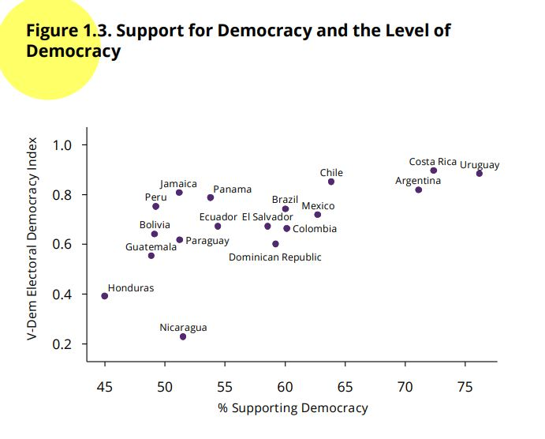

```{r setup, include=FALSE}
knitr::opts_chunk$set(message=FALSE,warning=FALSE, cache=TRUE)
```

```{css color, echo=FALSE}
.columns {display: flex;}
h1 {color: #3366CC;}
```

# Introducction

The previous sections corresponding to the [t-test](https://arturomaldonado.github.io/BarometroEdu_Web_Eng/ttest.html) and to the [ANOVA test](https://arturomaldonado.github.io/BarometroEdu_Web_Eng/anova.html) are about the relationship of a numerical variable with a categorical variable, in such a way that the goal is to compare and extrapolate the means of the numerical variable by groups of the categorical variable.
In the section about [cross-tables](https://arturomaldonado.github.io/BarometroEdu_Web_Eng/chi.html) we analyze bivariate relationships between two categorical variables (or factor variables in R terminology).
This evaluation is done using cross-tables (or contingency tables) and is evaluated using the chi-square test.

In this section we will look at the bivariate relationship between two numerical variables, using a scatterplot for visual inspection and Pearson's correlation coefficient for evaluation.

# About the dataset

The data we are going to use should be cited as follows: Source: AmericasBarometer by the Latin American Public Opinion Project (LAPOP), wwww.LapopSurveys.org.
You can download the data freely [here](http://datasets.americasbarometer.org/database/login.php).

This document reloads a trimmed database, originally in SPSS (.sav) format.
It is recommended to clean the Environment before starting this section.

```{r base}
library(rio) 
lapop18 = import("https://raw.github.com/lapop-central/materials_edu/main/LAPOP_AB_Merge_2018_v1.0.sav")
lapop18 = subset(lapop18, pais<=35)
```

We also load the data for the 2021 round.

```{r}
lapop21 = import("https://raw.github.com/lapop-central/materials_edu/main/lapop21.RData") 
lapop21 = subset(lapop21, pais<=35)
```

# Support for democracy and level of democracy

In this section we will continue to use the report *The Pulse of Democracy*, available [here](https://www.vanderbilt.edu/lapop/ab2018/2018-19_AmericasBarometer_Regional_Report_10.13.19.pdf), where the main findings of the 2018/19 round of the AmericasBarometer are presented.
In this report, Figure 1.3 is presented.
This is a scatterplot that relates the variable support for democracy (from the AmericasBarometer) to the Electoral Democracy Index from the project [V-Dem](https://www.v-dem.net/en/).
This figure shows "the relationship between the level of support for democracy and the rating of democracy in each country" (p. 12).

{width="505"}

To reproduce this figure, we must add the results of the variable ING4 by country.
ING4.
"Changing the subject, democracy may have problems, but it is better than any other form of government. To what extent do you agree or disagree with this statement?" People could respond on a scale of 1 to 7, where 1 means "strongly disagree" and 7 means "strongly agree." The report indicates that the original question is recoded into a dummy variable, where responses between 5 and 7 are considered supporters of democracy.
The X-axis of Figure 1.3 shows the percentage of people who support democracy by country (that is, those who answer between 5 and 7 in each country).

Then, on the V-Dem project website, we can calculate the Electoral Democracy Index scores for each country (see [here](https://www.v-dem.net/en/analysis/VariableGraph/)).
So, data can be collected for the 18 countries that are part of the report "The Pulse of Democracy".
This data can then be downloaded in .csv format.
The Y-axis of Figure 1.3 shows the V-Dem Electoral Democracy Index scores on a scale of 0 to 1.
For this section, data from the 2018 and 2019 Electoral Democracy Index have been collected for the 18 countries analyzed in the report, including the country code, in order to merge the data later.
This dataset is also hosted in the "materials_edu" repository of the LAPOP account on GitHub.
We load the data.

```{r vdem}
vdem = import("https://raw.github.com/lapop-central/materials_edu/main/vdem.xlsx")
vdem
```

To reproduce Figure 1.3 we have to recode the variable ING4 according to the rule indicated in the report:

-   ING4 values from 1-4 = 0 in the new variable "support"

-   ING4 values from 5-7 = 100 in the new variable "support"

```{r reco}
library(car)
lapop18$support = car::recode(lapop18$ing4, "1:4=0; 5:7=100")
table(lapop18$support)
```

With this new variable "support", we now have to add the data of this variable by country and save this information in a new dataframe "df".
For this we will use the command `summarySE` that reports the descriptive statistics of the "support" variable by country.
The N of each country, the average (which would be the percentage), the standard deviation, the standard error and the size of the confidence interval are included.
In this case we only require the data on average.
Looking at the table, we see that Uruguay is the country that reports a higher proportion of citizens who support democracy and also has the lowest standard deviation, indicating that there is greater homogeneity of opinions compared to the other 17 countries.

```{r df}
library(Rmisc) #para poder utilizar el comando summarySE
df = summarySE(data=lapop18, measurevar="support", groupvar="pais", na.rm=T)
df
```

We then use the data from the "vdem2019" column of the "vdem" dataframe to add these data to "df".
We do this with the `cbind` command, where the destination dataframe "df" and the data to de added are indicated, that is `vdem$vdem2019`.
The added column is renamed because by default it is named as the variable.

```{r merge}
df = cbind(df, vdem$vdem2019)
colnames(df)[7] = "vdem2019"
df
```

# Diagram of Dispersion

In the dataframe "df" we now have the two variables that are plotted in the scatterplot presented in Figure 1.3.
We can replicate this figure with the `plot` command, where the variable that will go on the X axis is indicated and then the one that will go on the Y axis.
The axes are labeled with `xlab` and `ylab`.
Axis limits are set with `xlim` and `ylim`.
The labels of each point are added with the `text` command, where it is indicated to add the label of the variable `df$pais`.

```{r plot}
plot(df$support, df$vdem2019, 
     xlab="support for democracy (%)", 
     ylab="Electoral Democracy Index V_Dem", 
     pch=19, xlim=c(40, 80), ylim=c(0.2, 1))
text(df$support, df$vdem2019, labels=df$pais, cex=0.5, pos=3)
```

However, these labels display the country codes.
To display the country names, we have to transform the variable "pais" into a factor variable "paises" and label with the names.

```{r pais}
df$country = as.factor(df$pais)
levels(df$country) = c("Mexico", "Guatemala", "El Salvador", "Honduras", "Nicaragua",
                      "Costa Rica", "Panama", "Colombia", "Ecuador", "Bolivia", "Peru", 
                      "Paraguay", "Chile", "Uruguay", "Brazil", "Argentina", "Dom. Rep.", 
                      "Jamaica")
table(df$country)
```

With this new variable we can redo the scatter plot with the country labels.

```{r plot2}
plot(df$support, df$vdem2019, 
     xlab="Support for democracy (%)", 
     ylab="Electoral Democracy Index VDem", 
     pch=19, xlim=c(40, 80), ylim=c(0.2, 1))
text(df$support, df$vdem2019, labels=df$country, cex=0.5, pos=3)
```

This same plot can also be reproduced using the library `ggplot`.
First, we define the aesthetics of the graph, that is, the dataframe, which will be "df", and with the specification `aes`, the variables on each axis of the figure.
With the command `geom_point` we indicate that we want to produce a point graph.
One element we can add is the prediction or smooth line, with the command `geom_smooth`.
Within this command it is specified that the linear method is used with `method=lm` and that the confidence interval around the prediction line is not displayed with `se=F`.
Then, with the command `geom_text`, the labels are included for each point, from the variable "country".
The specification `nudge_y` is used to wrap labels vertically and `check_overlap=T` to prevent labels from overlapping.
Finally, the axes are labeled with `labs(...)`, a general theme of the graph is defined, with `theme_light()` and the limits of the axes are defined.

```{r ggplot}
library(ggplot2)
ggplot(df, aes(x=support, y=vdem2019))+
  geom_point()+
  geom_smooth(method=lm, se=F)+ #add trend line
  geom_text(data=df, aes(label=country), cex=2.5, nudge_y = 0.02, check_overlap = T)+ #To label the points, give them a size, location and prevent them from overlapping
  labs(x="Support for democracy", y="Electoral Democracy Index V-Dem ")+ #To label the axes
  theme_light()+
  xlim(40, 80)+
  ylim(0.2, 1)
```

As presented in the figure, the distribution of the countries can be summarized with a linear approximation using a straight line.
This straight line has a positive slope, which indicates that there is a direct relationship between both variables: as a country exhibits a higher percentage of citizens who support democracy, a higher score is observed in the electoral democracy index.

# Pearson´s Correlation Coefficient

To evaluate the magnitude of the replationship between both variables, a statistical measure can be added, the Pearsons´s R correlation coefficient.
This coefficient varies between -1 to +1.
The sign indicates the direction of the relationship, while the value indicates the degree of the relationship.
If the coefficient is 0, this indicates an absence of a linear relationship and the closer it is to 1, the greater the linear relationship between the variables.

The report indicates that "in general, there is a positive relationship between the two measures (Pearson's correlation =.64). Although this analysis is descriptive and does not test a causal relationship, the pattern is consistent with previous investigations where it is identified that citizen support for democracy is a central ingredient for the vitality of democracy".

The command `cor.test` can be used to calculate the value of Pearson's coefficient.
Within this command, it is indicated which variable is located on each axis.
By default, the Pearson coefficient is calculated, but with the specification `method="..."`, the Kendall or Spearman coefficient can also be calculated.

```{r}
cor.test(x = df$support, y = df$vdem2019)
```

A coefficient of 0.62 is obtained, which indicates a positive relationship, although the exact value is not the same as that reported in the report because the calculations made in this section do not take into account the effect of survey weights.

# Summary

In this section we have worked on the bivariate relationship between two numerical variables.
The visualization of this relationship has been done through the diagram of dispersion and the evaluation of the relationship has been done through the Pearson´s correlation coefficient.

This is a first step in modeling.
In the following sections, modeling will be introduced using the simple linear regression technique, which is a mathematical expression of what has been seen in this section.
