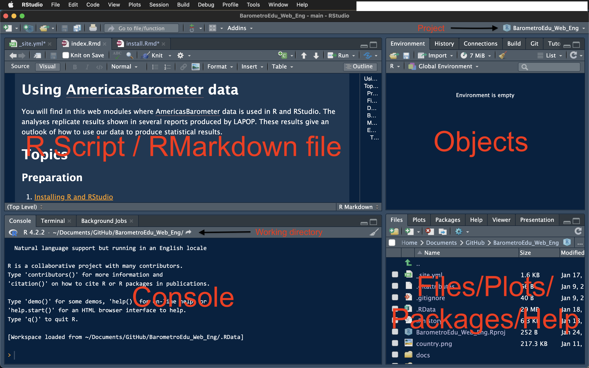

```{r setup, include=FALSE}
knitr::opts_chunk$set(message=FALSE,warning=FALSE, cache=TRUE)
```

```{css color, echo=FALSE}
.columns {display: flex;}
h1 {color: #3366CC;}
```

# How to install R and RStudio?

[R](http://www.r-project.org) is a license-free software that can be used to statistical analysis, data visualization, among other uses. In this case, we use them to analyze public opinion data, in particular, AmricasBarometer data from the Latin American Public Opinion Project, [LAPOP Lab](https://www.vanderbilt.edu/lapop/). R can be downloaded from its own repository: <https://cran.r-project.org>.

Other freeware is [RStudio](https://posit.co), which is a graphic interface IDE for R. In these links, both programs can be downloaded. First, you should download R and then RStudio. Both have versions for Windows, IOS and Linux.

# RStudio

After installation, users can open RStudio. No need to open R. RStudio´s main screen is divided in four panels.



-   R Script / RMarkdown file: this panel shows programming objects. For example, a R script file (\*.R) or an RMarkdown file (\*.Rmd), among other extensions. Basically, these files work to write code and save in files.

-   Objects: this panel shows four tabs. The most relevant is the first on. It shows the environment. All objects (such as datasets, vectors, lists, functions, etc.) uploaded or created are shown in this tab.

-   Console: we can write code lines in this panel, even though this code is not saved. Code run in some script or Markdown is processed here and results are shown. The tab Console shows the working directory. Files produced in RStudio are saved in this working directory.

-   Files/Plots/Packages/Help/Viewer/Presentation panel: The File tab shows files that are in the working directory. The Plots tab shows produced visualizations. The Packaged tab shows all packages loaded in R. Active packaged are shown with a check mark. We can seek resources in R, such as manuals, web pages for each library, documentations for each command in the Help tab.

# Projects

An arrow in the console figure above shows the name of the current project. In this case, the project is called "BarometroEdu_Web_Eng". The idea of setting a project is having all objects (scripts, RMarkdown files, datasets, plts, etc.) in a single directory.

To create a project, you can select the File menu (upper left, near the RStudio name) and select "New Project". When you click this option, the following window appears.

{width="409"}

You can choose a new directory or an existing one in this window. Also, there is an option for version control, that you can link to GitHub, for example.

Once selected a new directory or an existing one, all files you create or want to use should be in this directory. For example, a dataset called "lapop21.dta" can be called directly by its name without specifying all directories and sub directories in which this dataset is.

If you create a sub directory "base" within the working directory, you only have to specify "base/lapop21.dta" in the coding.

# Resources

1.  Google is the main source to get help for every problem you may have in R. Remember that in R you can obtain the same results using different means.

2.  [Stackoverflow](https://stackoverflow.com) is a specialized public platoform where you surely find an entry in which someone else may have the same question you have and that question may be answered by a lot of people. Take into account that R may have multiple responses for the same question, that is, multiple ways to solve the same operation.
