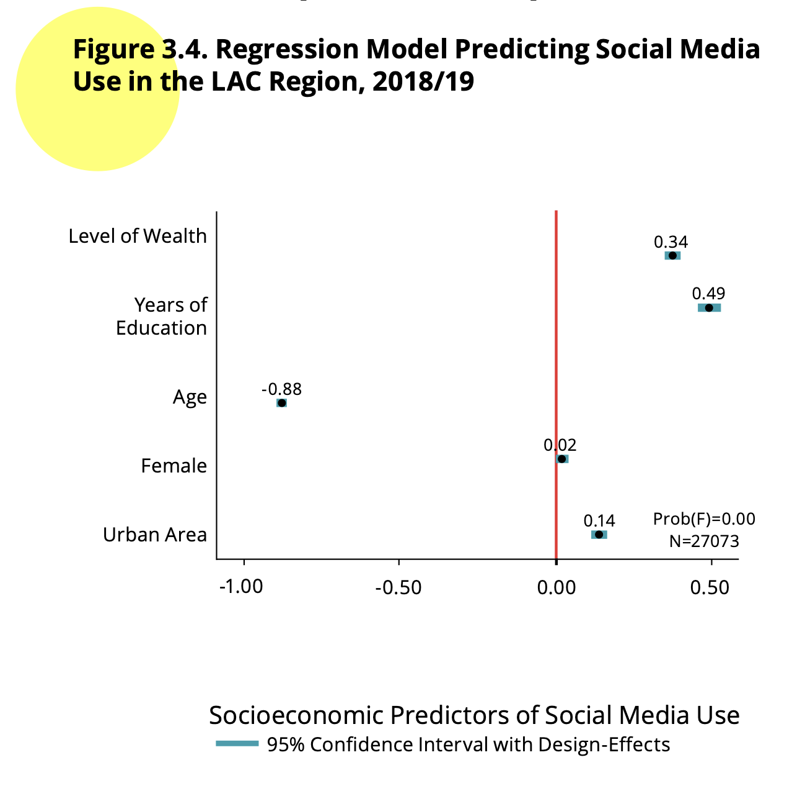

# Introduction

In this section, we will see basic aspects of the logistic model to analyze the relationship between a binary dependent variable and an independent variable.

We continue to replicate the analysis of chapter "Social networks and political attitudes" from the report [The Pulse of Democracy](https://www.vanderbilt.edu/lapop/ab2018/2018-19_AmericasBarometer_Regional_Report_10.13.19.pdf) of the 2018/19 round.
In this chapter, we analyze a measure of support for democracy.

# About the dataset

The data we are going to use should be cited as follows: Source: AmericasBarometer by the Latin American Public Opinion Project (LAPOP), wwww.LapopSurveys.org.
You can download the data freely [here](http://datasets.americasbarometer.org/database/login.php).

It is recommended to clean the Environment before starting this section.
In this document, a database in RData format is again loaded.
This format is efficient in terms of storage space.
This database is hosted in the "materials_edu" repository of the LAPOP account on GitHub.
Using the `rio` library and the `import` command, you can import this database from this repository, using the following code.


```r
library(rio)
lapop18 = import("https://raw.github.com/lapop-central/materials_edu/main/lapop18.RData")
lapop18 = subset(lapop18, pais<=35)
```

# Determinants of use of social networks

The section about social networks presents results of a logistic regression model in Figure 3.4.
As report says, this figure "shows the results of a logistic regression analysis that regress high use of social media (vs. low use) on the same set of demographic and socioeconomic factors" (p. 59).

{width="409"}

As the report also indicates "the dependent variable, *Social Media User*, is based on responses to the three questions about holding accounts from Facebook, Twitter, and Whatsapp. This dichotomous measure distinguishes between those individuals who use accounts from one or more of these platforms, compared to those who do not engane with any social media account" (p. 59).

In the section on [descriptive statistics](https://arturomaldonado.github.io/BarometroEdu_Web_Eng/Descriptives.html) we present the code to create users of each social network using the command`ifelse`.


```r
lapop18$fb_user = ifelse(lapop18$smedia1==1 & lapop18$smedia2<=4, 1, 0)
lapop18$tw_user = ifelse(lapop18$smedia4==1 & lapop18$smedia5<=4, 1, 0)
lapop18$wa_user = ifelse(lapop18$smedia7==1 & lapop18$smedia8<=4, 1, 0)
```

Based on these variables, we create a variable for users of any social network.
This dichotomous variable has a value of 1 if interviewee reports being user of any social network in the questionnaire (Facebook or Twitter or Whatsapp).


```r
lapop18$user = ifelse(lapop18$fb_user==1 | lapop18$wa_user==1 | lapop18$tw_user ==1, 1, 0)
table(lapop18$user)
```

```
## 
##     0     1 
##  8057 18973
```

Figure 3.4 shows the determinants of social media use.
These variables are:

-   Level of wealth: variable "quintall" in the dataset.

-   Years of education: variable "ed" in the dataset.

-   Age: variable "q2" in the dataset.

-   Female: variable "mujer" in the dataset.

-   Urban area: variable "ur" in the dataset.

Footnote 16 indicates that "Age and education are measured in years, rescaled to 0 to 1, where 0 indicates the youngest or the lowest level of education, and 1 the oldest or the highest level of education. Wealth is an ordinal variable, rescaled to 0 to 1, where 0 indicates the lowest level of wealth, and 1 the highest level of wealth. Place of residence is coded 1 for urban and 0 for rural. Gender is coded 1 for female and 0 for male" (p. 64).

We proceed to recode variables "quintall", "ed" and "q2" in variables that vary between 0 and 1, called "wealth", "educ" and "age".
Variables "mujer" and "urban", available in the dataset, are dichotomous variables, so we do not have to recode.


```r
lapop18$wealth = (lapop18$quintall - 1)/4
lapop18$educ = (lapop18$ed)/18
lapop18$age = (lapop18$q2 - 16)/83
summary(lapop18$wealth)
```

```
##    Min. 1st Qu.  Median    Mean 3rd Qu.    Max.    NA's 
##  0.0000  0.2500  0.5000  0.4935  0.7500  1.0000     423
```

```r
summary(lapop18$educ)
```

```
##    Min. 1st Qu.  Median    Mean 3rd Qu.    Max.    NA's 
##  0.0000  0.3889  0.6111  0.5519  0.6667  1.0000     472
```

```r
summary(lapop18$age)
```

```
##    Min. 1st Qu.  Median    Mean 3rd Qu.    Max.    NA's 
##  0.0000  0.1205  0.2530  0.2891  0.4217  1.0000      16
```

With the command `summary` we can evaluate if these variables vary between 0 and 1.
We should note that these variables have missing values "NAs" that will not be included in calculations.

# Logistic regression model

To evaluate factors associated to social media use, we can calculate a regression model.
In this case, different from the linear regression model, the dependent variable is not of type numeric, but it is a dichotomous variable, with value 0 to indicate not users and 1 to identify social media users.

Linear regression models do not fit this type of variable.
The reasons are multiple.
A linear regression to model the relationship between a dichotomous dependent variables and an numeric independent variable could results in predicted values higher than 1 o lower than 0.
So, it is not a good approach to calculate probabilities.

On the contrary, a logistic regression model restricts results between 0 and 1, so we can interpret as a probability.
In our example, we calculate the probability of being a social media user for different values of the independent variables.

Other reasons for not using a lineal regression model are more technical and are related to residuals.
If we use a linear regression model to fit the relationship between a dichotomous dependent variable and a numeric independent variable, the residuals would not be normally distributed and would be heteroskedastic.

To calculate a model, we use the command `glm` in which we specify the variable Y and then the independent variables.
Each independent variable is summed to the model.
The model in Figure 3.4 includes country fixed effects.
In the section on [multivariate linear regression](https://arturomaldonado.github.io/BarometroEdu_Web_Eng/regresion2.html) we explain the use of country fixed effects.
Here, we use the command `factor()` to include dummy variables for each country, taking Mexico (pais = 1) as reference.

This model is saved in an object "model1".
We can describe this model with the command `summary`.


```r
model1 = glm(user ~ wealth + educ + age + mujer + urban + factor(pais), family = binomial, data=lapop18)
summary(model1)
```

```
## 
## Call:
## glm(formula = user ~ wealth + educ + age + mujer + urban + factor(pais), 
##     family = binomial, data = lapop18)
## 
## Deviance Residuals: 
##     Min       1Q   Median       3Q      Max  
## -3.4629  -0.4583   0.2897   0.5852   2.9097  
## 
## Coefficients:
##                Estimate Std. Error z value Pr(>|z|)    
## (Intercept)    -0.76385    0.09468  -8.068 7.15e-16 ***
## wealth          2.03825    0.05708  35.710  < 2e-16 ***
## educ            2.86594    0.09167  31.265  < 2e-16 ***
## age            -5.69441    0.10458 -54.448  < 2e-16 ***
## mujer           0.14776    0.03556   4.155 3.25e-05 ***
## urban           0.74510    0.04060  18.353  < 2e-16 ***
## factor(pais)2  -0.20677    0.09583  -2.158 0.030965 *  
## factor(pais)3  15.88183   85.89147   0.185 0.853303    
## factor(pais)4  -0.26064    0.09604  -2.714 0.006649 ** 
## factor(pais)5  -0.54242    0.09522  -5.696 1.22e-08 ***
## factor(pais)6   1.92058    0.11207  17.137  < 2e-16 ***
## factor(pais)7  -0.44665    0.09503  -4.700 2.60e-06 ***
## factor(pais)8   0.51202    0.09770   5.241 1.60e-07 ***
## factor(pais)9   0.34890    0.10163   3.433 0.000597 ***
## factor(pais)10  0.09251    0.09715   0.952 0.340992    
## factor(pais)11 -0.06467    0.09814  -0.659 0.509967    
## factor(pais)12  0.88679    0.10191   8.702  < 2e-16 ***
## factor(pais)13  1.00887    0.10400   9.701  < 2e-16 ***
## factor(pais)14  1.89743    0.10781  17.600  < 2e-16 ***
## factor(pais)15  1.11293    0.10544  10.555  < 2e-16 ***
## factor(pais)17  1.41948    0.11000  12.905  < 2e-16 ***
## factor(pais)21  0.80326    0.10380   7.739 1.00e-14 ***
## factor(pais)23  0.54686    0.10213   5.354 8.58e-08 ***
## ---
## Signif. codes:  0 '***' 0.001 '**' 0.01 '*' 0.05 '.' 0.1 ' ' 1
## 
## (Dispersion parameter for binomial family taken to be 1)
## 
##     Null deviance: 31852  on 26274  degrees of freedom
## Residual deviance: 20156  on 26252  degrees of freedom
##   (1767 observations deleted due to missingness)
## AIC: 20202
## 
## Number of Fisher Scoring iterations: 15
```

The results shows the coefficient, standard errors, the z statistic and the linked p-value.
With this information, we can conclude about the direction of the relationship between each independent variable and the dependent variable.
For example, the relationship between wealth and the probability of being a social media user is positive, indicating that when wealth is higher, the probabilities of being a social media user are higher.
The relationship between age and the probability of being a social media user is negative: when age is higher, there are less probabilities of being a social media user.
In both cases, we have statistically significant relations because p-values are lower than 0.05.

The coefficients of the regression are interpreted as the change in the log odds of the dependent variable for an unit change in the independent variable.
For example, for each additional year in age, the log odds of being a social media user (versus not being a user) decreases in 5.69.

Other way to present these coefficients is transforming them whit the exponential function.
In this way, we can interpret the results as a rise in the probability in a factor according to this results.

With the following code, we can make this calculation for the main independent variables, excluding the dummy variables for each country.


```r
exp(coef(model1)[1:6])
```

```
##  (Intercept)       wealth         educ          age        mujer        urban 
##  0.465868370  7.677171277 17.565547484  0.003364729  1.159238630  2.106646383
```

In this manner, we can interpret that an increase of one unit in wealth increases the probability of being a social media user in a factor of 7.7.
Because wealth was recoded to vary between 0 and 1, a change of one unit is the maximum possible increase.

In the case of women, we can conclude that women have a 15.9% more probabilities of being social media users than men.

To present the results more clearly, we can use several libraries and commands.
In this section we use the library `jtools` and the command `summs`.
This command brings statistics to evaluate the model´s goodness of fit.
For example, the statistic χ2 evaluates the multivariate model versus the null model.
Because we have a high statistic and a p-value lower than 0.05, we conclude that the model fits the data.

Other statistic is the Pseudo-$R^2$, that we cannot interpret as the determination coefficient in a lineal regression, it gives an idea of the explanatory power of the model.


```r
#library(stargazer)
#stargazer(modelo1[1:6], align=T, type = 'text')
library(jtools)
summ(model1)
```

```
## MODEL INFO:
## Observations: 26275 (1767 missing obs. deleted)
## Dependent Variable: user
## Type: Generalized linear model
##   Family: binomial 
##   Link function: logit 
## 
## MODEL FIT:
## χ²(22) = 11696.30, p = 0.00
## Pseudo-R² (Cragg-Uhler) = 0.51
## Pseudo-R² (McFadden) = 0.37
## AIC = 20201.95, BIC = 20390.01 
## 
## Standard errors: MLE
## ----------------------------------------------------
##                         Est.    S.E.   z val.      p
## -------------------- ------- ------- -------- ------
## (Intercept)            -0.76    0.09    -8.07   0.00
## wealth                  2.04    0.06    35.71   0.00
## educ                    2.87    0.09    31.27   0.00
## age                    -5.69    0.10   -54.45   0.00
## mujer                   0.15    0.04     4.16   0.00
## urban                   0.75    0.04    18.35   0.00
## factor(pais)2          -0.21    0.10    -2.16   0.03
## factor(pais)3          15.88   85.89     0.18   0.85
## factor(pais)4          -0.26    0.10    -2.71   0.01
## factor(pais)5          -0.54    0.10    -5.70   0.00
## factor(pais)6           1.92    0.11    17.14   0.00
## factor(pais)7          -0.45    0.10    -4.70   0.00
## factor(pais)8           0.51    0.10     5.24   0.00
## factor(pais)9           0.35    0.10     3.43   0.00
## factor(pais)10          0.09    0.10     0.95   0.34
## factor(pais)11         -0.06    0.10    -0.66   0.51
## factor(pais)12          0.89    0.10     8.70   0.00
## factor(pais)13          1.01    0.10     9.70   0.00
## factor(pais)14          1.90    0.11    17.60   0.00
## factor(pais)15          1.11    0.11    10.56   0.00
## factor(pais)17          1.42    0.11    12.90   0.00
## factor(pais)21          0.80    0.10     7.74   0.00
## factor(pais)23          0.55    0.10     5.35   0.00
## ----------------------------------------------------
```

Figure 3.4 shows the coefficients for each variable and the 95% confidence interval.
A vertical line is included at point 0.
If a confidence interval crosses this vertical line, we can say that it does not have a statistically significant relationship with the dependent variable of being a social media user.
Confidence intervals that do not cross this line and that lie to the right (left) of this line have a positive (negative) relationship with social media user, that is, when this variable increases, the probability of being a social media user increases (decreases).
In this example, all five variables are statistically significant and four show a positive relationship with being a social media user.
Age is the only independent variable that has a negative relationship with being a social media user.


```r
library(jtools)
plot_summs(model1, coefs=c("Level of wealth"="wealth", "Years of education"="educ",
                            "Age"="age", "Women"="mujer", "Urban area"="urban"))
```

<!-- -->

This plot is similar and has the same tendencies as Figure 3.4.
However, it does not show the same results because, as the report indicates "The dots in Figure 4 are the predicted changes in the probability of the dependent variable taking on the value of \"1\" (social media user), given a change from the minimum to maximum value on the independent variable" (p. 59).
In the figure above, we present the coefficients of the logistic regression.

# Summary

In this section, we have used a logistic regression to model the relationship between independent variables and a dichotomous dependent variable.
In particular, we have presented a model with five predictors of being a social media user.
This model has been presented in a standard way in a table of results and also with a plot similar to Figure 3.4 in the report.

# Including survey weights

The calculations made do not include the survey weights.
An introduction to the use of the survey weights was made [here](https://arturomaldonado.github.io/BarometroEdu_Web_Eng/Expansion.html).
In this part we will use the library `survey`.

We will use the command `svydesign` (similar to the command svyset in STATA).
With this command, we create a new object called "design18", which saves the information of the variables contained in the dataframe, including the survey weights in the calculations.
Therefore, if a new variable is created later, this command would have to be calculated again so that this object "design18" includes this new variable.


```r
library(survey)
design18 = svydesign(ids = ~upm, strata = ~estratopri, weights = ~weight1500, nest=TRUE, data=lapop18)
```

The library `survey` includes the command `svyglm` that allows to compute a logistic regression model.
We can include the same variables used in model 1 in this command.
We have to specify the design that is used and the treatment of missing values.
This calculation is saved in a object "model2".
The command `summ` from the library `jtools` is used to describe the model.


```r
model2 = svyglm(user ~ wealth + educ + age + mujer + urban + factor(pais), family=quasibinomial, design=design18, na.action = na.omit)
summ(model2)
```

```
## MODEL INFO:
## Observations: 26275
## Dependent Variable: user
## Type: Analysis of complex survey design 
##  Family: quasibinomial 
##  Link function: logit 
## 
## MODEL FIT:
## Pseudo-R² (Cragg-Uhler) = 0.51
## Pseudo-R² (McFadden) = 0.37
## AIC =  NA 
## 
## ---------------------------------------------------
##                         Est.   S.E.   t val.      p
## -------------------- ------- ------ -------- ------
## (Intercept)            -0.76   0.10    -7.37   0.00
## wealth                  2.03   0.06    33.27   0.00
## educ                    2.86   0.09    30.20   0.00
## age                    -5.69   0.11   -53.54   0.00
## mujer                   0.15   0.04     4.33   0.00
## urban                   0.75   0.05    15.81   0.00
## factor(pais)2          -0.21   0.11    -1.80   0.07
## factor(pais)3          15.89   0.15   103.41   0.00
## factor(pais)4          -0.26   0.09    -2.75   0.01
## factor(pais)5          -0.54   0.11    -5.03   0.00
## factor(pais)6           1.92   0.14    13.65   0.00
## factor(pais)7          -0.45   0.13    -3.56   0.00
## factor(pais)8           0.51   0.11     4.78   0.00
## factor(pais)9           0.35   0.11     3.27   0.00
## factor(pais)10          0.09   0.11     0.88   0.38
## factor(pais)11         -0.06   0.11    -0.59   0.55
## factor(pais)12          0.89   0.10     8.56   0.00
## factor(pais)13          1.01   0.11     8.81   0.00
## factor(pais)14          1.90   0.12    16.04   0.00
## factor(pais)15          1.16   0.13     9.27   0.00
## factor(pais)17          1.42   0.12    11.55   0.00
## factor(pais)21          0.80   0.12     6.93   0.00
## factor(pais)23          0.55   0.11     4.82   0.00
## ---------------------------------------------------
## 
## Estimated dispersion parameter = 1.01
```

In the same way as with model 1, these results can also be plotted using the command `plot_summs`, selecting the variables to display.


```r
plot_summs(model2, coefs=c("Level of wealth"="wealth", "Years of education"="educ",
                            "Age"="age", "Mujer"="mujer", "Urban area"="urban"))
```

<!-- -->

This plot is similar to the one reported in Figure 3.4.
Differences are due to the fact that this plot shows the coefficients whereas Figure 3.4 shows predicted changes in the probability of the dependent variable.
