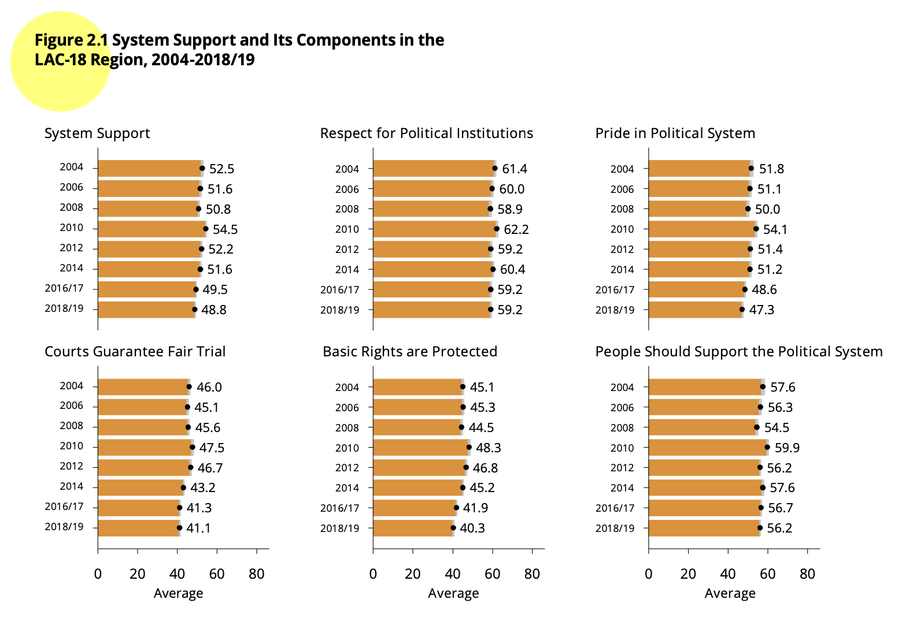

<style type="text/css">
.columns {display: flex;}
h1 {color: #3366CC;}
</style>

# Introduction

In this section we will see the main aspects of the ordinary least squares (OLS) regression models .
This is an extension of the theme of [correlation](https://arturomaldonado.github.io/BarometroEdu_Web_Eng/correlation.html) we see in the previous section.

This section will replicate the analysis of the chapter "Democratic legitimacy" of the report [The Pulse of Democracy](https://www.vanderbilt.edu/lapop/ab2018/2018-19_AmericasBarometer_Regional_Report_10.13.19.pdf).
This chapter analyzes a measure of support for democracy.

# About the dataset

The data we are going to use should be cited as follows: Source: Americas Barometer by the Latin American Public Opinion Project (LAPOP), wwww.LapopSurveys.org.
You can download the data freely [here](http://datasets.americasbarometer.org/database/login.php).

It is recommended to clean the Environment before starting this section.
This document loads a database in RData format.
This format, native to R, is more efficient in terms of storage space, allowing it to be hosted on GitHub (which has file size restrictions).
This base contains the information of the 2018 round for all the variables.
This database is hosted in the "materials_edu" repository of the LAPOP account on GitHub.
Using the `rio` library and the `import` command, you can import this database from this repository, using the following code.


```r
library(rio)
lapop18 = import("https://raw.github.com/lapop-central/materials_edu/main/lapop18.RData")
lapop18 = subset(lapop18, pais<=35)
```

# System support

As we saw in the section about [data manipulation](https://arturomaldonado.github.io/BarometroEdu_Web_Eng/Manipulation.html), to calculate this system support index, we work with a set of five variables:

**B1.** To what extent do you think the courts of justice in (country) guarantee a fair trial.
If you believe that the courts do not guarantee justice at all, choose number 1; if you think that the courts guarantee a los of justice, choose number 7 or choose an intermediate score.

**B2.** To what extent do you respect the political institutions of (country)?

**B3.** To what extent do you think that the basic rights of the citizen are well protected by the political system of (country)?

**B4.** To what extent do you feel proud to live under the political system of (country)?

**B6.** To what extent do you think the political system of (country) should be supported?

As the report indicates "For each question, the original scale from 1 ("Not at all") to 7 ("A lot") is recoded on a scale from 0 to 100, in such a way that 0 indicates the lowest level of support for the political system and 100 is the maximum level of support for the political system. This new scale follows the typical LAPOP recoding and can be interpreted as a measure of support in units, or degrees, on a continuous scale from 0 to 100" (p. 34).

To create the index of support for democracy, each variable, originally measured on a scale of 1-7, has to be rescaled to a new scale of 0-100.


```r
lapop18$b1rec = ((lapop18$b1-1)/6)*100
lapop18$b2rec = ((lapop18$b2-1)/6)*100
lapop18$b3rec = ((lapop18$b3-1)/6)*100
lapop18$b4rec = ((lapop18$b4-1)/6)*100
lapop18$b6rec = ((lapop18$b6-1)/6)*100
```

With these new variables, the mean is calculated for each observation in the dataset.
This can be done with the command `rowMeans`, where the columns to be averaged with the specification `[, 1370:1374]` are indicated.
The average of the 5 recoded variables is saved in a new object "support".

This new variable can be assumed to be numeric, so it can be described with the command `summary`.
The command `summary` shows that this new variable has a minimum of 0 and a maximum of 100.


```r
lapop18$support <- rowMeans(lapop18[,1370:1374])
summary(lapop18$support)
```

```
##    Min. 1st Qu.  Median    Mean 3rd Qu.    Max.    NA's 
##    0.00   33.33   50.00   48.79   66.67  100.00    1761
```

It is verified that the reported average is 48.8 units, similar to the one that appears in Figure 2.1 for the 2018 round.

{width="608"}

# Correlates of system support

Figure 2.10 shows the relationship between system support, the dependent variable, and five independent variables, used as predictors.
These variables are:

-   Index of political tolerance, built from four variables: D1, D2, D3 and D4.

-   External efficacy (EFF1): "Those who govern the country are interested in what people like you think. To what extent do you agree or disagree with this statement?"

-   Confidence in the executive (B21A): "To what extent do you trust the president/prime minister?"

-   Confidence in the local government (B32): "To what extent do you trust your local or municipal government?"

-   Interpersonal trust (IT1): "Now, speaking of the people from your neighborhood/area/community, would you say that the people in your neighborhood/area/community are very trustworthy, somewhat trustworthy, not very trustworthy, or untrustworthy?"

The figure shows the results for these five variables, and the regression model includes socioeconomic and demographic controls and country fixed effects.
The results are presented in a type of graph that is common in LAPOP reports and academic research.

{width="491"}

Figure 2.10 shows the coefficients of each variable and the 95% confidence interval of this estimate.
A vertical line is included at point 0.
If a confidence interval crosses this vertical line, it can be said that the independent variable does not have a statistically significant relationship with the dependent variable.
Confidence intervals that do not cross this line and that lie to the right (left) of this line have a positive (negative) relationship with system support, that is, when this variable increases, average system support increases (decreases).
In this example, all five variables are statistically significant and show a positive relationship with system support.

The value of the coefficient of determination $R^2$ is also displayed.
This coefficient indicates the goodness of fit of a model to the dependent variable.
It measures the proportion of the total variance of the dependent variable explained by the linear regression model.
This coefficient varies between 0 and 1.

Finally, Figure 2.10 shows the N with which the model is calculated.
This N is not necessarily equal to the sample size, since missing values in any of the variables included in the model decrease this total number of observations.

# Simple linear regression model

First, we will start with the relationship between an independent and a dependent variable.
For this, we will use support for the system as the dependent variable and trust in the executive as the independent variable.
This is a partial exercise of the one found in Figure 2.10, where 5 independent variables are used as predictors of system support in a multivariate regression model.

Above the dependent variable was calculated.
After calculating the dependent variable, we proceed to calculate the main independent variable, trust in the executive.
This variable is B21A.
To what extent do you trust the president/prime minister?
This variable is measured on a scale of 1-7 and must be recoded to a scale of 0-100.


```r
lapop18$ejec = ((lapop18$b21a-1)/6)*100
summary(lapop18$ejec)
```

```
##    Min. 1st Qu.  Median    Mean 3rd Qu.    Max.    NA's 
##    0.00    0.00   50.00   42.88   66.67  100.00     390
```

To evaluate the relationship between the variable of trust in the executive and support for the system, a linear regression model is calculated.
The model is calculated with the command `lm` (from lineal model) where the variable Y is indicated and then the X.
This model is saved in an object "model1" which can be described with the command `summary`.


```r
model1 = lm(support ~ ejec, data=lapop18)
summary(model1)
```

```
## 
## Call:
## lm(formula = support ~ ejec, data = lapop18)
## 
## Residuals:
##     Min      1Q  Median      3Q     Max 
## -68.834 -13.785   1.166  13.707  66.215 
## 
## Coefficients:
##             Estimate Std. Error t value Pr(>|t|)    
## (Intercept) 33.78463    0.19029   177.5   <2e-16 ***
## ejec         0.35049    0.00342   102.5   <2e-16 ***
## ---
## Signif. codes:  0 '***' 0.001 '**' 0.01 '*' 0.05 '.' 0.1 ' ' 1
## 
## Residual standard error: 19.7 on 26141 degrees of freedom
##   (1899 observations deleted due to missingness)
## Multiple R-squared:  0.2866,	Adjusted R-squared:  0.2866 
## F-statistic: 1.05e+04 on 1 and 26141 DF,  p-value: < 2.2e-16
```

These results can be presented in a more formal way using different commands.
Here we propose to use the command `summ` from the library `jtools`.


```r
library(jtools)
summ(model1)
```

```
## MODEL INFO:
## Observations: 26143 (1899 missing obs. deleted)
## Dependent Variable: support
## Type: OLS linear regression 
## 
## MODEL FIT:
## F(1,26141) = 10503.71, p = 0.00
## R² = 0.29
## Adj. R² = 0.29 
## 
## Standard errors: OLS
## ------------------------------------------------
##                      Est.   S.E.   t val.      p
## ----------------- ------- ------ -------- ------
## (Intercept)         33.78   0.19   177.55   0.00
## ejec                 0.35   0.00   102.49   0.00
## ------------------------------------------------
```

The basic information of the model shows that this bivariate model has been calculated on 26,143 observations.
That is, 1,899 observations of the total in the dataset have been lost due to missing values in some of the variables and are not included in the model.

To evaluate a relationship between two numerical variables, we have to answer the following questions.

## Is there an association?

The trust in the executive variable has a coefficient of 0.35.
The results for this variable also show the data from the significance test, with the corresponding p-value.
This significance test evaluates:

$H0: \beta_1 = 0$

The p-value can be interpreted as the probability of observing a coefficient like the one observed (0.35) if the value of the population parameter were zero, which would indicate that there is no relationship between the variables.
In our bivariate example, the p-value found is very small (2.2e-16).
If we propose a conventional critical value of 0.05, p-value values below this value would lead us to reject H0 and to affirm that the coefficient of the variable is different from zero, which implies affirming that there is a relationship between the variables.

## Relationship direction

The sign of the coefficient indicates the direction of the relationship.
If the sign is positive, the relationship is positive between the variables (the higher X, the higher Y).
If the sign is negative, the relationship is negative between the variables (the higher X, the lower Y).

In our bivariate example, the sign of the coefficient is positive (although it is implicit), indicating that an increase in trust in the executive leads to an average increase in support for the system.

## Determination coefficient $R^2$

The coefficient of determination is interpreted as how well X predicts Y and it means the proportional reduction in error when using the prediction line, rather than just using $\bar{Y}$ (the average of Y) to predict Y.

Remember that the errors (or residuals) are the distances from each point to the line.
Each point has a distance to the line of $\bar{Y}$ and also a distance to the prediction line.

In the image on the left, the distances of the points to the $\bar{Y}$ line are shown.
All these squared distances can be added.
This sum is E1.

In the image to the right, the distances of the points to the prediction line $\hat{Y}$ are shown.
All these squared distances can be added.
That sum is E2.


So, $R^2 = \frac{E1-E2}{E1}$.
This calculation is equal to the square of the correlation value.
Therefore:

-   $R^2$ varies between 0 and 1.

-   $R^2=1$ implies that E2 = 0, that is to say that all the points fall on the prediction line.

-   $R^2=0$ if the slope is zero.

In our example, $R^2=0.29$.
That is, the model reduces the error of using only the average to estimate Y by 29%.

## Model equation and prediction

With the model results, we can calculate the model equation for predicted values of the dependent variable.
In our example we have:

$$\hat{Y} = 33.78 + 0.35*X$$

With this equation, the predicted value of system support can be calculated for any value of confidence in the executive.
For example, the trust variable in the executive is recoded to vary between 0 and 100.
In this way, it can be calculated that for a minimum value of trust in the executive (X=0), the estimated support for the system would be 33.78 points.
For a maximum value of trust in the executive (X=100), the estimated support for the system would be 33.78 + 35 = 68.78 points.

## Model validity

The model results also present the data of a significance test F.
This significance test evaluates whether the coefficients as a whole are equal to zero.
In this case, those results are equal to the significance test of the coefficient because we have only one independent variable in the model.

This test is relevant when analyzing a multivariate linear regression model.
In a multivariate analysis, this significance test would be the first step in the analysis of the model.

# Summary

In this document, we have presented a simple linear regression model, using a numerical independent variable to explain a numerical dependent variable.
Then the main questions of the simple linear regression model have been answered, such as whether there is a relationship, the direction of the relationship, the coefficient of determination, the equation of the line and the prediction.

# Including survey weights

These calculations do not include survey weights.
An introduction to the use of the survey weights was made [here](https://arturomaldonado.github.io/BarometroEdu_Web_Eng/Expansion.html).
In this part we will use the library `survey`.

We will use the command `svydesign` (similar to the command svyset in STATA).
With this command a new object called "design18" is created, which saves the information of the variables contained in the dataframe, including the survey weights in the calculations.
Therefore, if a new variable is created later, this command would have to be calculated again so that this object "design18" includes this new variable.


```r
library(survey)
design18 = svydesign(ids = ~upm, strata = ~estratopri, weights = ~weight1500, nest=TRUE, data=lapop18)
```

The library `survey` includes the command `svyglm` that allows to compute a linear regression model.
The same variables used in model 1 can be included in this command.
We have to specify the design that is used and the treatment of missing values.
This calculation is saved in an object "model2".
The `summary` command is used to describe the model.


```r
model2 = svyglm(support~ejec, design18)
summary(model2)
```

```
## 
## Call:
## svyglm(formula = support ~ ejec, design = design18)
## 
## Survey design:
## svydesign(ids = ~upm, strata = ~estratopri, weights = ~weight1500, 
##     nest = TRUE, data = lapop18)
## 
## Coefficients:
##              Estimate Std. Error t value Pr(>|t|)    
## (Intercept) 33.780515   0.222170  152.05   <2e-16 ***
## ejec         0.350397   0.003722   94.15   <2e-16 ***
## ---
## Signif. codes:  0 '***' 0.001 '**' 0.01 '*' 0.05 '.' 0.1 ' ' 1
## 
## (Dispersion parameter for gaussian family taken to be 389.4621)
## 
## Number of Fisher Scoring iterations: 2
```

With the command `summ` of the library `jtools`, the model can be presented, including the $R^2$ weighted data.


```r
summ(model2)
```

```
## MODEL INFO:
## Observations: 26143
## Dependent Variable: support
## Type: Survey-weighted linear regression 
## 
## MODEL FIT:
## R² = 0.29
## Adj. R² = 0.29 
## 
## Standard errors: Robust
## ------------------------------------------------
##                      Est.   S.E.   t val.      p
## ----------------- ------- ------ -------- ------
## (Intercept)         33.78   0.22   152.05   0.00
## ejec                 0.35   0.00    94.15   0.00
## ------------------------------------------------
## 
## Estimated dispersion parameter = 389.46
```
