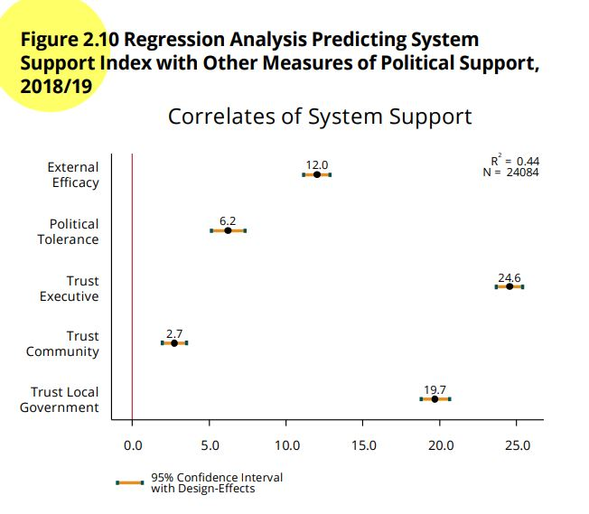

# Introduction

In the previous section we saw the basic aspects of the ordinary least squares model to analyze the relationship between a dependent and an independent variable, both numerical.
In this section the analysis will be expanded from a bivariate analysis to a multivariate analysis.
That is, the method of ordinary least squares will be used to analyze the relationship of a numerical dependent variable with several independent variables.

This section will continue replicating the analysis of the chapter "Democratic legitimacy" of the report [The Pulse of Democracy](https://www.vanderbilt.edu/lapop/ab2018/2018-19_AmericasBarometer_Regional_Report_10.13.19.pdf).
This chapter analyzes a measure of support for democracy.

# About the dataset

The data we are going to use should be cited as follows: Source: AmericasBarometer by the Latin American Public Opinion Project (LAPOP), wwww.LapopSurveys.org.
You can download the data freely [here](http://datasets.americasbarometer.org/database/login.php).

It is recommended to clean the Environment before starting this section.
In this document, a database in RData format is again loaded.
This format is efficient in terms of storage space.
This database is hosted in the "materials_edu" repository of the LAPOP account on GitHub.
Using the `rio` library and the `import` command, you can import this database from this repository, using the following code.


```r
library(rio)
lapop18 = import("https://raw.github.com/lapop-central/materials_edu/main/lapop18.RData")
lapop18 = subset(lapop18, pais<=35)
```

# Determinants of system support

In the previous section we saw that the Democratic Legitimacy section of the report presents a multiple regression model with predictors of the index of system support.
Figure 2.10 shows the results for five independent variables, although the full model includes socioeconomic and demographic controls.

{width="525"}

The variables shown in the graph are: external efficacy, political tolerance, trust in the executive, trust in the community, and trust in local government.

The dataset includes the variable "psar" that measures support for the system and that was calculated in the previous section from the original variables.
This variable is already recoded on the 0-100 scale.


```r
summary(lapop18$psar)
```

```
##    Min. 1st Qu.  Median    Mean 3rd Qu.    Max.    NA's 
##    0.00   33.33   50.00   48.90   66.67  100.00     327
```

Figure 2.10 shows the relationship between system support and five independent variables, used as predictors of this dependent variable.
These variables are:

-   Index of political tolerance, built from four variables: D1, D2, D3 and D4.
    In the dataset, the recoded variable is called "tol1r".

-   External efficacy (EFF1): "Those who govern the country are interested in what people like you think. To what extent do you agree or disagree with this statement?" In the dataset, the recoded variable is called "eff1r".

-   Confidence in the executive (B21A): "To what extent do you trust the president/prime minister?"

-   Confidence in the local government (B32): "To what extent do you trust your mayor's office?" In the dataset, the recoded variable is named "b32r".

-   Trust in your community (IT1): "Now, speaking of the people around here, would you say that the people in your community are very trustworthy, somewhat trustworthy, not very trustworthy, or not at all trustworthy?" In the dataset, the recoded variable is called "it1r".

In the same way as in the previous section, we have to calculate the trust in the executive variable, recoded to a scale of 0 to 100.


```r
lapop18$ejec = ((lapop18$b21a-1)/6)*100
summary(lapop18$ejec)
```

```
##    Min. 1st Qu.  Median    Mean 3rd Qu.    Max.    NA's 
##    0.00    0.00   50.00   42.88   66.67  100.00     390
```

# Multivariate linear regression model

To assess the determinants of system support, we can compute a multivariate linear regression model.
The model is calculated with the command `lm` where the Y variable is indicated and then the independent variables.
Each independent variable is added to the model.
This model is saved in an object "model1" which can be described with the command `summary`.


```r
model1 = lm(psar ~ eff1r + ejec + tolr + it1r + b32r, data=lapop18)
summary(model1)
```

```
## 
## Call:
## lm(formula = psar ~ eff1r + ejec + tolr + it1r + b32r, data = lapop18)
## 
## Residuals:
##     Min      1Q  Median      3Q     Max 
## -80.738 -11.985   0.626  12.249  76.319 
## 
## Coefficients:
##              Estimate Std. Error t value Pr(>|t|)    
## (Intercept) 19.063373   0.377552  50.492   <2e-16 ***
## eff1r        0.127794   0.003722  34.331   <2e-16 ***
## ejec         0.225187   0.003673  61.313   <2e-16 ***
## tolr         0.057712   0.004873  11.842   <2e-16 ***
## it1r         0.030792   0.003637   8.465   <2e-16 ***
## b32r         0.210219   0.003966  53.000   <2e-16 ***
## ---
## Signif. codes:  0 '***' 0.001 '**' 0.01 '*' 0.05 '.' 0.1 ' ' 1
## 
## Residual standard error: 18.01 on 24767 degrees of freedom
##   (3269 observations deleted due to missingness)
## Multiple R-squared:  0.4007,	Adjusted R-squared:  0.4006 
## F-statistic:  3312 on 5 and 24767 DF,  p-value: < 2.2e-16
```

To present the results clearly, we can use various libraries and commands.
In the previous section we used the library `jtools` and the command `summs`.
In this section we will use the library `stargazer` and the command of the same name.


```r
library(stargazer)
```

```
## 
## Please cite as:
```

```
##  Hlavac, Marek (2022). stargazer: Well-Formatted Regression and Summary Statistics Tables.
```

```
##  R package version 5.2.3. https://CRAN.R-project.org/package=stargazer
```

```r
stargazer(model1, align=T, type = 'text')
```

```
## 
## ================================================
##                         Dependent variable:     
##                     ----------------------------
##                                 psar            
## ------------------------------------------------
## eff1r                         0.128***          
##                               (0.004)           
##                                                 
## ejec                          0.225***          
##                               (0.004)           
##                                                 
## tolr                          0.058***          
##                               (0.005)           
##                                                 
## it1r                          0.031***          
##                               (0.004)           
##                                                 
## b32r                          0.210***          
##                               (0.004)           
##                                                 
## Constant                     19.063***          
##                               (0.378)           
##                                                 
## ------------------------------------------------
## Observations                   24,773           
## R2                             0.401            
## Adjusted R2                    0.401            
## Residual Std. Error     18.007 (df = 24767)     
## F Statistic         3,312.080*** (df = 5; 24767)
## ================================================
## Note:                *p<0.1; **p<0.05; ***p<0.01
```

Figure 2.10 shows the coefficients of each variable and the 95% confidence interval of this estimate.
A vertical line is included at point 0.
If a confidence interval crosses this vertical line, we can say that it does not have a statistically significant relationship with the dependent variable of system support.
Confidence intervals that do not cross this line and that lie to the right (left) of this line have a positive (negative) relationship with system support, that is, when this variable increases, average system support increases (decreases).
In this example, all five variables are statistically significant and show a positive relationship with system support.
To approximate a plot similar to the one shown in the report, we can use the library `jtools` and the command `plot_summs`.


```r
library(jtools)
plot_summs(model1)
```

<!-- -->

# Interpretation

As the report indicates: "All five support indicators have a positive, significant relationship with system support, according to the 95% confidence interval...This indicates that as the external efficacy, political tolerance, trust in the executive, community, and local government increase, so does the average level of support for the political system".

Before analyzing the relationship of each independent variable with the dependent variable, we can analyze the validity of the model as a whole.

## Model validity

The F test is used to evaluate the model in general.
This test hypothesizes:

$$
H0: \beta_1 = \beta_2 = \beta_3 = \beta_4 = \beta_5 = 0
$$

That is, the null hypothesis is that all the coefficients as a whole are equal to zero.
In our example, the p-value is less than 0.05, which means that H0 can be rejected and that at least one coefficient is different from zero.
This concludes that the model is valid.

## Relationship between independent and dependent variables

For each independent variable, the model calculates a t-test.
This significance test evaluates $H0: \beta_n =0$.
That is, if the coefficient of a single independent variable is equal to zero.

For example, the independent variable external efficacy has a coefficient of 0.128, a t-test statistic of 34.3, and an associated t-value of 0.004.
In the same way as in bivariate analysis, a critical value is established, conventionally 0.05.
Since this t-value is less than 0.05, the null hypothesis can be rejected and we can state that the coefficient is different from zero with 95% confidence.

The same conclusion can be drawn for the other independent variables, presenting a t-value less than 0.05.
With this it can be corroborated that the five independent variables are significant, as indicated in the report.

## Direction of relationship

The direction of the relationship is marked by the sign of the coefficient of the independent variable.
In our example, all five coefficients have positive signs, indicating a direct relationship; that is, when the independent variable increases, the dependent variable increases, on average.

## Determination coefficient $R^2$

Figure 2.10, in addition to showing the coefficients and the 95% confidence intervals, also shows the data for the determination coefficient $R^2$ and for the number of observations with which the model is calculated.

In our example the value of $R^2=0.401$.
This value is not the same as the one presented in the report (0.44) because the model of our example does not include socioeconomic and demographic controls and survey weights.
The result of our example indicates that the model reduces the error of using only the average to estimate system support by 40.1%.

# Including "dummy" variables

The report indicates that "We control for the same socio-economic and demographic indicators analyzed earlier, and country fixed effects".
Although the coefficients for these variables are not shown, the results shown in Figure 2.10 include the effect of these variables.

Before replicating the full model, we will explain the role of dummy variables.
A dummy variable is one that is coded as 0 and 1.
In the "lapop18" dataset we have a variable called "mujer", which identifies those interviewed as women with 1 and all others with 0.

In this section we want to compare system support between women and others.
In the section referring to the [t-test](https://arturomaldonado.github.io/BarometroEdu_Web_Eng/ttest.html), we explain the procedure for comparing a numerical dependent variable between groups of a dichotomous variable.
Here we will follow a similar procedure.
First, we compute the Levene's test for equality of variances.


```r
library(DescTools)
```

```
## 
## Attaching package: 'DescTools'
```

```
## The following object is masked from 'package:jtools':
## 
##     %nin%
```

```r
LeveneTest(lapop18$psar, lapop18$mujer)
```

```
## Warning in LeveneTest.default(lapop18$psar, lapop18$mujer): lapop18$mujer
## coerced to factor.
```

<div data-pagedtable="false">
  <script data-pagedtable-source type="application/json">
{"columns":[{"label":[""],"name":["_rn_"],"type":[""],"align":["left"]},{"label":["Df"],"name":[1],"type":["int"],"align":["right"]},{"label":["F value"],"name":[2],"type":["dbl"],"align":["right"]},{"label":["Pr(>F)"],"name":[3],"type":["dbl"],"align":["right"]}],"data":[{"1":"1","2":"0.001510476","3":"0.9689984","_rn_":"group"},{"1":"27698","2":"NA","3":"NA","_rn_":""}],"options":{"columns":{"min":{},"max":[10]},"rows":{"min":[10],"max":[10]},"pages":{}}}
  </script>
</div>

With this result, the zero hypothesis of equality of variances cannot be rejected, so we will assume that the variances are equal in the t-test.


```r
t.test(psar ~ mujer, data = lapop18, var.equal=T)
```

```
## 
## 	Two Sample t-test
## 
## data:  psar by mujer
## t = -4.7381, df = 27698, p-value = 2.168e-06
## alternative hypothesis: true difference in means between group 0 and group 1 is not equal to 0
## 95 percent confidence interval:
##  -1.8863128 -0.7823502
## sample estimates:
## mean in group 0 mean in group 1 
##        48.22274        49.55707
```

The results indicate that the group of women presents a higher support for the system (49.6) than the group of men (48.2), and that this difference is statistically significant with a p-value lower than 0.05 (2.17x10-6).

These results can be replicated through a simple linear regression analysis, using system support, a numerical variable, as the dependent variable, and woman, a dummy variable, as the independent variable.


```r
model2 = lm(psar ~ mujer, data=lapop18)
summary(model2)
```

```
## 
## Call:
## lm(formula = psar ~ mujer, data = lapop18)
## 
## Residuals:
##     Min      1Q  Median      3Q     Max 
## -49.557 -16.224   1.777  17.110  51.777 
## 
## Coefficients:
##             Estimate Std. Error t value Pr(>|t|)    
## (Intercept)  48.2227     0.1992 242.050  < 2e-16 ***
## mujer         1.3343     0.2816   4.738 2.17e-06 ***
## ---
## Signif. codes:  0 '***' 0.001 '**' 0.01 '*' 0.05 '.' 0.1 ' ' 1
## 
## Residual standard error: 23.44 on 27698 degrees of freedom
##   (342 observations deleted due to missingness)
## Multiple R-squared:  0.0008099,	Adjusted R-squared:  0.0007738 
## F-statistic: 22.45 on 1 and 27698 DF,  p-value: 2.168e-06
```

The estimate for the intercept, when X=0, that is, for men, replicates the result obtained in the t-test of the average system support for men.
In the case of the average of women, X=1 must be replaced in the model equation, which would give 48.22+1.33 = 49.55, similar to the result obtained in the t test.
The p-value of the coefficient of the dummy variable, in turn, also replicates the p-value obtained in the t-test.

In this way, it can be seen that by means of a simple linear regression model, the results of a t-test can be replicated, since both evaluate whether there are differences in the mean of a numerical variable between two groups.

The evaluation can be done with a variable that indicates one of the countries included in the 2018/19 round.
For example, if we want to assess whether there are differences between Mexican and non-Mexican citizens in their levels of support for the system, we have to create this dummy variable and then proceed in the same way as with the variable "mujer".

First, we create the dummy variable "mexico" with values 1 if a interviewee is from Mexico and 0 in any other case.


```r
lapop18$mexico = ifelse(lapop18$pais==1, 1, 0)
```

With this variable, it is possible to evaluate the differences in support for the system between Mexicans and the rest of the interviewees.


```r
LeveneTest(lapop18$psar, lapop18$mexico)
```

```
## Warning in LeveneTest.default(lapop18$psar, lapop18$mexico): lapop18$mexico
## coerced to factor.
```

<div data-pagedtable="false">
  <script data-pagedtable-source type="application/json">
{"columns":[{"label":[""],"name":["_rn_"],"type":[""],"align":["left"]},{"label":["Df"],"name":[1],"type":["int"],"align":["right"]},{"label":["F value"],"name":[2],"type":["dbl"],"align":["right"]},{"label":["Pr(>F)"],"name":[3],"type":["dbl"],"align":["right"]}],"data":[{"1":"1","2":"15.83093","3":"6.943704e-05","_rn_":"group"},{"1":"27713","2":"NA","3":"NA","_rn_":""}],"options":{"columns":{"min":{},"max":[10]},"rows":{"min":[10],"max":[10]},"pages":{}}}
  </script>
</div>


```r
t.test(psar ~ mexico, data = lapop18, var.equal=F)
```

```
## 
## 	Welch Two Sample t-test
## 
## data:  psar by mexico
## t = -12.058, df = 1768.7, p-value < 2.2e-16
## alternative hypothesis: true difference in means between group 0 and group 1 is not equal to 0
## 95 percent confidence interval:
##  -8.062505 -5.806558
## sample estimates:
## mean in group 0 mean in group 1 
##        48.50774        55.44227
```

This result is similar to that obtained with a simple linear regression


```r
model3 = lm(psar ~ mexico, data=lapop18)
summary(model3)
```

```
## 
## Call:
## lm(formula = psar ~ mexico, data = lapop18)
## 
## Residuals:
##     Min      1Q  Median      3Q     Max 
## -55.442 -15.175   1.492  18.159  51.492 
## 
## Coefficients:
##             Estimate Std. Error t value Pr(>|t|)    
## (Intercept)  48.5077     0.1446  335.40   <2e-16 ***
## mexico        6.9345     0.6112   11.35   <2e-16 ***
## ---
## Signif. codes:  0 '***' 0.001 '**' 0.01 '*' 0.05 '.' 0.1 ' ' 1
## 
## Residual standard error: 23.39 on 27713 degrees of freedom
##   (327 observations deleted due to missingness)
## Multiple R-squared:  0.004624,	Adjusted R-squared:  0.004588 
## F-statistic: 128.7 on 1 and 27713 DF,  p-value: < 2.2e-16
```

# Including categorical variables

The calculation of system support for Mexicans involved the creation of a "dummy" variable from the categorical variable "country".
This variable is a variable of type "factor", which includes the 18 countries included in this dataset.

If we want to assess system support in each country, we have to create a dummy variable for each group.
In the simple linear regression analysis, we evaluate the difference in support for the system between the citizens of the included country and the rest of the interviewees.

Other way to do this evaluation is to include all the dummy variables (except one) in a multiple linear regression model.
The excluded variable will act as a reference variable and the other countries will be evaluated based on this variable.

Instead of creating 18 "dummy" variables for each country, we can use the function `factor` inside the function `lm` to indicate that this is a categorical variable and to evaluate each group separately.
By default, the first group (that is, country=1, Mexico) is taken as a reference.


```r
model4 = lm(psar ~ factor(pais), data=lapop18)
summary(model4)
```

```
## 
## Call:
## lm(formula = psar ~ factor(pais), data = lapop18)
## 
## Residuals:
##    Min     1Q Median     3Q    Max 
## -59.16 -15.92   0.94  16.85  58.19 
## 
## Coefficients:
##                Estimate Std. Error t value Pr(>|t|)    
## (Intercept)     55.4423     0.5844  94.876  < 2e-16 ***
## factor(pais)2   -4.8799     0.8267  -5.903 3.61e-09 ***
## factor(pais)3   -5.1837     0.8331  -6.222 4.98e-10 ***
## factor(pais)4  -12.1896     0.8271 -14.738  < 2e-16 ***
## factor(pais)5   -3.6108     0.8302  -4.349 1.37e-05 ***
## factor(pais)6    3.7224     0.8344   4.461 8.18e-06 ***
## factor(pais)7   -9.7110     0.8276 -11.734  < 2e-16 ***
## factor(pais)8   -5.3478     0.8138  -6.571 5.08e-11 ***
## factor(pais)9   -3.3549     0.8295  -4.044 5.26e-05 ***
## factor(pais)10  -6.3823     0.8136  -7.845 4.49e-15 ***
## factor(pais)11 -13.6326     0.8317 -16.391  < 2e-16 ***
## factor(pais)12  -8.6253     0.8340 -10.342  < 2e-16 ***
## factor(pais)13 -10.0246     0.8182 -12.252  < 2e-16 ***
## factor(pais)14  -1.3612     0.8244  -1.651   0.0987 .  
## factor(pais)15 -12.8693     0.8351 -15.410  < 2e-16 ***
## factor(pais)17  -9.5257     0.8314 -11.457  < 2e-16 ***
## factor(pais)21  -9.3756     0.8344 -11.236  < 2e-16 ***
## factor(pais)23  -5.6218     0.8370  -6.717 1.89e-11 ***
## ---
## Signif. codes:  0 '***' 0.001 '**' 0.01 '*' 0.05 '.' 0.1 ' ' 1
## 
## Residual standard error: 23.02 on 27697 degrees of freedom
##   (327 observations deleted due to missingness)
## Multiple R-squared:  0.03658,	Adjusted R-squared:  0.03599 
## F-statistic: 61.86 on 17 and 27697 DF,  p-value: < 2.2e-16
```

The results indicate that the intercept is 55.44, which is the mean of system support for the reference group, Mexico, as calculated in the previous procedures.
The average support for the system for the rest of the countries can be calculated by adding (or subtracting) the value of the coefficient of the country from the reference value.

For example, Guatemala is country 2.
To calculate the average support for the system in that country, we have to calculate 55.44-4.88=50.56.
Not only that, the p-value corresponding to country 2 indicates that the difference in system support between Guatemala and Mexico is statistically significant.

Another example, Peru is country 11.
The mean support for the system in Peru would be 55.44-13.63=41.81 and is statistically different from the mean support in Mexico.

# Including control variables

The inclusion of "dummy" variables for each country allows us to analyze the average support for the system in each group and to know if there are statistically significant differences with the reference country.
Many times these "dummy" variables are included as part of a more general analysis.
Such is the case of Figure 2.10, where the effect of five independent variables on system support is analyzed and "controlled by the same socioeconomic and demographic indicators and by country fixed effects." These so-called "country fixed effects" refer to the inclusion of these "dummies" as control variables in a multivariate linear regression.
These variables capture idiosyncratic effects present in each country.

For example, if we want to evaluate the relationship between external efficacy and system support, including country fixed effects, we have to calculate a multivariate linear regression model with system support as the dependent variable, external efficacy as the main independent variable and the "dummy" variables for each country, except for the reference country.


```r
model5 = lm(psar ~ eff1r + factor(pais), data=lapop18)
summary(model5)
```

```
## 
## Call:
## lm(formula = psar ~ eff1r + factor(pais), data = lapop18)
## 
## Residuals:
##     Min      1Q  Median      3Q     Max 
## -74.219 -14.355   1.174  14.935  69.887 
## 
## Coefficients:
##                  Estimate Std. Error t value Pr(>|t|)    
## (Intercept)     40.221907   0.582982  68.993  < 2e-16 ***
## eff1r            0.269289   0.003945  68.260  < 2e-16 ***
## factor(pais)2   -1.283208   0.766097  -1.675  0.09395 .  
## factor(pais)3   -1.061799   0.769619  -1.380  0.16771    
## factor(pais)4   -6.312159   0.767894  -8.220  < 2e-16 ***
## factor(pais)5   -1.395543   0.765276  -1.824  0.06823 .  
## factor(pais)6    7.068293   0.769040   9.191  < 2e-16 ***
## factor(pais)7   -4.715749   0.764862  -6.165 7.13e-10 ***
## factor(pais)8   -3.111784   0.750645  -4.145 3.40e-05 ***
## factor(pais)9   -0.762552   0.764028  -0.998  0.31826    
## factor(pais)10  -4.566197   0.750926  -6.081 1.21e-09 ***
## factor(pais)11 -10.464442   0.766590 -13.651  < 2e-16 ***
## factor(pais)12  -6.194721   0.769992  -8.045 8.98e-16 ***
## factor(pais)13  -4.255263   0.759044  -5.606 2.09e-08 ***
## factor(pais)14   1.824124   0.760984   2.397  0.01653 *  
## factor(pais)15 -10.109041   0.770314 -13.123  < 2e-16 ***
## factor(pais)17  -4.408314   0.768863  -5.734 9.94e-09 ***
## factor(pais)23  -2.510171   0.778686  -3.224  0.00127 ** 
## ---
## Signif. codes:  0 '***' 0.001 '**' 0.01 '*' 0.05 '.' 0.1 ' ' 1
## 
## Residual standard error: 21.07 on 25870 degrees of freedom
##   (2154 observations deleted due to missingness)
## Multiple R-squared:  0.1851,	Adjusted R-squared:  0.1845 
## F-statistic: 345.6 on 17 and 25870 DF,  p-value: < 2.2e-16
```

We can calculate other model including the five independent variables of interest and country fixed effects.


```r
model6 = lm(psar ~ eff1r + ejec + tolr + it1r + b32r + factor(pais), data=lapop18)
summary(model6)
```

```
## 
## Call:
## lm(formula = psar ~ eff1r + ejec + tolr + it1r + b32r + factor(pais), 
##     data = lapop18)
## 
## Residuals:
##     Min      1Q  Median      3Q     Max 
## -83.421 -11.541   0.581  11.672  83.518 
## 
## Coefficients:
##                 Estimate Std. Error t value Pr(>|t|)    
## (Intercept)    18.042261   0.597709  30.186  < 2e-16 ***
## eff1r           0.123037   0.003651  33.702  < 2e-16 ***
## ejec            0.245316   0.003743  65.546  < 2e-16 ***
## tolr            0.059463   0.004775  12.454  < 2e-16 ***
## it1r            0.022774   0.003592   6.340 2.34e-10 ***
## b32r            0.199306   0.003975  50.141  < 2e-16 ***
## factor(pais)2   5.874244   0.659653   8.905  < 2e-16 ***
## factor(pais)3   2.254085   0.666982   3.380 0.000727 ***
## factor(pais)4  -2.528939   0.666218  -3.796 0.000147 ***
## factor(pais)5   3.394305   0.656248   5.172 2.33e-07 ***
## factor(pais)6   9.828894   0.659125  14.912  < 2e-16 ***
## factor(pais)7   5.252759   0.658864   7.972 1.62e-15 ***
## factor(pais)8   1.079195   0.639643   1.687 0.091581 .  
## factor(pais)9   4.797174   0.650208   7.378 1.66e-13 ***
## factor(pais)10  0.219212   0.641355   0.342 0.732508    
## factor(pais)11 -4.286303   0.652026  -6.574 5.00e-11 ***
## factor(pais)12 -3.483247   0.657532  -5.297 1.18e-07 ***
## factor(pais)13 -2.215527   0.647355  -3.422 0.000622 ***
## factor(pais)14  5.144355   0.655011   7.854 4.20e-15 ***
## factor(pais)15 -7.506204   0.654577 -11.467  < 2e-16 ***
## factor(pais)17  2.849686   0.664574   4.288 1.81e-05 ***
## factor(pais)23  0.366617   0.683767   0.536 0.591844    
## ---
## Signif. codes:  0 '***' 0.001 '**' 0.01 '*' 0.05 '.' 0.1 ' ' 1
## 
## Residual standard error: 17.52 on 24751 degrees of freedom
##   (3269 observations deleted due to missingness)
## Multiple R-squared:  0.433,	Adjusted R-squared:  0.4325 
## F-statistic:   900 on 21 and 24751 DF,  p-value: < 2.2e-16
```

To replicate the model presented in Figure 2.10, it is necessary to add the socio-demographic controls: level of education, quintiles of wealth, place of residence, gender and age (in groups).
The following model includes all these controls.
Since these are categorical variables, the command `factor` is included to make "dummy" variables for each category of the variable, leaving the first group of each variable as the reference category.


```r
model7 = lm(psar ~ eff1r + ejec + tolr + it1r + b32r + factor(pais)
              + factor(edr) + factor(quintall) + factor(urban) + factor(mujer)
              + factor(edad), data=lapop18)
summary(model7)
```

```
## 
## Call:
## lm(formula = psar ~ eff1r + ejec + tolr + it1r + b32r + factor(pais) + 
##     factor(edr) + factor(quintall) + factor(urban) + factor(mujer) + 
##     factor(edad), data = lapop18)
## 
## Residuals:
##     Min      1Q  Median      3Q     Max 
## -82.923 -11.452   0.635  11.565  83.708 
## 
## Coefficients:
##                    Estimate Std. Error t value Pr(>|t|)    
## (Intercept)       25.238284   1.077472  23.424  < 2e-16 ***
## eff1r              0.118781   0.003684  32.244  < 2e-16 ***
## ejec               0.245818   0.003798  64.724  < 2e-16 ***
## tolr               0.063572   0.004889  13.002  < 2e-16 ***
## it1r               0.027886   0.003670   7.599 3.10e-14 ***
## b32r               0.192699   0.004020  47.936  < 2e-16 ***
## factor(pais)2      4.909332   0.669281   7.335 2.28e-13 ***
## factor(pais)3      1.588472   0.682881   2.326 0.020020 *  
## factor(pais)4     -3.755768   0.677621  -5.543 3.01e-08 ***
## factor(pais)5      2.438619   0.660267   3.693 0.000222 ***
## factor(pais)6      9.258804   0.663994  13.944  < 2e-16 ***
## factor(pais)7      4.880653   0.661942   7.373 1.72e-13 ***
## factor(pais)8      0.923837   0.640161   1.443 0.148996    
## factor(pais)9      4.391761   0.663259   6.621 3.63e-11 ***
## factor(pais)10    -0.080546   0.644643  -0.125 0.900567    
## factor(pais)11    -4.350131   0.660879  -6.582 4.73e-11 ***
## factor(pais)12    -4.281331   0.663541  -6.452 1.12e-10 ***
## factor(pais)13    -1.874951   0.650075  -2.884 0.003928 ** 
## factor(pais)14     5.478034   0.657810   8.328  < 2e-16 ***
## factor(pais)15    -7.317981   0.655948 -11.156  < 2e-16 ***
## factor(pais)17     2.922762   0.666485   4.385 1.16e-05 ***
## factor(pais)23    -0.204536   0.696405  -0.294 0.768988    
## factor(edr)1      -1.756767   0.843487  -2.083 0.037285 *  
## factor(edr)2      -2.388068   0.846357  -2.822 0.004783 ** 
## factor(edr)3      -2.717511   0.881744  -3.082 0.002059 ** 
## factor(quintall)2 -0.809320   0.357849  -2.262 0.023730 *  
## factor(quintall)3 -0.650724   0.359260  -1.811 0.070108 .  
## factor(quintall)4 -1.536633   0.363703  -4.225 2.40e-05 ***
## factor(quintall)5 -1.697764   0.381232  -4.453 8.49e-06 ***
## factor(urban)1    -2.606313   0.267281  -9.751  < 2e-16 ***
## factor(mujer)1     1.380202   0.225837   6.111 1.00e-09 ***
## factor(edad)2     -3.282294   0.323640 -10.142  < 2e-16 ***
## factor(edad)3     -4.193760   0.348896 -12.020  < 2e-16 ***
## factor(edad)4     -3.497258   0.385234  -9.078  < 2e-16 ***
## factor(edad)5     -2.547496   0.434275  -5.866 4.52e-09 ***
## factor(edad)6     -1.687481   0.476292  -3.543 0.000396 ***
## ---
## Signif. codes:  0 '***' 0.001 '**' 0.01 '*' 0.05 '.' 0.1 ' ' 1
## 
## Residual standard error: 17.34 on 24048 degrees of freedom
##   (3958 observations deleted due to missingness)
## Multiple R-squared:  0.4438,	Adjusted R-squared:  0.443 
## F-statistic: 548.3 on 35 and 24048 DF,  p-value: < 2.2e-16
```

Figure 2.10 includes these controls, but does not present them on the graph.
This can be replicated with the command `plot_summs`, which can display model 7, but it allows that we say which coefficients to plot with the command `coefs`.


```r
plot_summs(model7, coefs=c("External efficacy"="eff1r", "Confidence in the executive"= "ejec",
                            "Political tolerance"="tolr", "Trust in the community"="it1r",
                            "Trust in local government"="b32r"))
```

<!-- -->

In this way, a multivariate linear regression model has been created, in which five independent numerical variables of interest and a series of socio-demographic controls and fixed effects by country have been included.

# Summary

In this section we have used the method of least squares to compute a multivariate model.
In particular, a model with five predictors of system support has been presented.
This model has been presented in a standard way in a table of results and through a graph similar to Figure 2.10 of the report.

According to the results of this multivariate model, we explain the validity of the model, the inference test to evaluate the relationship between each independent variable with the dependent variable, the direction of the relationships and the decrease in error through the coefficient of determination.

Then, we include control dummy variables and country fixed effects in the multivariate model to replicate Figure 2.10.

# Including survey weights

The calculations made do not include the survey weights.
An introduction to the use of the survey weights was made [here](https://arturomaldonado.github.io/BarometroEdu_Web_Eng/Expansion.html).
In this part we will use the library `survey`.

We will use the command `svydesign` (similar to the command svyset in STATA).
With this command, we create a new object called "design18", which saves the information of the variables contained in the dataframe, including the survey weights in the calculations.
Therefore, if a new variable is created later, this command would have to be calculated again so that this object "design18" includes this new variable.


```r
library(survey)
design18 = svydesign(ids = ~upm, strata = ~estratopri, weights = ~weight1500, nest=TRUE, data=lapop18)
```

The library `survey` includes the command `svyglm` that allows to compute a multivariate linear regression model.
We can include the same variables used in model 7 in this command.
We have to specify the design that is used and the treatment of missing values.
This calculation is saved in a object "model8".
The command `summ` from the library `jtools` is used to describe the model.


```r
model8 = svyglm(psar ~ eff1r + ejec + tolr + it1r + b32r + factor(pais) + 
    factor(edr) + factor(quintall) + factor(urban) + factor(mujer) + 
    factor(edad), design=design18, na.action = na.omit)
summ(model8)
```

```
## MODEL INFO:
## Observations: 24084
## Dependent Variable: psar
## Type: Survey-weighted linear regression 
## 
## MODEL FIT:
## R² = 0.44
## Adj. R² = 0.43 
## 
## Standard errors: Robust
## ------------------------------------------------------
##                            Est.   S.E.   t val.      p
## ----------------------- ------- ------ -------- ------
## (Intercept)               25.35   1.27    19.98   0.00
## eff1r                      0.12   0.00    27.03   0.00
## ejec                       0.25   0.00    56.82   0.00
## tolr                       0.06   0.01    11.45   0.00
## it1r                       0.03   0.00     7.09   0.00
## b32r                       0.19   0.00    41.47   0.00
## factor(pais)2              4.90   0.78     6.29   0.00
## factor(pais)3              1.56   0.69     2.27   0.02
## factor(pais)4             -3.78   0.77    -4.89   0.00
## factor(pais)5              2.44   0.77     3.16   0.00
## factor(pais)6              9.25   0.66    13.94   0.00
## factor(pais)7              4.88   0.72     6.74   0.00
## factor(pais)8              0.93   0.72     1.28   0.20
## factor(pais)9              4.39   0.78     5.59   0.00
## factor(pais)10            -0.08   0.69    -0.11   0.91
## factor(pais)11            -4.35   0.72    -6.04   0.00
## factor(pais)12            -4.29   0.68    -6.32   0.00
## factor(pais)13            -1.89   0.68    -2.78   0.01
## factor(pais)14             5.47   0.78     7.04   0.00
## factor(pais)15            -7.21   0.74    -9.71   0.00
## factor(pais)17             2.91   0.81     3.58   0.00
## factor(pais)23            -0.19   0.79    -0.24   0.81
## factor(edr)1              -1.92   1.00    -1.92   0.05
## factor(edr)2              -2.55   1.02    -2.50   0.01
## factor(edr)3              -2.87   1.05    -2.72   0.01
## factor(quintall)2         -0.74   0.38    -1.98   0.05
## factor(quintall)3         -0.60   0.37    -1.63   0.10
## factor(quintall)4         -1.47   0.37    -3.93   0.00
## factor(quintall)5         -1.68   0.37    -4.50   0.00
## factor(urban)1            -2.61   0.29    -9.08   0.00
## factor(mujer)1             1.41   0.24     5.86   0.00
## factor(edad)2             -3.26   0.32   -10.29   0.00
## factor(edad)3             -4.21   0.35   -11.87   0.00
## factor(edad)4             -3.47   0.40    -8.68   0.00
## factor(edad)5             -2.46   0.46    -5.38   0.00
## factor(edad)6             -1.69   0.51    -3.35   0.00
## ------------------------------------------------------
## 
## Estimated dispersion parameter = 300.32
```

We should note that this table presents the $R^2 = 0.44$ and $N = 23084$, which are the same values reported in Figure 2.10.

In the same way as with model 7, these results can also be plotted using the command `plot_summs`, selecting the variables to display.


```r
plot_summs(model8, coefs=c("External efficacy"="eff1r", "Confidence in the executive"= "ejec",
                            "Political tolerance"="tolr", "Trust in the community"="it1r",
                            "Trust in local government"="b32r"))
```

<!-- -->
