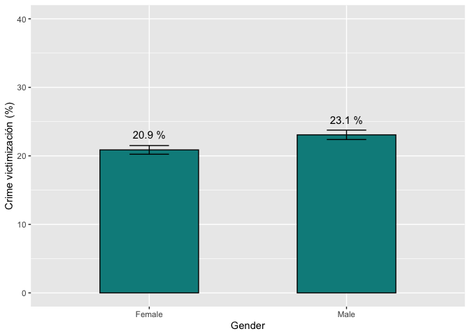
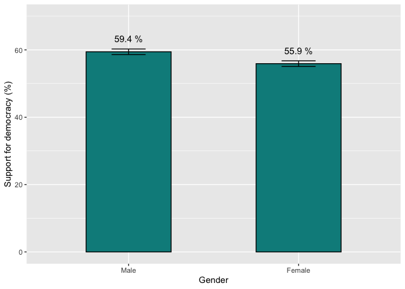

<style type="text/css">
.columns {display: flex;}
h1 {color: #3366CC;}
</style>

# Introduction

In this section we will see how to compare two means and know if the differences can be inferred to the population, through the means comparison t-test.
For that, we will continue to use the latest regional report "The Pulse of Democracy", available [here](https://www.vanderbilt.edu/lapop/ab2021/2021_LAPOP_AmericasBarometer_2021_Pulse_of_Democracy.pdf), where the main findings of the 2018/19 round of the AmericasBarometer are presented.
This report shows the results on support for electoral democracy, a variable that is crossed with some other sociodemographic variables such as gender or place of residence (see Figure 1.5).

# About the dataset

The data we are going to use should be cited as follows: Source: AmericasBarometer by the Latin American Public Opinion Project (LAPOP), wwww.LapopSurveys.org.
This section reloads a trimmed database.
It is recommended to clean the Environment before starting this section.

This database is hosted in the "materials_edu" repository of the LAPOP account on GitHub.
Using the `rio` library and the `import` command, you can import this database from this repository.
In addition, the data from countries with codes less than or equal to 35 are selected, that is, the observations of the United States and Canada are eliminated.


```r
library(rio)
lapop18 = import("https://raw.github.com/lapop-central/materials_edu/main/LAPOP_AB_Merge_2018_v1.0.sav")
lapop18 = subset(lapop18, pais<=35)
```

We also load the dataset for the 2021 round of the AmericasBarometer.


```r
lapop21 = import("https://raw.github.com/lapop-central/materials_edu/main/lapop21.RData")
lapop21 = subset(lapop21, pais<=35)
```

# Crime victimization

Victimization for crime is measure with the variable "vic1ext".
The question is worded: "Now, changing the subject, have you been a victim of any type of crime in the past 12 months? That is, have you been a victim of robbery, burglary, assault, fraud, blackmail, extortion, violent threats or **any other type** of crime in the past 12 months?".

This variable is coded 1 "Yes" and 2 "No".
To be able to replicate the results in Figure 3.12, we have to recode this variable.
As we indicate in a previous section, this recodification allows to calculate the percentage of victims for crime with the command `mean`.
The results indicate that 22% of citizens report having been victim of crime.


```r
library(car)
lapop21$crime = car::recode(lapop21$vic1ext, "1=100; 2=0")
mean(lapop21$crime, na.rm=T)
```

```
## [1] 21.92233
```

Figure 3.12 shows a comparison of victimization for crime crossed by four sociodemographic variables: gender, age, education and quintiles of wealth.

{width="512"}\
To replicate difference between gender, we have to recode variable "q1tb" and then declare this new variable as factor.


```r
lapop21$gender = car::recode(lapop21$q1tb, "1=2; 2=1; 3=1")
lapop21$gender = as.factor(lapop21$gender)
levels(lapop21$gender) = c("Female", "Male")
table(lapop21$gender)
```

```
## 
## Female   Male 
##  31487  29174
```

In the same way as in the section about confidence intervals, we use the command `tapply` to calculate the percentage of crime victimization by groups of gender.


```r
tapply(lapop21$crime, lapop21$gender, mean, na.rm=T) #Para género
```

```
##   Female     Male 
## 20.87127 23.06949
```

To reproduce the bar plot, including the confidence intervals, first we have to produce a table that saves the percentages for each group and the upper and lower limits of the confidence intervals.
We can do this with the command `group.CI` of the library `Rmisc` .

With this table, we can use the library `ggplot` to reproduce the first pane of Figure 3.12.
Results are not the same due to we have not used survey weights.


```r
library(Rmisc)
crxgen = group.CI(crime~gender, lapop21)
library(ggplot2)
graf3.12a = ggplot(crxgen, aes(x=gender, y=crime.mean))+
  geom_bar(width=0.5, fill="darkcyan", colour="black", stat="identity")+
  geom_errorbar(aes(ymin=crime.lower, ymax=crime.upper), width=0.2)+
  geom_text(aes(label=paste(round(crime.mean, 1), "%")), vjust=-1.5, size=4)+
  xlab("Gender") + ylab("Crime victimización (%)")+
  ylim(0, 40)
graf3.12a
```

<!-- -->

We can compare visually the confidence intervals between groups in this graph.
Because they do not overlap, we can conclude that the difference between men and women in crime victimization is statistically significant (initially).

This result, however, has to be confirmed formally with a significance test that we will see below.

# Support for Democracy

Support for democracy, variable "ING4", measured on a scale from 1 to 7, where 1 means "strongly disagree" and 7 means "strongly agree", has to be recoded.
According to the report "Responses are considered in the portion of the scale that indicates agreement, this is the values from 5 to 7, to indicate the percentage that supports democracy" (p. 11).
The command `mean` is used to report the regional average of support for democracy.
We specify `na.rm=T` so that the command does not take missing values into account in the calculation.


```r
library(car)
lapop18$ing4r = car::recode(lapop18$ing4, "1:4=0; 5:7=100")
mean(lapop18$ing4r, na.rm=T)
```

```
## [1] 57.67924
```

It is observed that in general, 57.7% of those interviewed support democracy in the set of countries evaluated in 2018.

# Factors associated with support for democracy

Figure 1.5 shows how support for democracy varies by sociodemographic groups.
In particular, the results are presented for the variable place of residence that distinguishes the urban and rural areas, and for the variable gender, which distinguishes between men and women.

{width="395"}

As we saw in the section on confidence intervals, the percentage of support for each group can be calculated.
First, we are going to create new factor variables for place of residence and gender, which are imported as numeric variables.
These new variables are then labeled.


```r
lapop18$gender = as.factor(lapop18$q1)
levels(lapop18$gender) = c("Male", "Female")
lapop18$ambito = as.factor(lapop18$ur)
levels(lapop18$ambito) = c("Urban", "Rural")
```

As in the section on confidence intervals, we use the command `tapply` to calculate average support for democracy by gender and urban/rural setting.


```r
tapply(lapop18$ing4r, lapop18$gender, mean, na.rm=T) #To gender
```

```
##     Male   Female 
## 59.42899 55.90933
```

```r
tapply(lapop18$ing4r, lapop18$ambito, mean, na.rm=T) #To urban-rural
```

```
##    Urban    Rural 
## 58.71664 55.07453
```

We can reproduce the bar plots that compare the average support for democracy between groups by gender and urban/rural.
First, for gender, you have to create a table with the data of the mean and the limits of the confidence intervals for each group.
We will do this with the command `group.CI` which is part of the library `Rmisc`.
We save this data in an R object called "sdxgen".

This table saves the results of the mean support for democracy for each group ("ing4r.mean" column) and the upper and lower limits of the confidence intervals ("ing4r.lower" and "ing4r.upper" columns).
It also saves the "gender" column with the names of the groups.

Figure 1.5 is reproduced using the command `ggplot` in the same way as in previous sections.


```r
library(Rmisc)
sdxgen = group.CI(ing4r~gender, lapop18)
library(ggplot2)
graf1.5 = ggplot(sdxgen, aes(x=gender, y=ing4r.mean))+
  geom_bar(width=0.5, fill="darkcyan", colour="black", stat="identity")+
  geom_errorbar(aes(ymin=ing4r.lower, ymax=ing4r.upper), width=0.2)+
  geom_text(aes(label=paste(round(ing4r.mean, 1), "%")), vjust=-1.5, size=4)+
  xlab("Gender") + ylab("Support for democracy (%)")+
  ylim(0, 70)
graf1.5
```

<!-- -->

A similar graph can be generated that presents the percentage of support for democracy and the confidence intervals by urban and rural groups.


```r
sdxamb <- group.CI(ing4r~ambito, lapop18)
library(ggplot2)
graf1.5_2 = ggplot(sdxamb, aes(x=ambito, y=ing4r.mean))+
  geom_bar(width=0.5, fill="darkcyan", colour="black", stat="identity")+
  geom_errorbar(aes(ymin=ing4r.lower, ymax=ing4r.upper), width=0.2)+
  geom_text(aes(label=paste(round(ing4r.mean, 1), "%")), vjust=-1.5, size=4)+
  xlab("Place of residence") + ylab("Support for democracy (%)")+
  ylim(0, 70)
graf1.5_2
```

<!-- -->

The LAPOP Lab generally presents the confidence intervals of each group in its graphs.
These gray bars on the report serve as a quick way to compare.
If the bars overlap, that would mean that there would be no statistically significant differences between the groups.
On the contrary, if the gray bars do not overlap, it would mean that the difference between the groups is significant at 95% confidence.
However, to check these conclusions, a statistical test has to be calculated.
When the comparison is between the means of two groups, the appropriate statistical test is the t-test for differences of means.
In this section we are assuming that we can treat the variable "jc15a" and "ing4r" as numerical variables, from which the mean and standard deviation can be calculated, although these variables are strictly a nominal qualitative type.

# T-test

Student's t tests the following hypotheses:

$$
H_0: µ_1 = µ_2
$$

$$
H_a: µ_1 ≠ µ_2
$$

The t-test statistic is calculated with a standard error that depends on whether the variances appear different or whether the variances appear equal.
To determine this condition, the first thing is to calculate a test of equality of variances between the groups, called Levene's test.

$$
H_0: var_1 = var_2
$$

$$
H_a: var_1 ≠ var_2
$$

## T-test for the difference in means of crime victimization by gender

The first step is to run the Levene test to evaluate if variances are equal or different, which is a condition that then is used in the t-test.
To run this test, we use the library `DescTools` that includes the command `LeveneTest`.


```r
library(DescTools)
LeveneTest(lapop21$crime, lapop21$gender)
```

<div data-pagedtable="false">
  <script data-pagedtable-source type="application/json">
{"columns":[{"label":[""],"name":["_rn_"],"type":[""],"align":["left"]},{"label":["Df"],"name":[1],"type":["int"],"align":["right"]},{"label":["F value"],"name":[2],"type":["dbl"],"align":["right"]},{"label":["Pr(>F)"],"name":[3],"type":["dbl"],"align":["right"]}],"data":[{"1":"1","2":"21.36284","3":"3.816323e-06","_rn_":"group"},{"1":"30305","2":"NA","3":"NA","_rn_":""}],"options":{"columns":{"min":{},"max":[10]},"rows":{"min":[10],"max":[10]},"pages":{}}}
  </script>
</div>

Because the p-value (Pr(\>F)) is lower than 0.05, we reject the null hypothesis and affirm that variances are different.
With this result, we can run the command `t.test`, which null hypothesis indicates that means of crime victimization are equal between men and women, and the alternative hypothesis indicates that both means are different.
We include the specification `var.equal = F` because the results of the Levene test indicates that variances seem different.


```r
t.test(crime ~ gender, data = lapop21, var.equal=F)
```

```
## 
## 	Welch Two Sample t-test
## 
## data:  crime by gender
## t = -4.6147, df = 29850, p-value = 3.952e-06
## alternative hypothesis: true difference in means between group Female and group Male is not equal to 0
## 95 percent confidence interval:
##  -3.131886 -1.264558
## sample estimates:
## mean in group Female   mean in group Male 
##             20.87127             23.06949
```

The p-value is lower than 0.05.
With this result, we can reject the null hypotesis and affirm the alternative hypothesis that means between both groups are different.
We conclude that men report a higher crime victimization than women in the region.

## T-test for the difference in means of support for democracy by gender

The first step is to do the Levene test.
To run this test, the library `DescTools` is used, which includes the command `LeveneTest`.


```r
library(DescTools)
LeveneTest(lapop18$ing4r, lapop18$gender)
```

<div data-pagedtable="false">
  <script data-pagedtable-source type="application/json">
{"columns":[{"label":[""],"name":["_rn_"],"type":[""],"align":["left"]},{"label":["Df"],"name":[1],"type":["int"],"align":["right"]},{"label":["F value"],"name":[2],"type":["dbl"],"align":["right"]},{"label":["Pr(>F)"],"name":[3],"type":["dbl"],"align":["right"]}],"data":[{"1":"1","2":"34.38526","3":"4.573811e-09","_rn_":"group"},{"1":"27069","2":"NA","3":"NA","_rn_":""}],"options":{"columns":{"min":{},"max":[10]},"rows":{"min":[10],"max":[10]},"pages":{}}}
  </script>
</div>

As the p-value (Pr(\>F) is less than 0.05, the null hypothesis is rejected and it is stated that the variances are different.
With this result, the command `t.test` can be run, whose null hypothesis indicates that the means of support for democracy are the same between men and women and the alternative hypothesis indicates that both means are different.
The specification `var.equal = F` is included due to the result of Levene's test indicating that the variances appear different.


```r
t.test(ing4r ~ gender, data = lapop18, var.equal=F)
```

```
## 
## 	Welch Two Sample t-test
## 
## data:  ing4r by gender
## t = 5.8633, df = 27046, p-value = 4.59e-09
## alternative hypothesis: true difference in means between group Male and group Female is not equal to 0
## 95 percent confidence interval:
##  2.343068 4.696255
## sample estimates:
##   mean in group Male mean in group Female 
##             59.42899             55.90933
```

The value of the p-value (4.59e-09) is less than 0.05, so the null hypothesis is rejected and the alternative is affirmed, concluding that the differences are different in the population at 95% confidence.

## T-test for the difference in means of support for democracy by domain groups

In the same way as in the previous case, Levene's test is first run to analyze the equality of variances.


```r
LeveneTest(lapop18$ing4r, lapop18$ambito)
```

<div data-pagedtable="false">
  <script data-pagedtable-source type="application/json">
{"columns":[{"label":[""],"name":["_rn_"],"type":[""],"align":["left"]},{"label":["Df"],"name":[1],"type":["int"],"align":["right"]},{"label":["F value"],"name":[2],"type":["dbl"],"align":["right"]},{"label":["Pr(>F)"],"name":[3],"type":["dbl"],"align":["right"]}],"data":[{"1":"1","2":"30.01406","3":"4.327404e-08","_rn_":"group"},{"1":"27084","2":"NA","3":"NA","_rn_":""}],"options":{"columns":{"min":{},"max":[10]},"rows":{"min":[10],"max":[10]},"pages":{}}}
  </script>
</div>

Again, the p-value is less than 0.05, which rejects the hypothesis of equality of variances.
The t-test is then run with the specification of different variances.


```r
t.test(ing4r ~ ambito, data = lapop18, var.equal=F)
```

```
## 
## 	Welch Two Sample t-test
## 
## data:  ing4r by ambito
## t = 5.4543, df = 14056, p-value = 5e-08
## alternative hypothesis: true difference in means between group Urban and group Rural is not equal to 0
## 95 percent confidence interval:
##  2.333228 4.950988
## sample estimates:
## mean in group Urban mean in group Rural 
##            58.71664            55.07453
```

In this comparison, the p-value is also less than 0.05, so the null hypothesis is rejected and it is found that the differences in support for democracy between urban and rural areas is statistically significant at 95% confidence.
As the report indicates, "Considering the region as a whole, Figure 1.5 shows statistically significant relationships between five demographic variables and socioeconomic groups (education, wealth, urban/rural residence, gender, and age) and support for democracy" (p. 13).
In this section we have checked these statistical results for demographic variables of two groups, such as gender and urban/rural residence.

# Summary

In this section we have described and plotted a variable, such as support for democracy, by groups of other variable, such as gender.
Starting from the comparison of confidence intervals, we formalize this comparison with a statistical test, such as the t-test, to conclude whether the differences between groups are statistically significant.

# Calculations including survey weights

## For crime victimization

To calculate the difference of means including a survey weight, we can use the library `survey`.
This library requires a change in the dataset, in the same way as we did in this [section](https://arturomaldonado.github.io/BarometroEdu_Web_Eng/Descriptives2.html).


Once we fit the dataset, we have to define the sampling design with the command `svydesign` and we save this design in an object called "design21".


```r
library(survey)
design21 = svydesign(ids = ~upm, strata = ~strata, weights = ~weight1500, nest=TRUE, data=lapop21)
```

Now we can calculate the table of the mean of crime victimization for each group of gender, including the survey weight.
In the same way as we see in the section on [confidence intervals](https://arturomaldonado.github.io/BarometroEdu_Web_Eng/IC.html), we use the command `svyby`.


```r
crxgen.w = svyby(~crime, ~gender, design21, svymean, na.rm=T, vartype = "ci")
crxgen.w
```

<div data-pagedtable="false">
  <script data-pagedtable-source type="application/json">
{"columns":[{"label":[""],"name":["_rn_"],"type":[""],"align":["left"]},{"label":["gender"],"name":[1],"type":["fct"],"align":["left"]},{"label":["crime"],"name":[2],"type":["dbl"],"align":["right"]},{"label":["ci_l"],"name":[3],"type":["dbl"],"align":["right"]},{"label":["ci_u"],"name":[4],"type":["dbl"],"align":["right"]}],"data":[{"1":"Female","2":"19.89003","3":"19.13471","4":"20.64535","_rn_":"Female"},{"1":"Male","2":"22.37644","3":"21.55720","4":"23.19569","_rn_":"Male"}],"options":{"columns":{"min":{},"max":[10]},"rows":{"min":[10],"max":[10]},"pages":{}}}
  </script>
</div>

It should be noted that these results are equal to those presented in Figure 3.12.
With this table we can proceed to replicate the left panel of this figure, in the same manner as we did above in this section.

For the calculation of the t-test of difference of means, the library `survey` has a native command, called `svyttest`, that allows to perform this test.
However, we do not have a command to evaluate the variances, as the Levene test.
The command `svyttest` is a development of a more general command for generalized linear models, which assume variances are equal.
If we would like to validate this assumption, we can do it manually, as explained in this [link](https://stats.stackexchange.com/questions/148314/f-test-for-equality-of-variances-with-weighted-survey-data).
Here we are going to proceed as if assumption is correct.
We observe this command get results very similar to those obtained with no survey weights and, for all effect, we arrive to the same conclusions.
The p-value is lower than 0.05, so we can reject the null hypothesis and affirm there are differences between men and women in their levels of crime victimization, taking into account the survey weights.


```r
svyttest(crime~gender, design21)
```

```
## 
## 	Design-based t-test
## 
## data:  crime ~ gender
## t = 4.3654, df = 30282, p-value = 1.273e-05
## alternative hypothesis: true difference in mean is not equal to 0
## 95 percent confidence interval:
##  1.370025 3.602805
## sample estimates:
## difference in mean 
##           2.486415
```

## For support for democracy

Other way to calculate the difference of means including the survey wieight is by using the library `survey`.
For this we have to define the sample design with the command `svydesign` and save this design in an object, here called "design18".


```r
library(survey)
design18 = svydesign(ids = ~upm, strata = ~estratopri, weights = ~weight1500, nest=TRUE, data=lapop18)
```

First, the table of the mean support for democracy can be calculated for each value of the variable gender, including the survey weight.
In the same way as seen in the section on [confidence intervals](https://arturomaldonado.github.io/BarometroEdu_Web/IC.html), and use the command `svyby`.


```r
sdxgen.w = svyby(~ing4r, ~gender, design18, svymean, na.rm=T, vartype = "ci")
sdxgen.w
```

<div data-pagedtable="false">
  <script data-pagedtable-source type="application/json">
{"columns":[{"label":[""],"name":["_rn_"],"type":[""],"align":["left"]},{"label":["gender"],"name":[1],"type":["fct"],"align":["left"]},{"label":["ing4r"],"name":[2],"type":["dbl"],"align":["right"]},{"label":["ci_l"],"name":[3],"type":["dbl"],"align":["right"]},{"label":["ci_u"],"name":[4],"type":["dbl"],"align":["right"]}],"data":[{"1":"Male","2":"59.45019","3":"58.60266","4":"60.29772","_rn_":"Male"},{"1":"Female","2":"55.95399","3":"55.09168","4":"56.81630","_rn_":"Female"}],"options":{"columns":{"min":{},"max":[10]},"rows":{"min":[10],"max":[10]},"pages":{}}}
  </script>
</div>

With this table you can proceed to create the bar plot, in the same way that was done above in this section.

For the calculation of the t-test for difference of means, the package `survey` has a native command `svyttest`that allows this calculation.


```r
svyttest(ing4r~gender, design18)
```

```
## 
## 	Design-based t-test
## 
## data:  ing4r ~ gender
## t = -5.8332, df = 1329, p-value = 6.822e-09
## alternative hypothesis: true difference in mean is not equal to 0
## 95 percent confidence interval:
##  -4.672004 -2.320395
## sample estimates:
## difference in mean 
##          -3.496199
```

Because the p-value is lower than 0.05, we conclude there are differences between men and women in their levels of support for democracy in the region.
